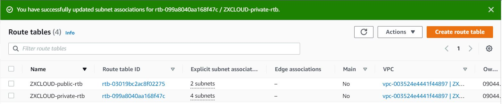
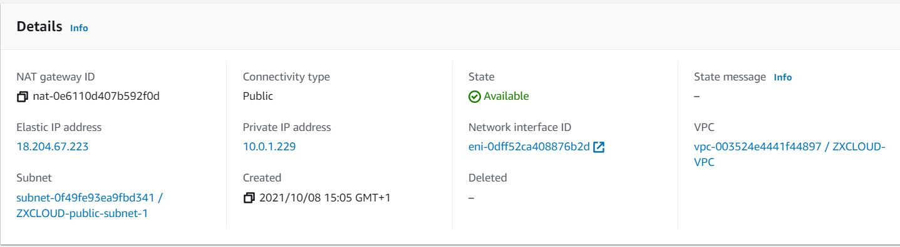
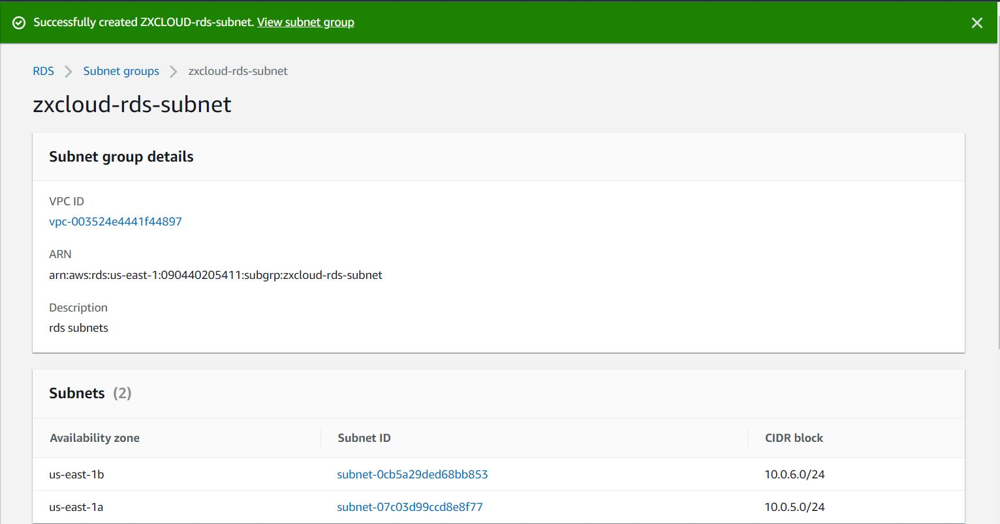
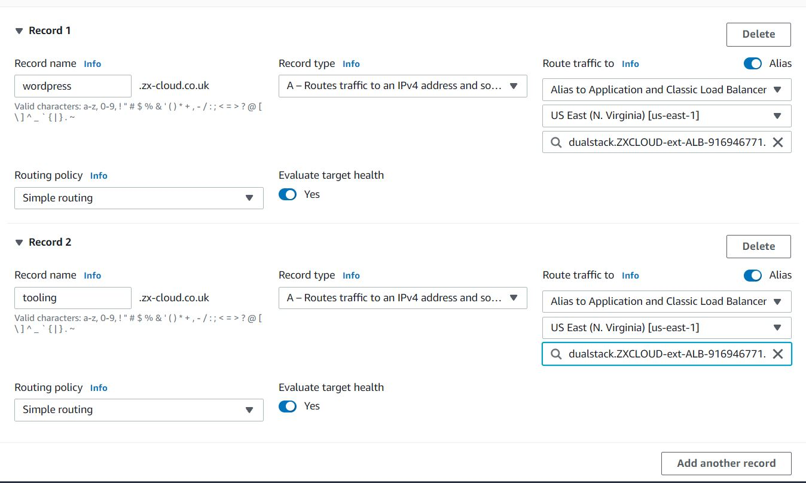
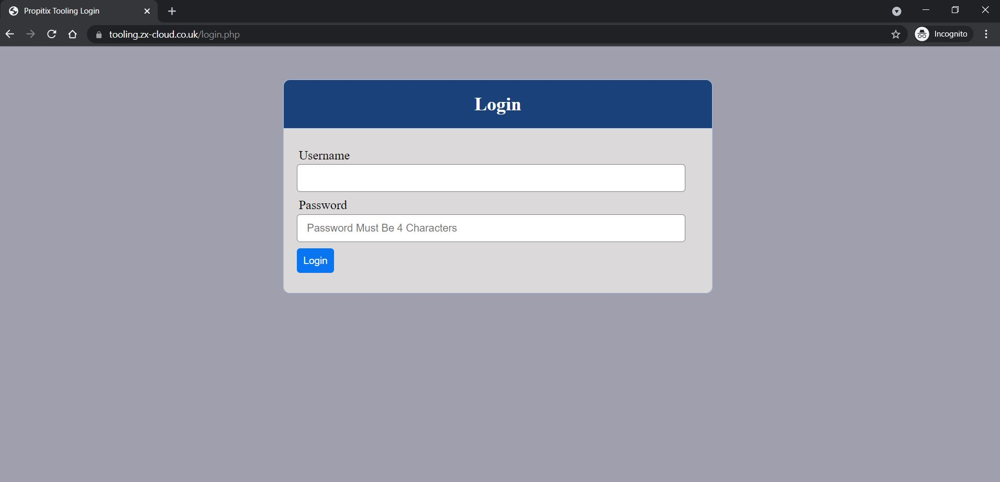

### AWS CLOUD SOLUTION FOR 2 WEBSITES USING A REVERSE PROXY TECHNOLOGY

In this project I built a secure infrastructure inside AWS VPC (Virtual Private Cloud) network for a fictitious company that uses WordPress CMS for it’s main business website and a tooling website.

To improve security and performance a reverse proxy technology using NGINX web server was used to achieve this.

Cost, Security, and Scalability are the major requirements for this project to ensure that infrastructure is resilient to webserver failures, can accommodate increased traffic at a moderate cost.

Setup an AWS account and Organization Unit

Created a domain name for the company website.
Setup a hosted zone in AWS Route 53

•	In Route 53 select ‘Create Hosted Zone’

•	Choose ‘Public hosted zone’ to route traffic on the internet

•	Select ‘Create hosted zone’

•	Signed into AWS Console as DevOps (new AWS account).

Mapped my hosted domain to my domain from LCN.com

Setup a Virtual Private Network (VPC)

•	Created a VPC

Enabled DNS hostnames

Created an Internet gateway and attached it to the VPC.

Attached VPC to Internet Gatweway

Create subnets (public and private subnets).

IPinfo.io is a trusted source for IP address data, can be used to check the range of IP addresses associated with each subnet.

Setup zxcloud vpc in public subnet 1 (10.0.1.0/24) in the us-east-1a and public subnet 2 (10.0.3.0/24) in the us-east-1b availability zones respectively. 

Created public and private route tables and associate them with their respective subnets.

Associate route tables with their subnets

Edited the route for the public route table, so that subnets associated with the route table can access the internet through the internet gateway.

Create an Elastic IP and associate it with the NAT gateway.

Create a Network Address Translation (NAT) Gateway to map IP Addresses in the private subnets.

Create security groups for 

•	Nginx servers: The Application Load balancer will be able to access Nginx. 

•	Bastion servers: Access to the Bastion servers will be allowed only from 
           workstations that need to SSH into the bastion servers. 

•	Application Load Balancer (ALB): ALB will be accessible from the internet.

•	Webservers: data traffic to the webservers can only be allowed from the Nginx servers.

•	Data Layer: The Data layer comprises of Amazon Relational Database Service (RDS) and 
Amazon Elastic File System (EFS). Only the webservers will be able to connect to the RDS, 

while Nginx and the webservers will have access to EFS Mountpoint.

Create TLS/SSL Certificates from Amazon Certificate Manager
 TLS certificates is required to handle secure connection to my Application Load Balancers (ALB).

Setup a wild card (*.zx-cloud.co.uk) to ensure that subdomain names attached to zx-cloud.co.uk will have SSL/TLS certificate attached to the subdomain name.

 Setup Amazon Elastic File System
The Elastic File System (EFS) will be used by the webservers for files storage.
1.	Create an EFS file system.
2.	Create an EFS mount target per AZ in the VPC, associate it with both subnets dedicated for data layer
3.	Associate the Security groups for data layer.

Next, create an EFS Access Point. Amazon EFS Access Points is an EFS feature that provides applications access to shared data sets in an EFS file system. 

In this project, I created two access points for my wordpress and tooling webservers.

Setup Relational Database Service (RDS)

Pre-requisite: Create a KMS key from Key Management Service (KMS) to be used to encrypt the database instance.

Amazon RDS is a managed distributed relational database service by Amazon Web Services. 

Steps to configure RDS

1.	 Created a subnet group and add the 2 private subnets where the RDS servers will be setup.

2.	Created MySQL database

3.	For this project I selected the Free tier template, considering that the Dev/Test and Production templates are very expensive. With the Free tier template, the database cannot be encrypted using the KMS key created.

Set Up Compute Resources for Bastion. Nginx and Webserver server
Provisioned an EC2 t2.micro RHEL 8 instance for Bastion server.

Installed the following packages

epel-release

python

htop

ntp

net-tools

vim

wget

telnet

Provisioned an EC2 t2.micro RHEL 8 instance for Nginx server.

Installed the following packages
Python

Ntp

net-tools

vim

wget

telnet

epel-release

htop

Provisioned an EC2 t2.micro RHEL 8 instance for Webserver.

Installed the following packages

Python

Ntp

net-tools

Vim

Wget

telnet

epel-release

htop

php

Created Amazon machine image (AMI) out of the instances for the 3 resources.

Configured Target Groups

Target groups were created for instances behind a load balancer. Load balancers forwards traffic to the target groups. In this case target group was created for the nginx, tooling and wordpress webservers

•	Select instances as target type

•	Entered the target group name

•	Selected the VPC created – ZXCLOUD-vpc

•	For health checks, select HTTPS and health check path as /healthstatus

•	Add Tags

•	Register the 3 webservers as targets

Installed a self signed SSL certificate on the Nginx AMI. The Nginx AMI will be attached to a target group that uses HTTPs protocol and health checks. 

The load balancer establishes TLS connections with the targets using certificates that you install on the targets.

Configure Application Load Balancers (ALB) for Nginx
1.	Created an Internet facing ALB
2.	Selected HTTPS protocol (TCP port 443)
3.	Setup ALB to my VPC, availability zone, public subnet 1 and 2.
4.	Selected TLS Certificate from ACM
5.	Selected my external load balancer as Security Group
6.	Selected the Nginx Instance as the target group

Configure Application Load Balancers (ALB) for Webservers
The ALB for wordpress and tooling webservers will not be internet facing. Two ALBs were setup for each server.
1.	Created an Internal ALB
2.	Selected HTTPS protocol (TCP port 443)
3.	Setup ALB to my VPC, availability zone, private subnet 1 and 2.
4.	Selected TLS Certificate from ACM
5.	Selected my internal load balancer Security Group
6.	Select wordpress as the default Instance for the target group
7.	Created a rule to forward 

Created a rule to forward tooling request to the Tooling target. The internal ALB is configured to check host headers with tooling.zx-cloud.co.uk or www.tooling.zx-cloud.co.uk and forward it to the tooling target (ZXCLOUD-tooling-target). 

### Create Launch Templates for Auto-scaling Groups 

A launch template contains the configuration information to launch an instance. 

A launch template provides full functionality for Amazon EC2 Auto Scaling.

Create templates for Nginx

	Prepare a launch template from the AMI instance

	From EC2 Console, click Launch Templates from the left pane

	Selected my Nginx AMI

	Selected the instance type (t2.micro)

	Selected my key pair

	Selected the security group for Nginx

	Added resource tags

	Click Advanced details, scroll down to the end and configure the user data script to update the yum repo and install nginx. 

Userdata for Nginx:

#!/bin/bash

yum install -y nginx

systemctl start nginx

systemctl enable nginx

git clone https://github.com/obinnao/ZXCLOUD-project-config.git

mv /ZXCLOUD-project-config/reverse.conf /etc/nginx/

mv /etc/nginx/nginx.conf /etc/nginx/nginx.
conf-distro

cd /etc/nginx/

touch nginx.conf

sed -n 'w nginx.conf' reverse.conf

systemctl restart nginx

rm -rf reverse.conf

rm -rf /ZXCLOUD-project-config

### Created templates for Bastion

Prepare a launch template from the AMI instance

From EC2 Console, click Launch Templates from the left pane

Selected my Bastion AMI

Selected the instance type (t2.micro)

Selected my key pair

Selected the security group for Bastion

Added resource tags

Click Advanced details, scroll down to the end and configure the user data script to update the yum repo and install nginx. 

Userdata for Bastion:

#!/bin/bash 
yum install -y mysql 
yum install -y git tmux 
yum install -y ansible

### Created templates for the Webservers

Prepare a launch template from the AMI instance for Tooling

From EC2 Console, click Launch Templates from the left pane

Selected my Tooling AMI

Selected the instance type (t2.micro)

Selected my key pair

Selected the security group for Tooling

Added resource tags

Click Advanced details, scroll down to the end and configure the user data script to update the yum repo and install nginx. 

Userdata for Tooling:

#!/bin/bash

mkdir /var/www/

sudo mount -t efs -o tls,accesspoint=fsap-0f2492484a9e0f47b fs-0a9e85be:/ /var/www/

yum install -y httpd 

systemctl start httpd

systemctl enable httpd

yum module reset php -y

yum module enable php:remi-7.4 -y

yum install -y php php-common php-mbstring 

php-opcache php-intl php-xml php-gd php-cur

php-mysqlnd php-fpm php-json

systemctl start php-fpm

systemctl enable php-fpm

mkdir /var/www/html

cp -R /tooling-1/html/*  /var/www/html/

cd /tooling-1

mysql -h acs-database.cdqpbjkethv0.us-east-1.rds.amazonaws.com -u admin -p toolingdb < tooling-db.sql

cd /var/www/html/

touch healthstatus

sed -i "s/$db = mysqli_connect('mysql.tooling.svc.cluster.local', 'admin', 'admin', 'tooling');/$db = mysqli_connect('zxcloud-database.cvn4wfv8sum4.us-east-1.rds.amazonaws.com', 'admin', 'admin12345', 'toolingdb');/g" functions.php

chcon -t httpd_sys_rw_content_t /var/www/html/ -R
systemctl restart httpd

Prepare a launch template from the AMI instance for Wordpress

From EC2 Console, click Launch Templates from the left pane

Selected my Wordpress AMI

Selected the instance type (t2.micro)

Selected my key pair

Selected the security group for Wordpress

Added resource tags

Click Advanced details, scroll down to the end and configure the user data script to update the yum repo and install nginx. 

Userdata for Wordpress:

#!/bin/bash

mkdir /var/www/

sudo mount -t efs -o tls,accesspoint=fsap-06d5e5cb22b7bffb5 fs-0a9e85be:/ /var/www/

yum install -y httpd 

systemctl start httpd

systemctl enable httpd

yum module reset php -y

yum module enable php:remi-7.4 -y

yum install -y php php-common php-mbstring php-opcache php-intl php-xml php-gd php-curl php-mysqlnd php-fpm php-json

systemctl start php-fpm

systemctl enable php-fpm

wget http://wordpress.org/latest.tar.gz

tar xzvf latest.tar.gz

rm -rf latest.tar.gz

cp wordpress/wp-config-sample.php wordpress/wp-config.php

mkdir /var/www/html/

cp -R /wordpress/* /var/www/html/

cd /var/www/html/

touch healthstatus

sed -i "s/localhost/zxcloud-database.cvn4wfv8sum4.us-east-1.rds.amazonaws.com/g" wp-config.php 
sed -i "s/username_here/admin/g" wp-config.php 
sed -i "s/password_here/admin12345/g" wp-config.php 
sed -i "s/database_name_here/wordpressdb/g" wp-config.php 

chcon -t httpd_sys_rw_content_t /var/www/html/ -R

systemctl restart httpd

Created Autoscaling groups for the launch templates (Bastion, Nginx, tooling and wordpress servers)

An Auto Scaling group contains a collection of Amazon EC2 instances that are treated as a logical grouping for the purposes of automatic scaling and management.

An Auto Scaling group starts by launching enough instances to meet its desired capacity. It maintains this number of instances by performing periodic health checks on the instances in the group. 

The Auto Scaling group continues to maintain a fixed number of instances even if an instance becomes unhealthy. 

If an instance becomes unhealthy, the group terminates the unhealthy instance and launches another instance to replace it. 

Health check status for wordpress target

Create Databases for Webservers in the RDB 

SSH into the RDB server from the Bastion server. Created ‘toolingdb’ and ‘wordpressdb’ databases for the two webservers. 

### Configure DNS with Route 53

Created an alias record for the wordpress main domain and directed its traffic to the external ALB DNS name and an alias record for tooling.zx-cloud.co.uk and forwarded traffic to ALB CNS name.

Accessed the tooling and wordpress servers from a web browser.

