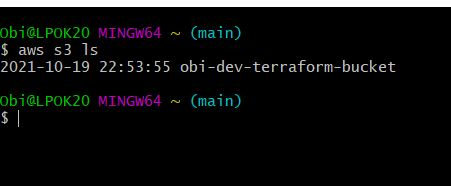
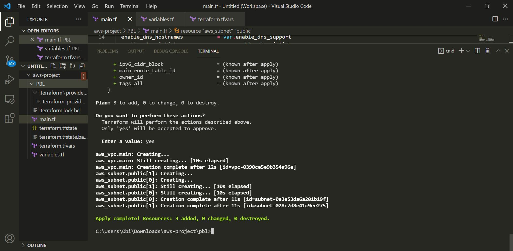

### AUTOMATE INFRASTRUCTURE WITH IAC USING TERRAFORM (PART 1)

Terraform is an open-source infrastructure as a code. Terraform is a tool for building, changing, and versioning infrastructure safely and efficiently. Terraform can manage existing and popular service providers as well as custom in-house solutions.

#### Pre-requisites

•	Create an IAM user and named it terraform

•	Copy and saved the secret access key and access key ID.

•	Configure programmatic access from my computer to connect to AWS using the secret access keys.

#### Create an S3 bucket to store Terraform state file.

An Amazon S3 bucket is a public cloud storage resource available in Amazon Web Services.  It is built to store, secure and retrieve data from “buckets” at anytime from anywhere on any device. 

Programmatically accessed my AWS account using Git Bash as shown below.

VPC Subnets and Security Groups

Create a directory structure using Visual Studio Code

Create a folder called PBL and a file inside the folder and named it main.tf

Add AWS as a provider, and a resource to create a VPC in the main.tf file.

Provider block informs Terraform that the infrastructure will be built within AWS.

provider "aws" {

  region = "eu-wes-2"

}

`# Create VPC

resource "aws_vpc" "main" {

  cidr_block                     = "172.16.0.0/16"

  enable_dns_support             = "true"

  enable_dns_hostnames           = "true"

  enable_classiclink             = "false"

  enable_classiclink_dns_support = "false"

}

Downloaded the necessary plugins for Terraform by running `terraform init`

These plugins are used by providers and provisioners. 

Run terraform plan to see actions terraform will perform

#### Observations:

1.	A new file is created terraform.tfstate. Terraform reads this file to know what already exists, what should be added, or destroyed based on the entire terraform code that is being developed.

2.	Another file gets created during planning and apply. But this file gets deleted immediately .terraform.tfstate.lock.info This is what Terraform uses to track, who is running its code against the infrastructure at any point in time. This is very important for teams working on the same Terraform repository at the same time. 

The lock prevents a user from executing Terraform configuration against the same infrastructure when another user is doing the same.

### Create Subnets Resource

Added the configuration below to the main.tf file to create 2 public subnets.

 `#Create public subnets1

    resource "aws_subnet" "public1" {

    vpc_id                     = aws_vpc.main.id

    cidr_block                 = "172.16.0.0/24"

    map_public_ip_on_launch    = true

    availability_zone          = "eu-central-1a"

}

 `#Create public subnet2

    resource "aws_subnet" "public2" {

    vpc_id                     = aws_vpc.main.id

    cidr_block                 = "172.16.1.0/24"

    map_public_ip_on_launch    = true

    availability_zone          = "eu-central-1b"

}

Run terraform plan and terraform apply

VPC Created in AWS

The code can be improved and restructured by refactoring it.

First, destroy the current infrastructure by running `terraform destroy` command, and type yes after evaluating the plan.

Refactoring our Code

The main purpose of code refactoring is to make the code more efficient and maintainable. This is key in reducing technical cost since it’s much better to clean up the code now than pay for costly errors later. 

Variables are introduced to replace data embedded in the code.
In the provider block, declare a variable named region, give it a default value, and update the provider section by referring to the declared variable.

    variable "region" {
        default = "eu-west-2"
    }

    provider "aws" {
        region = var.region
    }

CIDR value in the VPC block

     variable "region" {
         
     default = "eu-central-1"

   }

         

    variable "vpc_cidr" {
        default = "172.16.0.0/16"

    }

    variable "enable_dns_support" {

        default = "true"
    }

    variable "enable_dns_hostnames" {

        default ="true" 
    }

    variable "enable_classiclink" {

        default = "false"
    }

    variable "enable_classiclink_dns_support" {

        default = "false"
    }

    provider "aws" {

    region = var.region

    }

    # Create VPC

    resource "aws_vpc" "main" {

    cidr_block                     = var.vpc_cidr

    enable_dns_support             = var.enable_dns_support 

    enable_dns_hostnames           = var.enable_dns_support

    enable_classiclink             = var.enable_classiclink

    enable_classiclink_dns_support = var.enable_classiclink

    }

 Use Terraform Data Sources to fetch the list of availability zones from AWS.

 `# Get list of availability zones

        data "aws_availability_zones" "available" {

        state = "available"

        }

To make use of this new data resource, add count argument to the subnet block.

`# Create public subnet1

    resource "aws_subnet" "public" {
 
        count                   = 2

        vpc_id                  = aws_vpc.main.id

        cidr_block              = "172.16.1.0/24"

        map_public_ip_on_launch = true

        availability_zone       = data.aws_availability_zones.available.names[count.index]

    }

•	The count above shows that 2 subnets are required. Terraform invokes a loop to create 2 subnets.

•	The data resource returns a list object that contains a list of AZs. 

  ["eu-west-2a", "eu-west-2b"]

 Each time Terraform goes into a loop to create a subnet, The 2 public subnets are created in the retrieved availability zone (eu-west-2). 

Make CIDR Dynamic
Since cidr_block is hard coded, it can’t be created twice. However, when  function cidrsubnet() is applied this creates the cidr_block twice in the VPC.

`# Create public subnet1

    resource "aws_subnet" "public" { 

        count                   = 2

        vpc_id                  = aws_vpc.main.id

        cidr_block              = cidrsubnet(var.vpc_cidr, 4 , count.index)

        map_public_ip_on_launch = true

        availability_zone       = data.aws_availability_zones.available.names[count.index]

    }

cidr subnet function works like an algorithm to dynamically create a subnet CIDR per AZ.
Its parameters are cidrsubnet (prefix, newbits and netnum)
•	The prefix parameter is given in CIDR notation, same as for VPC.

•	The newbits parameter is the number of additional bits with which to extend the prefix. For example, if given a prefix ending with /16 and a newbits value of 4, the resulting subnet address will have length /20

•	The netnum parameter is a whole number that can be represented as a binary integer with no more than newbits binary digits, which will be used to populate the additional bits added to the prefix

Remove hard coded count value
Since the data resource returns all the AZs within a region, it makes sense to count the number of AZs returned and pass that number to the count argument.

The length() function is introduced to determine the length of a given list, map, or string.

#### Update the public subnet resource block

`# Create public subnet1

    resource "aws_subnet" "public" { 

        count   = length(data.aws_availability_zones.available.names)

        vpc_id                  = aws_vpc.main.id

        cidr_block              = cidrsubnet(var.vpc_cidr, 4 , count.index)

        map_public_ip_on_launch = true

        availability_zone       = data.aws_availability_zones.available.names[count.index]

    }

Since the length function will return number 3 to the count argument instead of 2 required, declare a variable to store the desired number of public subnets, and set the default value.

variable "preferred_number_of_public_subnets" {

  default = 2

}

Next, update the count argument with a condition.

`# Create public subnets

resource "aws_subnet" "public" {

  count  = var.preferred_number_of_public_subnets == null ? length(data.aws_availability_zones.available.names) : var.preferred_number_of_public_subnets  
 
  vpc_id = aws_vpc.main.id

  cidr_block              = cidrsubnet(var.vpc_cidr, 4 , count.index)

  map_public_ip_on_launch = true

  availability_zone       = data.aws_availability_zones.available.names[count.index]

}

•	The first part `var.preferred_number_of_public_subnets == null` checks if the value of the variable is set to null or has some value defined.

•	The second part ? and `length(data.aws_availability_zones.available.names)` means, if the first part is true, then use this. In other words, if preferred number of public subnets is null (or unknown) then set the value to the data returned by lenght function.

•	The third part : and `var.preferred_number_of_public_subnets` means, if the first condition is false i.e. the preferred number of public subnets is not null then set the value defined in `var.preferred_number_of_public_subnets`

#### The configuration looks like this:

`# Get list of availability zones

data "aws_availability_zones" "available" {

state = "available"

}

variable "region" {

      default = "eu-central-1"

}

variable "vpc_cidr" {

    default = "172.16.0.0/16"

}

variable "enable_dns_support" {

    default = "true"

}

variable "enable_dns_hostnames" {

    default ="true" 

}

variable "enable_classiclink" {

    default = "false"
}

variable "enable_classiclink_dns_support" {

    default = "false"
}

  variable "preferred_number_of_public_subnets" {

      default = 2
}

provider "aws" {

  region = var.region

}

`# Create VPC
resource "aws_vpc" "main" {

  cidr_block                     = var.vpc_cidr

  enable_dns_support             = var.enable_dns_support 

  enable_dns_hostnames           = var.enable_dns_support

  enable_classiclink             = var.enable_classiclink

  enable_classiclink_dns_support = var.enable_classiclink

}

`# Create public subnets

resource "aws_subnet" "public" {

  count  = var.preferred_number_of_public_subnets == null ? length(data.aws_availability_zones.available.names) : var.preferred_number_of_public_subnets 
  
  vpc_id = aws_vpc.main.id

  cidr_block              = cidrsubnet(var.vpc_cidr, 4 , count.index)

  map_public_ip_on_launch = true

  availability_zone       = data.aws_availability_zones.available.names[count.index]

}

#### INTRODUCING VARIABLES.TF AND TERRAFORM.TFVARS

To ensure the code is readable and better structured, some part of the configuration content can be moved to other files.

1.	Created a file and named it variables.tf
2.	Copied all the variable declarations into the new file.
3.	Created another file and named it terraform.tfvars
4.	Set values for each of the variables.

#### Configuration in the main.tf file

`# Get list of availability zones

data "aws_availability_zones" "available" {

state = "available"

}

provider "aws" {

  region = var.region

}

`# Create VPC

resource "aws_vpc" "main" {

  cidr_block                     = var.vpc_cidr

  enable_dns_support             = var.enable_dns_support 

  enable_dns_hostnames           = var.enable_dns_support

  enable_classiclink             = var.enable_classiclink

  enable_classiclink_dns_support = var.enable_classiclink

}

`# Create public subnets

resource "aws_subnet" "public" {

  count  = var.preferred_number_of_public_subnets == null ? length(data.aws_availability_zones.available.names) : var.preferred_number_of_public_subnets   
  vpc_id = aws_vpc.main.id

  cidr_block              = cidrsubnet(var.vpc_cidr, 4 , count.index)

  map_public_ip_on_launch = true

  availability_zone       = data.aws_availability_zones.available.names[count.index]

}

#### Configuration in the variable.tf file

variable "region" {

      default = "eu-central-1"
}

variable "vpc_cidr" {

    default = "172.16.0.0/16"

}

variable "enable_dns_support" {

    default = "true"

}

variable "enable_dns_hostnames" {

    default ="true" 
}

variable "enable_classiclink" {

    default = "false"

}

variable "enable_classiclink_dns_support" {

    default = "false"
}

  variable "preferred_number_of_public_subnets" {

      default = null

}

#### Configuration in the terraform.tfvars file.

The terraform.tfvars file holds the default values.

region = "eu-west-2"

vpc_cidr = "172.16.0.0/16" 

enable_dns_support = "true" 

enable_dns_hostnames = "true"  

enable_classiclink = "false" 

enable_classiclink_dns_support = "false" 

preferred_number_of_public_subnets = 2

The File Structure

    └── PBL

    ├── main.tf

    ├── terraform.tfstate

    ├── terraform.tfstate.backup

    ├── terraform.tfvars

    └── variables.tf

#### Run terraform plan and terraform apply command to build the AWS infrastructure

