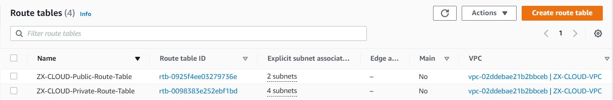

### AUTOMATE AWS INFRASTRUCTURE USING TERRAFORM (IAC) PART 2
This is a continuation of project 16.

#### Networking 
Created 4 private subnets and applied these principles

•	Use  variables or length() function to determine the number of AZs

•	variables and cidrsubnet() function to allocate vpc_cidr for subnets

•	Setup a separate files for variables and resources for better code structure and readability

•	Tag all resources

Declared a a variable in the variable.tf file as shown below:

    variable "preferred_number_of_private_subnets" {

    type = number

    description = “number of private subnets”

    }

Terraform.tfvars file

preferred_number_of_public_subnets = 4

 main.tf file

    .# Create private subnets

    resource "aws_subnet" "private" {

    count  = var.preferred_number_of_public_subnets == null ? length(data.aws_availability_zones.available.names) : var.   preferred_number_of_public_subnets   

    vpc_id = aws_vpc.main.id

    cidr_block              = cidrsubnet(var.vpc_cidr, 4 , count.index+2)

    map_public_ip_on_launch = true

    availability_zone       = data.aws_availability_zones.available.names[count.index]

    tags = merge(
    local.default_tags,

    {
      Name = format("PrivateSubnet-%s", count.index)
    } 

    )

    }

Tagging resources is very useful as it helps manage resources efficiently.

#### Internet Gateway

Setup a file int-gw.tf, then created a resource configuration code

    resource "aws_internet_gateway" "ig" {
    vpc_id =  aws_vpc.main.id
    tags =  merge(
    var.tags,

    {
    Name =  format("%s-%s!", aws_vpc.main.id, "IG")

    },

    )

    }

The format() function is used to dynamically generate a unique name for this resource.
The %s takes the interpolated value of aws_vpc.main.id while the second %s appends a literal string IG and finally an exclamation mark is added in the end.

#### NAT Gateway

Created 1 NAT Gateway and 1 Elastic IP (EIP) address.

Created the NAT Gateways in a file called natgateway.tf

    .# create elastic IP

    resource "aws_eip" "nat_eip" {

    vpc        = true

    depends_on = [aws_internet_gateway.ig]

    tags = merge(

    var.tags,

    {

      Name = format("%s-EIP", var.name)

    },

    )

    }

    .# create nat gateway

    resource "aws_nat_gateway" "nat" {

     allocation_id = aws_eip.nat_eip.id

     subnet_id     = element(aws_subnet.public.*.id, 0)

    depends_on    = [aws_internet_gateway.ig]

    tags = merge(

    var.tags,
    {

      Name = format("%s-Nat", var.name)

    },

    )

    }

#### AWS ROUTES

Created a file route_tables.tf, then created routes tables for the public and private subnets.

    .# create private route table

    resource "aws_route_table" "private-rtb" {

    vpc_id = aws_vpc.main.id

    tags = merge(

    var.tags,

    {

      Name = format("%s-Private-Route-Table", var.name)

    },

    )

    }

    #create route for private route table and attach a nat gateway

    resource "aws_route" "private-rtb-route" {

    route_table_id         = aws_route_table.private-rtb.id

    destination_cidr_block = "0.0.0.0/0"

    gateway_id             = aws_nat_gateway.nat.id

    }

    .# associate all private subnets to the private route table

     resource "aws_route_table_association" "private-subnets-assoc" {

     count          = length(aws_subnet.private[*].id)

     subnet_id      = element(aws_subnet.private[*].id, count.index)

     route_table_id = aws_route_table.private-rtb.id

    }

    .# create route table for the public subnets

    resource "aws_route_table" "public-rtb" {

    vpc_id = aws_vpc.main.id

    tags = merge(

    var.tags,

    {

      Name = format("%s-Public-Route-Table", var.name)

    },

    )

    }

    .# create route for the public route table and attach the internet gateway

    resource "aws_route" "public-rtb-route" {

    route_table_id         = aws_route_table.public-rtb.id

    destination_cidr_block = "0.0.0.0/0"

    gateway_id             = aws_internet_gateway.ig.id

    }

    .# associate all public subnets to the public route table

    resource "aws_route_table_association" "public-subnets-assoc" {

    count          = length(aws_subnet.public[*].id)

    subnet_id      = element(aws_subnet.public[*].id, count.index)

    route_table_id = aws_route_table.public-rtb.id

    }

The following resources were created in AWS after running terraform plan and terraform apply command

•	A VPC

•	2 public subnets

•	4 private subnets

•	1 internet Gateway

•	1 NAT Gateway

•	1 Elastic IP

•	2 Route tables

### AWS Identity and Access Management

Created an Assume Role to pass IAM role to AWS WC2 instance. AssumeRole is used for cross-account access.

Assume Role use Security Token Service (STS) API that returns a set of temporary security credentials required to access AWS resources. 

These temporary credentials consists of an access key ID, a secret access key, and a security token. 

Created a terraform file and named it 'roles.tf' file and entered configuration code.

    resource "aws_iam_role" "ec2_instance_role" {

    name = "ec2_instance_role"

    assume_role_policy = jsonencode({

    Version = "2012-10-17"

    Statement = [

      {

        Action = "sts:AssumeRole"

        Effect = "Allow"

        Sid    = ""

        Principal = {

          Service = "ec2.amazonaws.com"

        }

      },

    ]

    })

    tags = merge(

    var.tags,

    {

      Name = "aws assume role"

    },

    )

    }

The code above grants the EC2 instance permission to assume the role.

Created an IAM policy for this role

    resource "aws_iam_policy" "policy" {

    name        = "ec2_instance_policy"

    description = "A test policy"

    policy = jsonencode({

    Version = "2012-10-17"

    Statement = [

    {

    Action = [

    "ec2:Describe*",

    ]

    Effect   = "Allow"

    Resource = "*"

    },

    ]

    })

    tags = merge(

    var.tags,

    {

    Name =  "aws assume policy"

    },

    )

    }

Attached the policy to the IAM role

    resource "aws_iam_role_policy_attachment" "test-attach" {

    role       = aws_iam_role.

    ec2_instance_role.name

    policy_arn = aws_iam_policy.policy.arn

    }

Created an instance profile and interpolated the role

    resource "aws_iam_instance_profile" "ip" {

    name = "aws_instance_profile_test"

    role =  aws_iam_role.ec2_instance_role.name

    }

#### SECURITY GROUPS

Created all the security group in a file named security.tf

Setup resource for the internet facing application load balancer (ALB)

    .# security group for alb, to allow access from anywhere for HTTP and HTTPS traffic

    resource "aws_security_group" "ext-alb-sg" {

    name        = "ext-alb-sg"

    vpc_id      = aws_vpc.main.id

    description = "Allow TLS inbound traffic"

    ingress {

    description = "HTTP"

    from_port   = 80

    to_port     = 80

    protocol    = "tcp"

    cidr_blocks = ["0.0.0.0/0"]

    }

    ingress {

    description = "HTTPS"

    from_port   = 22

    to_port     = 22

    protocol    = "tcp"

    cidr_blocks = ["0.0.0.0/0"]

    }

    egress {

    from_port   = 0

    to_port     = 0

    protocol    = "-1"

    cidr_blocks = ["0.0.0.0/0"]

    }

    tags = merge(

    var.tags,

    {

      Name = "ext-alb-sg"

    },

    )

    }

#### Security group for the bastion server

    .# security group for bastion, to allow access into the bastion host

    resource "aws_security_group" "bastion_sg" {

    name        = "vpc_web_sg"

    vpc_id = aws_vpc.main.id

    description = "Allow incoming HTTP connections."

    ingress {

    description = "SSH"

    from_port   = 22

    to_port     = 22

    protocol    = "tcp"

    cidr_blocks = ["0.0.0.0/0"]

    }

    egress {

    from_port   = 0

    to_port     = 0

    protocol    = "-1"

    cidr_blocks = ["0.0.0.0/0"]

    }

     tags = merge(

    var.tags,

    {

      Name = "Bastion-SG"

    },

    )

    }

#### Setup security group for Nginx reverse proxy

#security group for nginx reverse proxy, to allow access only from the extaernal load balancer and bastion instance

    resource "aws_security_group" "nginx-sg" {

    name   = "nginx-sg"

    vpc_id = aws_vpc.main.id

    egress {

    from_port   = 0

    to_port     = 0

    protocol    = "-1"

    cidr_blocks = ["0.0.0.0/0"]

    }

    tags = merge(

    var.tags,

    {

      Name = "nginx-SG"

    },

    )

    }

    resource "aws_security_group_rule" "inbound-nginx-http" {

    type                     = "ingress"

    from_port                = 443

    to_port                  = 443

    protocol                 = "tcp"

    source_security_group_id = aws_security_group.ext-alb-sg.id

    security_group_id        = aws_security_group.nginx-sg.id

    }

    resource "aws_security_group_rule" "inbound-bastion-ssh" {

    type                     = "ingress"

    from_port                = 22

    to_port                  = 22

    protocol                 = "tcp"

    source_security_group_id = aws_security_group.bastion_sg.id

    security_group_id        = aws_security_group.nginx-sg.id

    }

Setup security group for the internal ALB

    .# security group for ialb, to have acces only from nginx reverser proxy server

    resource "aws_security_group" "int-alb-sg" {

    name   = "my-alb-sg"

    vpc_id = aws_vpc.main.id

    egress {

    from_port   = 0

    to_port     = 0

    protocol    = "-1"

    cidr_blocks = ["0.0.0.0/0"]

    }

    tags = merge(

    var.tags,

    {

      Name = "int-alb-sg"

    },

    )

    }

    resource "aws_security_group_rule" "inbound-ialb-https" {

    type                     = "ingress"

    from_port                = 443

    to_port                  = 443

    protocol                 = "tcp"

    source_security_group_id = aws_security_group.nginx-sg.id

    security_group_id        = aws_security_group.int-alb-sg.id

    }

#### Security group for webservers

    .# security group for webservers, to have access only from the internal load balancer and bastion instance

    resource "aws_security_group" "webserver-sg" {

    name   = "my-asg-sg"

    vpc_id = aws_vpc.main.id

    egress {

    from_port   = 0

    to_port     = 0

    protocol    = "-1"

    cidr_blocks = ["0.0.0.0/0"]

    }

    tags = merge(

    var.tags,

    {

      Name = "webserver-sg"

    },

    )

    }

    resource "aws_security_group_rule" "inbound-web-https" {

    type                     = "ingress"

    from_port                = 443

    to_port                  = 443

    protocol                 = "tcp"

    source_security_group_id = aws_security_group.int-alb-sg.id

    security_group_id        = aws_security_group. webserver-sg.id

    }

    resource "aws_security_group_rule" "inbound-web-ssh" {

    type                     = "ingress"

    from_port                = 22

    to_port                  = 22

    protocol                 = "tcp"

    source_security_group_id = aws_security_group.bastion_sg.id

    security_group_id        = aws_security_group.webserver-sg.id

    }

#### Security group for the datalayer

    .# security group for datalayer to alow traffic from websever on nfs and mysql port and bastiopn host on mysql port

    resource "aws_security_group" "datalayer-sg" {

    name   = "datalayer-sg"

    vpc_id = aws_vpc.main.id

    egress {

    from_port   = 0

    to_port     = 0

    protocol    = "-1"

    cidr_blocks = ["0.0.0.0/0"]

    }

    tags = merge(

    var.tags,

    {

      Name = "datalayer-sg"

    },

    )

    }

     resource "aws_security_group_rule" "inbound-nfs-port" {

    type                     = "ingress"

    from_port                = 2049

    to_port                  = 2049

    protocol                 = "tcp"

    source_security_group_id = aws_security_group.webserver-sg.id

    security_group_id        = aws_security_group.datalayer-sg.id

    }

    resource "aws_security_group_rule" "inbound-mysql-bastion" {

    type                     = "ingress"

    from_port                = 3306

    to_port                  = 3306

    protocol                 = "tcp"

    source_security_group_id = aws_security_group.bastion_sg.id

    security_group_id        = aws_security_group.datalayer-sg.id

    }

    resource "aws_security_group_rule" "inbound-mysql-webserver" {

    type                     = "ingress"

    from_port                = 3306

    to_port                  = 3306

    protocol                 = "tcp"

    source_security_group_id = aws_security_group.webserver-sg.id

    security_group_id        = aws_security_group.datalayer-sg.id

    }

Below is the security group in AWS after running terraform plan and terraform apply command.

Upload SSH Key to AWS EC2 Keypairs
Created keypair.tf file and added the resource below

    resource "aws_key_pair" "devops" {

    key_name   = "devops"

    public_key = file(C:/Users/<username>/.ssh/id_rsa.pub")

    }

#### AWS CERTIFICATE MANAGER (ACM)

The ACM certificate resource allows requests and management of certificates from the Amazon Certificate Manager.

Created a certificate, public zone and validate the certificate using DNS method

    .# Create the certificate using a wildcard for all the domains created in zx-cloud.co.uk

    resource "aws_acm_certificate" "zx-cloud" {
    domain_name       = "*.zx-cloud.co.uk"
    validation_method = "DNS"
    }

    .# calling the hosted zone

    data "aws_route53_zone" "zx-cloud" {

    name         = "zx-cloud"

    private_zone = false

    }

    .# selecting validation method

    resource "aws_route53_record" "zx-cloud" {

    for_each = {

    for dvo in aws_acm_certificate.oyindamola.domain_validation_options : dvo.domain_name => {

      name   = dvo.resource_record_name

      record = dvo.resource_record_value

      type   = dvo.resource_record_type

    }

    }

    allow_overwrite = true

    name            = each.value.name

    records         = [each.value.record]

    ttl             = 60

    type            = each.value.type

    zone_id         = data.aws_route53_zone.zx-cloud.zone_id

    }

    .# validate the certificate through DNS method
    resource "aws_acm_certificate_validation" "zx-cloud" {

    certificate_arn         = aws_acm_certificate.zx-cloud.arn

    validation_record_fqdns = [for record in aws_route53_record.oyindamola : record.fqdn]

    }

    .# create records for tooling

    resource "aws_route53_record" "tooling" {

    zone_id = data.aws_route53_zone.zx-cloud.zone_id

    name    = "tooling.zx-cloud.co.uk"

    type    = "A"

    alias {

    name                   = aws_lb.ext-alb.dns_name

    zone_id                = aws_lb.ext-alb.zone_id

    evaluate_target_health = true

    }

    }

    .# create records for wordpress

    resource "aws_route53_record" "wordpress" {

    zone_id = data.aws_route53_zone.zx-cloud.zone_id

    name    = "wordpress.zx-cloud"

    type    = "A"

    alias {

    name                   = aws_lb.ext-alb.dns_name

    zone_id                = aws_lb.ext-alb.zone_id

    evaluate_target_health = true

    }

    }

Create an external (internet facing) Application Load Balancer (ALB)

Create a file called alb.tf

The setup an Amazon Load Balancer to balance the traffic between the instances.

    resource "aws_lb" "ext-alb" {

    name     = "ext-alb"

    internal = false

    security_groups = [

    aws_security_group.ext-alb-sg.id,

    ]

    subnets = [

    aws_subnet.public[0].id,
    aws_subnet.public[1].id

    ]

     tags = merge(

    var.tags,

    {

    Name = "ACS-ext-alb"

    },

    )

     ip_address_type    = "ipv4"

    load_balancer_type = "application"

    }

To inform the ALB to where route the traffic we need to create a Target Group to point to its targets

    resource "aws_lb_target_group" "nginx-tgt" {

    health_check {

    interval            = 10

    path                = "/healthstatus"

    protocol            = "HTTPS"

    timeout             = 5

    healthy_threshold   = 5

    unhealthy_threshold = 2

    }

    name        = "nginx-tgt"

    port        = 443

    protocol    = "HTTPS"

    target_type = "instance"

    vpc_id      = aws_vpc.main.id

    }

Then created a Listener for this target Group

    resource "aws_lb_listener" "nginx-listner" {

    load_balancer_arn = aws_lb.ext-alb.arn

    port              = 443

    protocol          = "HTTPS"

    certificate_arn   = aws_acm_certificate_validation.zx-cloud.certificate_arn

    default_action {

    type             = "forward"

    target_group_arn = aws_lb_target_group.nginx-tgt.arn

    }

    }

Create a file output.tf file and added code below to display output on a screen

    output "alb_dns_name" {

    value = aws_lb.ext-alb.dns_name

    }

    output "alb_target_group_arn" {

    value = aws_lb_target_group.nginx-tgt.arn

    }

Create an Internal Application Load Balancer 

    .# ----------------------------

    #Internal Load Balancers for webservers

    #---------------------------------

    resource "aws_lb" "ialb" {
    name     = "ialb"

    internal = true

    security_groups = [

     aws_security_group.int-alb-sg.id,

    ]

    subnets = [

    aws_subnet.private[0].id,

    aws_subnet.private[1].id

    ]

    tags = merge(

    var.tags,

    {

    Name = "ACS-int-alb"

    },

    )

    ip_address_type    = "ipv4"

    load_balancer_type = "application"

    }

#### Create a Target Group

    .# --- target group  for wordpress -------

    resource "aws_lb_target_group" "wordpress-tgt" {

    health_check {

    interval            = 10

    path                = "/healthstatus"

    protocol            = "HTTPS"

    timeout             = 5

    healthy_threshold   = 5

    unhealthy_threshold = 2

    }

     name        = "wordpress-tgt"

    port        = 443

    protocol    = "HTTPS"

    target_type = "instance"

    vpc_id      = aws_vpc.main.id

    }

    .# --- target group for tooling -------

    resource "aws_lb_target_group" "tooling-tgt" {

    health_check {

    interval            = 10

    path                = "/healthstatus"

    protocol            = "HTTPS"

    timeout             = 5

    healthy_threshold   = 5

    unhealthy_threshold = 2

    }

    name        = "tooling-tgt"
    port        = 443
    protocol    = "HTTPS"
    target_type = "instance"
    vpc_id      = aws_vpc.main.id

    }

#### Create a Listener for the target group

A certificate was specified to create a listener as shown in the code below.

    .# For this aspect a single listener was created for the wordpress which is 
    default,

    .# A rule was created to route traffic to tooling when the host header changes

    resource "aws_lb_listener" "web-listener" {

    load_balancer_arn = aws_lb.ialb.arn

    port              = 443

    protocol          = "HTTPS"

    certificate_arn   = aws_acm_certificate_validation.zx-cloud.certificate_arn

    default_action {

    type             = "forward"

    target_group_arn = aws_lb_target_group.wordpress-tgt.arn

    }

    }

    .# listener rule for tooling target

    resource "aws_lb_listener_rule" "tooling-listener" {

    listener_arn = aws_lb_listener.web-listener.arn

    priority     = 99

    action {

    type             = "forward"

    target_group_arn = aws_lb_target_group.tooling-tgt.arn

    }

    condition {

    host_header {

    values = ["tooling.zx-cloud.co.uk."]

    }

    }

    }

After running terraform plan and terraform apply, the following resources were created:

AWS certificate was issued and validated

Target groups 

Route53 record

Internal and external Application load balancers

Listener for the two load balancers

#### AUTOSCALING GROUP

Created Auto Scaling Groups for the bastion, nginx, wordpress and tooling servers.

Setup a asg-bastion-nginx.tf file containing the Launch Template and Autoscaling groups for Bastion and Nginx.

Also created a file named asg-wordpress-tooling.tf containing the Launch Template and Autoscaling group for wordpress and tooling.

asg-bastion-nginx.tf configuration file

#### create sns topic for all the auto scaling groups

    resource "aws_sns_topic" "obi-sns" {

    name = "Default_CloudWatch_Alarms_Topic"

    }

Created a notification for the auto scaling groups

    resource "aws_autoscaling_notification" "obi_notifications" {

    group_names = [

    aws_autoscaling_group.bastion-asg.name,

    aws_autoscaling_group.nginx-asg.name,

    aws_autoscaling_group.wordpress-asg.name,

    aws_autoscaling_group.tooling-asg.name,

      ]

    notifications = [

    "autoscaling:EC2_INSTANCE_LAUNCH",

    "autoscaling:EC2_INSTANCE_TERMINATE",

    "autoscaling:EC2_INSTANCE_LAUNCH_ERROR",

    "autoscaling:EC2_INSTANCE_TERMINATE_ERROR",

    ]

    topic_arn = aws_sns_topic.obi-sns.arn

    }

#### Launch template for bastion

    resource "random_shuffle" "az_list" {

    input        = data.aws_availability_zones.available.names

    }

    resource "aws_launch_template" "bastion-launch-template" {

    image_id               = var.ami

    instance_type          = "t2.micro"

    vpc_security_group_ids = [aws_security_group.bastion_sg.id]

    iam_instance_profile {

    name = aws_iam_instance_profile.ip.id

     }

    key_name = var.keypair

    placement {

    availability_zone = "random_shuffle.az_list.result"

    }

    lifecycle {

    create_before_destroy = true

    }

    tag_specifications {

    resource_type = "instance"

    tags = merge(

    var.tags,

    {
      Name = "bastion-launch-template"

    },

    )

    }

    user_data = filebase64("${path.module}/bastion.sh")

    }

    .# ---- Autoscaling for bastion  hosts

    resource "aws_autoscaling_group" "bastion-asg" {

    name                      = "bastion-asg"

    max_size                  = 2

    min_size                  = 1

    health_check_grace_period = 300

    health_check_type         = "ELB"

    desired_capacity          = 1

    vpc_zone_identifier = [

    aws_subnet.public[0].id,

    aws_subnet.public[1].id

    ]

    launch_template {

    id = aws_launch_template.bastion-launch-template.id

    version = "$Latest"

    }

    tag {

    key                 = "Name"

    value               = "bastion-launch-template"

    propagate_at_launch = true

    }

    }

    .# launch template for nginx

    resource "aws_launch_template" "nginx-launch-template" {

    image_id               = var.ami

    instance_type          = "t2.micro"

    vpc_security_group_ids = [aws_security_group.nginx-sg.id]

    iam_instance_profile {

    name = aws_iam_instance_profile.ip.id

    }

    key_name =  var.keypair

    placement {

    availability_zone = "random_shuffle.az_list.result"

    }

    lifecycle {

    create_before_destroy = true

    }

    tag_specifications {

    resource_type = "instance"

    tags = merge(

    var.tags,

    {Name = "nginx-launch-template"

    },
    
    )

    }

    user_data = filebase64("${path.module}/nginx.sh")

    }

    .# ------ Autoscslaling group for reverse proxy nginx ---------

    resource "aws_autoscaling_group" "nginx-asg" {

    name                    = "nginx-asg"
    max_size                = 2

    min_size                   = 1
    health_check_grace_period  = 300
    health_check_type         = "ELB"
    vpc_zone_identifier  = [
    aws_subnet.public[0].id,
    aws_subnet.public[1].id

    ]

    launch_template {

    id = aws_launch_template.nginx-launch-template.id

    version = "$Latest"

     }

    tag {

    key                 = "Name"
    value               = "nginx-launch-template"
    propagate_at_launch = true

    }

    }

    .# attaching autoscaling group of nginx to external load balancer
     resource "aws_autoscaling_attachment" "asg_attachment_nginx" {
    autoscaling_group_name = aws_autoscaling_group.nginx-asg.id
    alb_target_group_arn   = aws_lb_target_group.nginx-tgt.arn

     }

asg-wordpress-tooling.tf  configuration file

    .# launch template for wordpress

    resource "aws_launch_template" "wordpress-launch-template" {
    image_id               = var.ami
    instance_type          = "t2.micro"
    vpc_security_group_ids = [aws_security_groupwebserver-sg.id]
    iam_instance_profile {
    name = aws_iam_instance_profile.ip.id
    }
    key_name = var.keypair
    placement {
    availability_zone = "random_shuffle.az_list.result"
     }
    lifecycle {
    create_before_destroy = true
    }
        
    tag_specifications {
    resource_type = "instance"

    tags = merge(
    var.tags,
    {
      
    Name = "wordpress-launch-template"
    },
    )  

    }

    user_data = filebase64("${path.module}/wordpress.sh")
    }

    .# ---- Autoscaling for wordpress application

    resource "aws_autoscaling_group" "wordpress-asg" {
    name   = "wordpress-asg"
    max_size  = 2
    min_size   = 1
    health_check_grace_period = 300
    health_check_typ  = "ELB"
    desired_capacity  = 1
    vpc_zone_identifier  = 
    [aws_subnet.private[0].id,
    aws_subnet.private[1].id

    ]

    launch_template {
    id  = aws_launch_template.wordpress-launch-template.id
    version = "$Latest"

    }

    tag {
    key   = "Name"
    value = "wordpress-asg"
    propagate_at_launch = true

    }

    }

    .# attaching autoscaling group of  wordpress application to internal loadbalancer
    resource "aws_autoscaling_attachment" "asg_attachment_wordpress" {
    autoscaling_group_name = aws_autoscaling_group.wordpress-asg.id
    alb_target_group_arn   = aws_lb_target_group.wordpress-tgt.arn

    }

    .# launch template for tooling

    resource "aws_launch_template" "tooling-launch-template" {
    image_id               = var.ami
    instance_type          = "t2.micro"
    vpc_security_group_ids = [aws_security_group.webserver-sg.id]
    iam_instance_profile {
    name = aws_iam_instance_profile.ip.id

    }

     key_name = var.keypair
     placement {
     availability_zone = "random_shuffle.az_list.result"

     }

    lifecycle {
    create_before_destroy = true

    }

     tag_specifications {
     resource_type = "instance"
     tags = merge(
     var.tags,
    {

     Name = "tooling-launch-template"

    },

    )

    }

    user_data = filebase64("${path.module}/tooling.sh")

    }

     .# ---- Autoscaling for tooling -----

    resource "aws_autoscaling_group" "tooling-asg" {
    name                      = "tooling-asg"
    max_size                  = 2
    min_size                  = 1
    health_check_grace_period = 300
    health_check_type         = "ELB"
    desired_capacity          = 1
    vpc_zone_identifier = [
    aws_subnet.private[0].id,
    aws_subnet.private[1].id

    ]

    launch_template {
    id = aws_launch_template.tooling-launch-template.id
    version = "$Latest"

    }

    tag {
    key = "Name"
    value = "tooling-launch-template"
    propagate_at_launch = true

    }

    }

    .# attaching autoscaling group of  tooling application to internal 

    Loadbalancer
    resource "aws_autoscaling_attachment" "asg_attachment_tooling" {
    autoscaling_group_name = aws_autoscaling_group.tooling-asg.id
    alb_target_group_arn   = aws_lb_target_group.tooling-tgt.arn

    }

Ran terraform plan and terraform apply command.

Auto-scaling groups were created

#### STORAGE AND DATABASE

#### Create an Elastic File System (EFS)

AWS Key Management Service (KMS) is used to create and manage cryptographic keys and controls their use across a wide range of AWS services.

Setup EFS configuration by creating a terraform file called efs.tf

    .# create key from key management system

    resource "aws_kms_key" " ZXCLOUD -kms" {
    description = "KMS key "
    policy      = <<EOF

     {

    "Version": "2012-10-17",
    "Id": "kms-key-policy",
    "Statement": [

    {

    "Sid": "Enable IAM User Permissions",
    "Effect": "Allow",
    "Principal": { "AWS": "arn:aws:iam::${var.account_no}:user/obi" },
    "Action": "kms:*",
    "Resource": "*"

    }

    ]

    }

    EOF

    }

    .# create key alias

    resource "aws_kms_alias" "alias" {
    name = "alias/kms"
    target_key_id = aws_kms_key.ZXCLOUD-kms.key_id

    }

#### Create EFS and mount to web servers in private subnet 1 and 2.

    .# create Elastic file system

    resource "aws_efs_file_system" "ZXCLOUD-efs" {
    encrypted  = true
    kms_key_id = aws_kms_key.ACS-kms.arn
    tags = merge(
    var.tags,

    {
     Name = " ZXCLOUD -efs"
    },

    )

    }

    .# set first mount target for the EFS 

    resource "aws_efs_mount_target" "subnet-1" {
    file_system_id = aws_efs_file_system. ZXCLOUD -efs.id
    subnet_id       = aws_subnet.private[2].id
    security_groups = [aws_security_group.datalayer-sg.id]

    }

    .# set second mount target for the EFS 

    resource "aws_efs_mount_target" "subnet-2" {
    file_system_id  = aws_efs_file_system. ZXCLOUD -efs.id
    subnet_id = aws_subnet.private[3].id
    security_groups = [aws_security_group.datalayer-sg.id]

    }

#### Create Access Point

    .# create access point for wordpress

    resource "aws_efs_access_point" "wordpress" {
    file_system_id = aws_efs_file_system.ACS-efs.id
    posix_user {
    gid = 0
    uid = 0

    }
    root_directory {
    path = "/wordpress"
    creation_info {
    owner_gid   = 0
    owner_uid   = 0
    permissions = 0755

    }

    }

    }

    .# create access point for tooling

    resource "aws_efs_access_point" "tooling" {
    file_system_id = aws_efs_file_system.ZXCLOUD-efs.id
    posix_user {
    gid = 0
    uid = 0

  }

    root_directory {
    path = "/tooling"
    creation_info {
    owner_gid   = 0
    owner_uid   = 0
    permissions = 0755

    }

    }

    }

#### Create MYSQL RDS 

Create a file rds.tf to setup RDS configuration code

    .# This section will create the subnet group for the RDS  instance using the private subnet

    resource "aws_db_subnet_group" "ZXCLOUD-rds" {
    name = "zxcloud-rds"
    subnet_ids = [aws_subnet.private[2].id, aws_subnet.private[3].id]
    tags = merge(
    var.tags,
    {
      Name = "ZXCLOUD-rds"

    },

    )  

    }

    .# create the RDS instance with the subnets group

    resource "aws_db_instance" "ZXCLOUD-rds" {
    allocated_storage      = 20
    storage_type           = "gp2"
    engine                 = "mysql"
    engine_version         = "5.7"
    instance_class         = "db.t2.micro"
    name                   = "obdb"
    username               = var.master-username
    password               = var.master-password
    parameter_group_name   = "default.mysql5.7"
    db_subnet_group_name   = aws_db_subnet_group.ACS-rds.name
    skip_final_snapshot    = true
    vpc_security_group_ids = [aws_security_group.datalayer-sg.id]
    multi_az               = "true"

}

Terraform apply completed successfully after setting up and creating the resources. 

#### RDS Database in AWS

