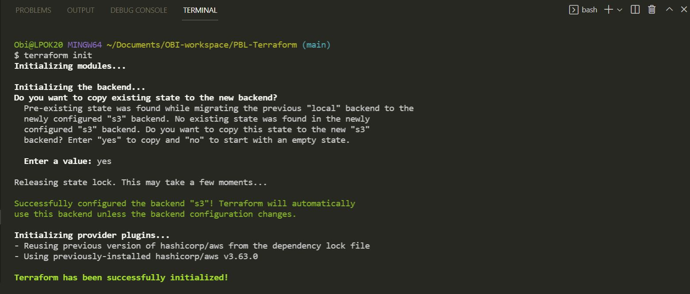
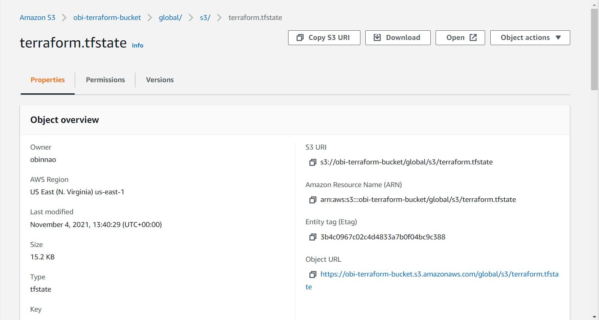
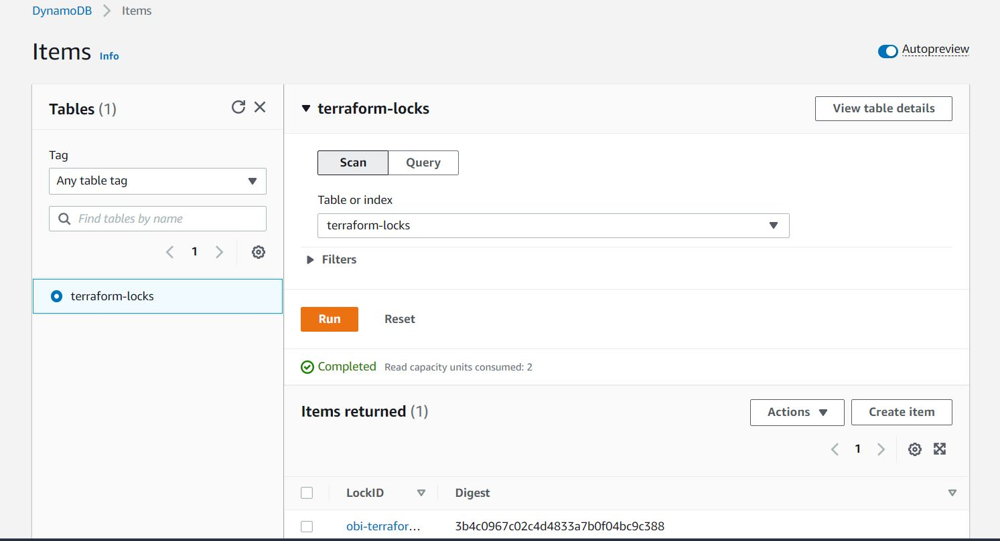
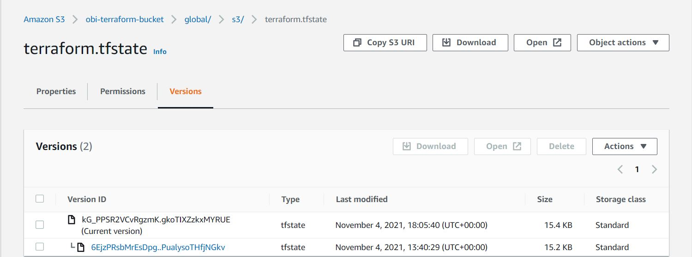
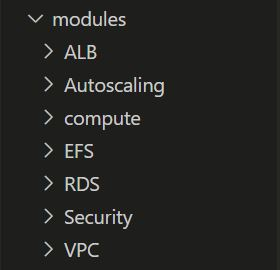
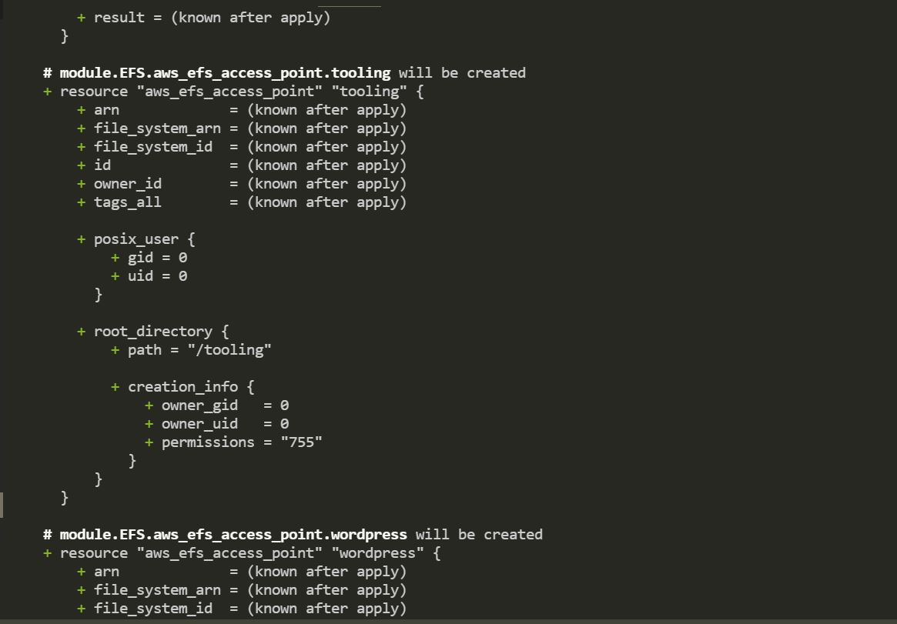
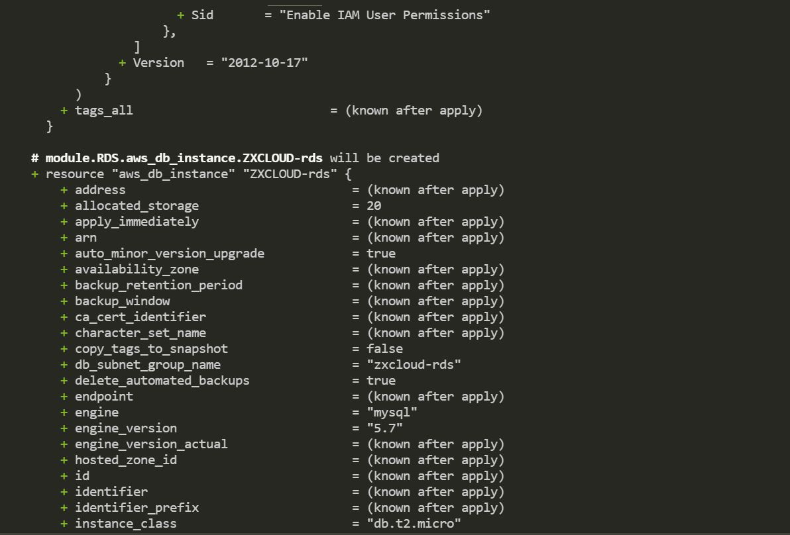
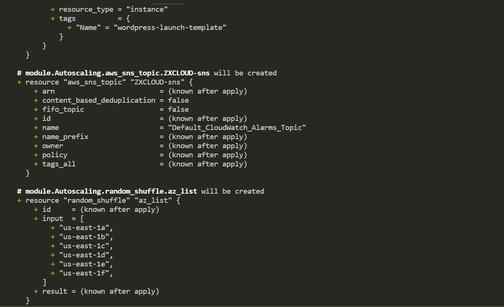
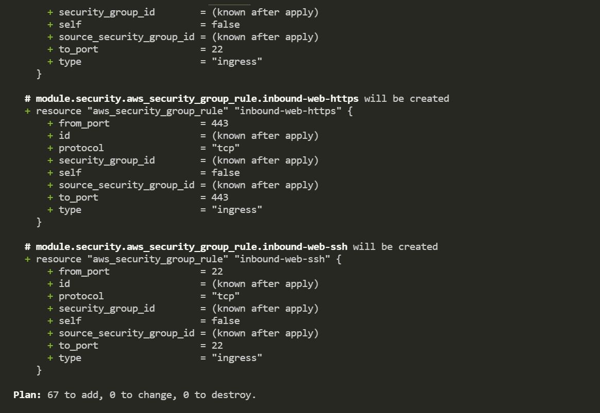

### AUTOMATE AWS INFRASTRUCTURE USING TERRAFORM PART 3 - REFACTORING

The main task of this project are :

1. Refactor terraform codes using modules. 

2. Introduce backend on S3 to store terraform states in the cloud. 

3. Introduced dynamo db to store lock files.

#### INTRODUCING BACKEND ON S3

By introducing a backend solution such as Amazon Simple Storage Service (Amazon S3), it means other members of the team can access the state file remotely instead of on a local workstation.

#### Configure S3

•	Add S3 and DynamoDB resource blocks before deleting the local state file

•	Update terraform block to introduce backend and locking

•	Re-initialize terraform

•	Delete the local tfstate file and check the one in S3 bucket

•	Add outputs

•	terraform apply

1.	Create a file and name it backend.tf. Added the code below and replaced the name of the S3 bucket 

        .# Note: The bucket name may not work for you since buckets are unique globally in AWS.

        resource "aws_s3_bucket" "terraform_state" {

        bucket = "dev-terraform-bucket"

        .# Enable versioning so we can see the full revision history of our state files

        versioning {

        enabled = true

        }

        .# Enable server-side encryption by default

        server_side_encryption_configuration {

        rule {

        apply_server_side_encryption_by_default {

        sse_algorithm = "AES256"

        }

        }

        }

        }

Terraform stores secret data in the state files. Passwords and secret keys are stored there. Therefore, it very important to enable encryption. This can be achieved by using server side encryption.

2.	Create a DynamoDB table to handle locks and perform consistency checks. In previous projects, locks were handled with a local file as shown in terraform.tfstate.lock.info. 

Thus, by deploying Amazon DynamoDB team members can access and manage the terraform database (auto-scaling, backup and restore running) running on a central location.

    resource "aws_dynamodb_table" "terraform_locks" {

    name         = "terraform-locks"

    billing_mode = "PAY_PER_REQUEST"

    hash_key     = "LockID"

    attribute {

    name = "LockID"

    type = "S"

    }

    }

#### Configure S3 backend

    terraform {

    backend "s3" {

    bucket         = "obi-terraform-bucket"

    key            = "global/s3/terraform.tfstate"

    region         = "us-east-1"

    dynamodb_table = "terraform-locks"

    encrypt        = true

    }

    }

Re-initialize the backend by running terraform init 
Terraform migrated existing state to the s3 backend (cloud)

#### S3 Bucket

#### DynamoDB table entry on AWS Console.

#### Terraform Output

 Added an output so that the S3 bucket Amazon Resource Names ARN and DynamoDB table name can be displayed.

Created a new file and named it output.tf and added the code below.

    output "s3_bucket_arn" {

    value       = aws_s3_bucket.terraform_state.arn

    description = "The ARN of the S3 bucket"

    }

    output "dynamodb_table_name" {

    value       = aws_dynamodb_table.terraform_locks.name

    description = "The name of the DynamoDB table"

    }

After running terraform apply, Terraform automatically read the latest state from the S3 bucket to determine the current state of the infrastructure.

The image below shows the different versions of my terraform.tfstate file in the S3 bucket.

### Terraform Modules

Modules serve as containers that logically group Terraform codes for similar resources in the same domain form example ALB, Network and Security. 

A root module can call other child modules and insert their configurations when applying Terraform config.

•	Created a modules directory in your root directory structure

•	Inside the modules directory, created directories for all the resources

•	Refactor each module to use variables

Repository containing my Terraform files: https://github.com/obi-0/Terraform-Project

Run terraform plan command to create AWS resources

