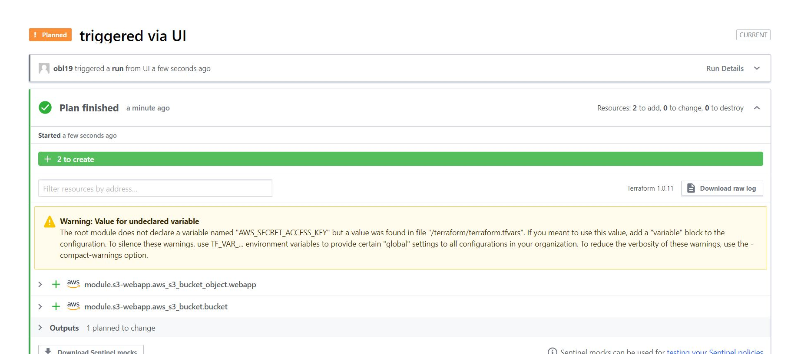

### TERRAFORM CLOUD

Terraform cloud is a software as a service (SaaS) managed by HashiCorp that saves and retrieves the state file from Terraform cloud.

We can provision infrastructure securely and reliably in the cloud with free remote stage storage.

### Migrate Terraform codes (.tf file) to Terraform Cloud

1.	Create a terraform cloud account via this link Terraform Cloud
2.	Create an organisation. Select "Start from Scratch", enter a name and email address then select Create organisation.

#### Create a new Workspace

•	Create a new GitHub repo that will contain .tf configuration

•	Push the files from the previous projects to the repository.

•	On Terraform Cloud, click create workspace.

•	Select "version control workflow".

•	Add the newly created repository.

•	Provide a description for your workspace and click "Create workspace".

#### Configure variables

Terraform Cloud supports two types of variables: environment variables and Terraform variables.

Setup 2 environment variables. In Workspace select ‘Add variable’ , select the ‘Environment variable’ radio button and then create variables for AWS_ACCESS_KEY_ID and AWS_SECRET_ACCESS_KEY 

Run terraform plan and terraform apply from web console

After plan run is complete, select "Confirm and Apply". 

Enter a comment then select "Confirm Plan".

When a file in the repository is edited, a plan run is automatically triggered.

### Practice Task 1

1.	Configure 3 branches in your terraform-cloud repository for dev, test, prod environments.

2.	Make necessary configuration to trigger runs automatically only for dev environment.

•	Create a new workspace, select "version control workflow".

•	Select "GitHub" as version control provider.

•	Select the repo containing .tf files.

•	Enter workspace name.

•	Click Advanced options, under VCS branch, enter the branch to be configured.

•	Select ‘Create Workspace’. 

•	Configure variables.

•	Click the Settings menu and select ‘Run Triggers’.

•	Select the workspace created previously.

3.	Create an Email and Slack notifications for certain events 

•	Click Settings, then select Notifications.

•	Click on the ‘Create a Notification’ button.

•	Select Email.

•	Enter a name for the notification.

•	Select notification recipients.

•	Under Triggers, cli.

•	Check the box required to get notified.

4. Apply destroy from Terraform Cloud web console

•	Choose Settings then select ‘Destruction and Deletion’.

•	Under ‘Manually destroy’ select ‘Queue destroy plan’.

•	Enter workspace name to confirm destroy plan, then select ‘Queue destroy plan’.

### Practice Task 2 Working with Private repository

#### Create a simple Terraform repository

•	Cloned this repository  https://github.com/hashicorp/learn-private-module-aws-s3-webapp

•	 Repository naming format should be terraform -< Provider>-< Name>

•	Click "Tag release" from the left pane.

•	Create a new release.

•	Select "Create a new release", and add 1.0.0 to the tag version field, and set the Release title.

•	Select "Publish release".

#### Import module into my private repository

•	On Terraform cloud UI, select the Registry menu.

•	 Click on ‘Add a VCS connection’. Select GitHub (Custom) when prompted.

•	Follow the outlined steps to setup Provider.

•	Select Connect and continue.

•	In the Registry menu, select  "Public private module".

•	Select the VCS configured and find the name of the module repository.

•	Select the module and click the "Publish module" button.

### Create a configuration for the module

•	Create main.tf, variables.tf and outputs.tf files.

•	Entered the code below into my main.tf file.

    terraform {

    required_providers {

    aws = {

    source = "ZCloud/aws"

    }

    }

    }

    provider "aws" {

    region = var.region

    }

    module "s3-webapp" {

    source  = "app.terraform.io/ZCloud/s3-webapp/aws"

    name   = var.name

    region = var.region

    prefix = var.prefix
    version = "1.0.0"

    }

Added the code below in my variables.tf file 

    variable "region" {
    description = "This is the cloud hosting region where your webapp will be deployed."
    }
    variable "prefix" {
    description = "This is the environment your webapp will be prefixed with. dev, qa, or prod"
    }
    variable "name" {
    description = "Your name to attach to the webapp address"
    }

Also added the code below to my outputs.tf file

    output "website_endpoint" {
    value = module.s3-webapp.endpoint
    }

### Create a workspace for the configuration

In Terraform Cloud, create a new workspace and choose your GitHub connection.

Terraform Cloud will display a list of GitHub repositories already setup. 

Filter by name to find and choose the root configuration repository, called learn-private-module-root.

Leave the workspace name and "Advanced options" unchanged, and click the purple "Create workspace" button to create the workspace.

Once configuration is uploaded successfully, select "Configure variables."

Added the three Terraform variables prefix, region and name. 

These variables correspond to the variables.tf file in your root module configuration and are necessary to create a unique S3 bucket name for your webapp. 

Added my AWS credentials as two environment
variables, AWS_ACCESS_KEY_ID and AWS_SECRET_ACCESS_KEY and marked them as sensitive.

### Deploy Infrastructure

Tested my deployment by queuing a plan in your Terraform Cloud UI.

### Destroy deployment

In the "Settings" menu select "Destruction and Deletion". 
Click the red "Queue destroy plan" button and run a destroy plan.

