    

## NGINX LOAD BALANCER SOLUTION

In this project, i registered a domain name and configured secured connection using SSL/TLS certificates and setup an NGINX Load balancer.

By implementing SSL/TLS solution, data transfer between a client(browser) and  web server over the internet is encrypted and thus secured.

### NGINX SSL/TLS ARCHITECTURE

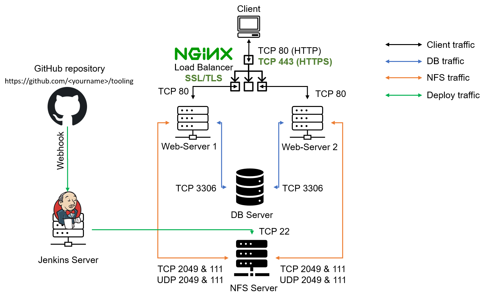

        
 ### Step 1 - Configure Nginx As A Load Balancer
    

1.	Launched an EC2 instance and setup Ubuntu Server 20.04 LTS. Opened port TCP 80 and TCP 443.

2.	Updated the /etc/hosts file for local DNS with Web Servers’ names for web1 and web2 servers and their local IP addresses.

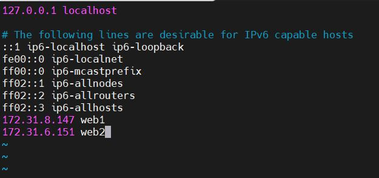

3. Installed and configured Nginx as a load balancer to direct traffic to the resolvable DNS names of the web servers

    Installed Nginx

    `sudo apt update`

    `sudo apt install nginx`

Configured Nginx LB using Web Servers’ names defined in /etc/nginx/nginx.conf

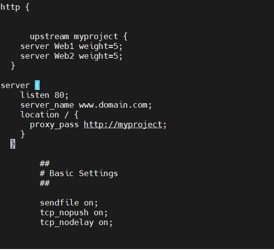

Restarted Nginx server and checked the status

`sudo systemctl restart nginx`

`sudo systemctl status nginx`

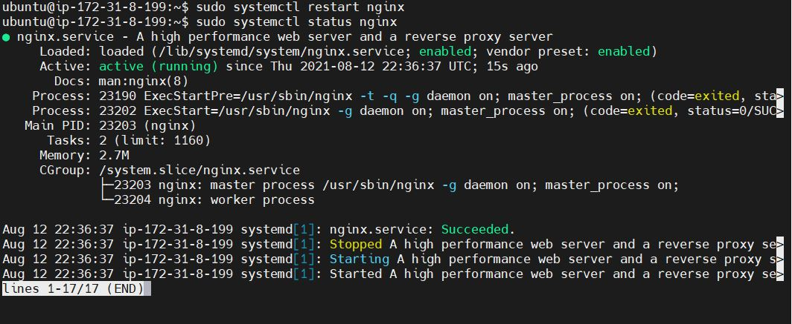

REGISTERED A DOMAIN NAME AND CONFIGURED SECURED CONNECTION USING SSL/TLS 
CERTIFICATES

To obtain a valid SSL certificate, I registered a domain name -  `toolingobx.co.uk`

Successfully allocated an elastic IP Address.

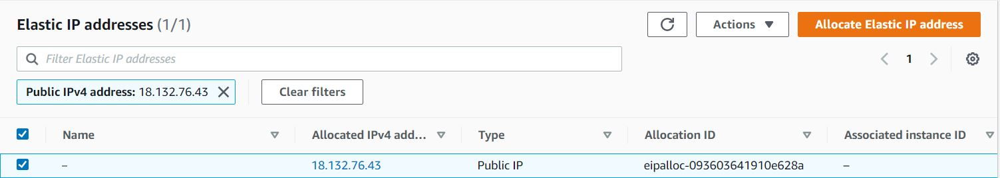

Associated Elastic IP address with my instance to enable communication with the internet.

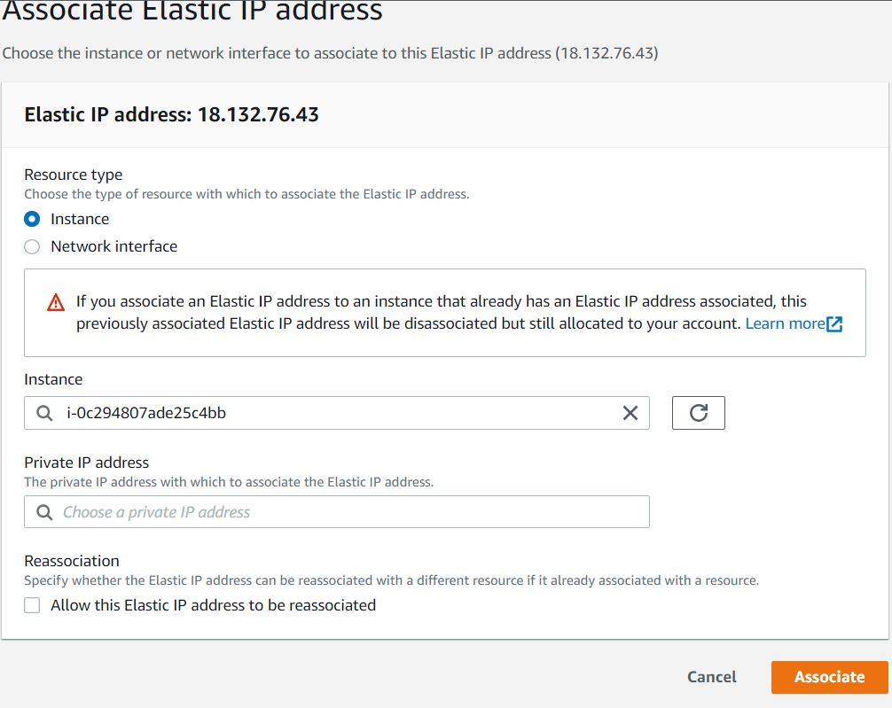

Updated A record in my domain registrar to point to Nginx LB using Elastic IP address.

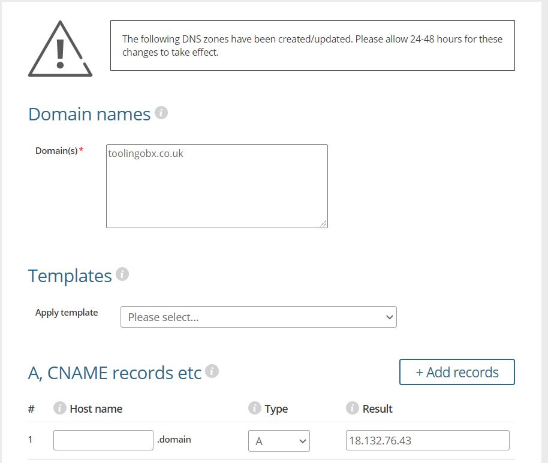

Configured Nginx to recognize my domain name

  I configured the Nginx load balancer using web server's name defined in /etc/hosts by editing Nginx configuration file -  /etc/nginx/nginx.conf

Verified that i can access my web server by accessing my domain name using HTTP protocol.

Checked the status of snapd

Snapd are app packages for desktop, cloud and IoT that update automatically, are easy to install, secure, cross-platform and dependency-free. 

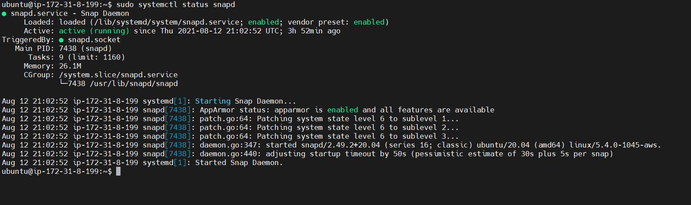

Installed certbot

Certbot is used to switch an existing HTTP site to work in HTTPS (and, afterward, to continue renewing the site's HTTPS certificates.

`sudo snap install --classic certbot`

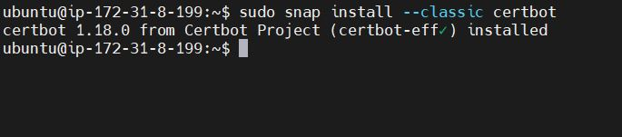

Request TSL certificate

Transport Layer Security (TLS) certificates, also known as Secure Sockets Layer (SSL), are essential to securing internet browser connections and transactions through data encryption.

`sudo ln -s /snap/bin/certbot /usr/bin/certbot`

`sudo certbot –nginx`

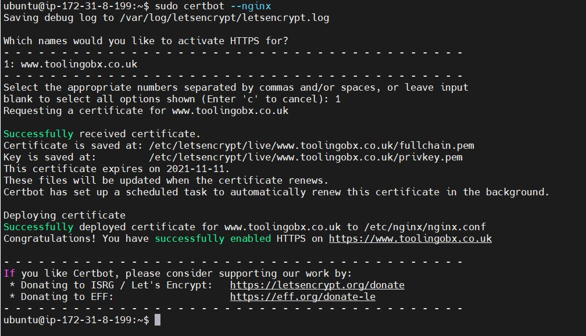

Tested secured access to my web domain using the HTTPS protocol.

Set up periodic renewal of my SSL/TLS certificate

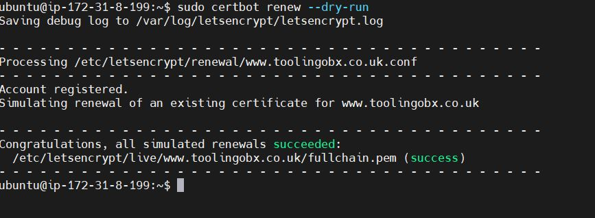

