### ANSIBLE – AUTOMATE PROJECT 7 to 10

The objective of this project is to Install and configure Ansible client to act as a Jump Server/Bastion Host and then setup a simple Ansible playbook to automate servers configuration

INSTALL AND CONFIGURE ANSIBLE 

1.	On my AWS EC2 instance changed the tag name for my Jenkins server to Jenkins-Ansible. The Ansible server will be used to run playbooks.

Playbooks record and execute Ansible’s configuration, deployment, and orchestration functions. They can describe a policy you want your remote systems to enforce or procedures in a general IT process.

2.	Created a repository on my GitHub account named ansible-config-mgt. The inventory and playbooks folders will be stored in this repository.

3.	Install Ansible

`sudo apt update`

         `sudo apt install ansible`

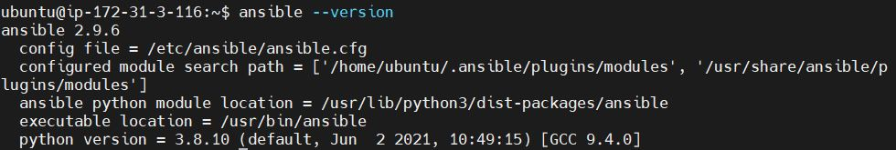

Configured Jenkins build job to save my repository content when a change is made.

Configured GitHub webhook to trigger a build in Jenkins

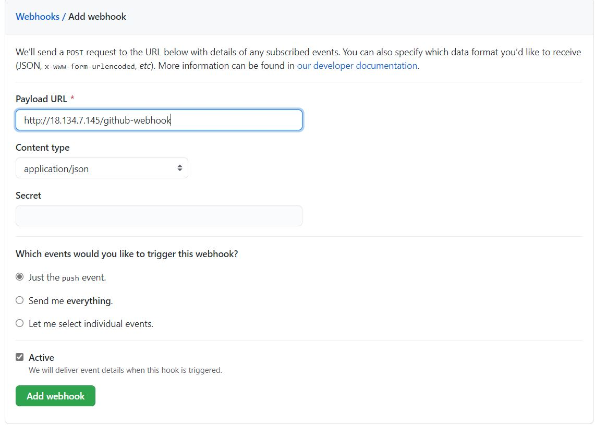

 
Created a freestyle project – ‘ansible’ on Jenkins

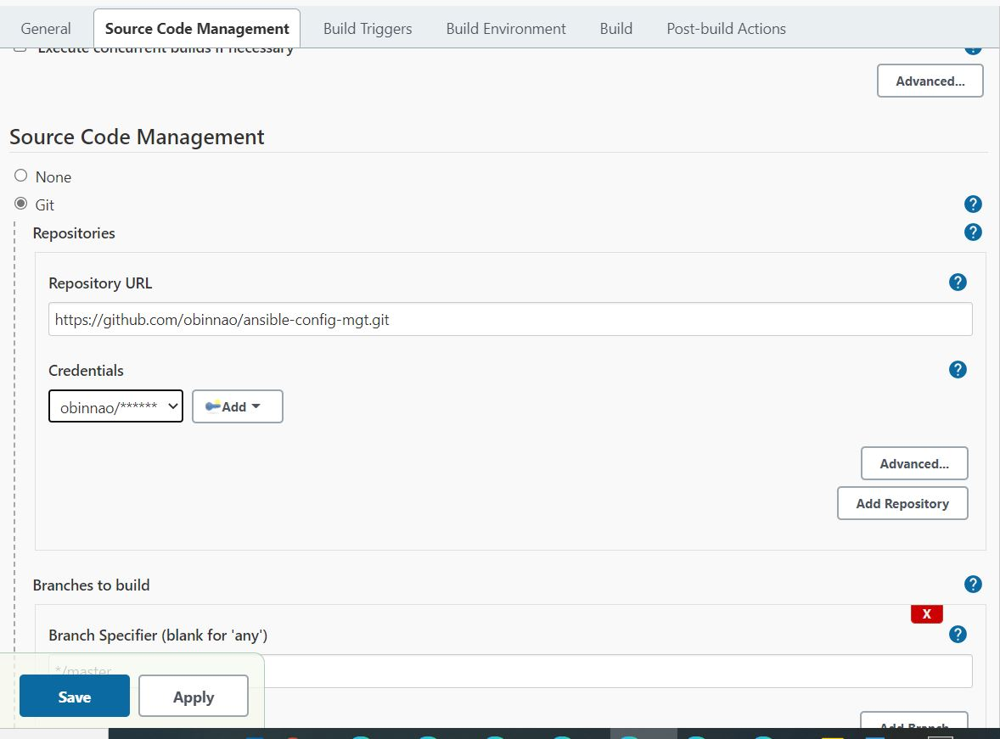

Configured a post build action to archive all the files.

Made changes to the README file in my repository and ‘commit changes’. This triggered a build and archived the build file in the location 

/var/lib/jenkins/jobs/ansible/builds/2/archive$

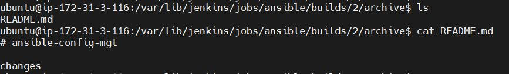

Current Ansible Architecture  

To ensure that the Jenkins IP Address remains when Jenkins EC2 instance is topped, I allocated an Elastic IP Address.

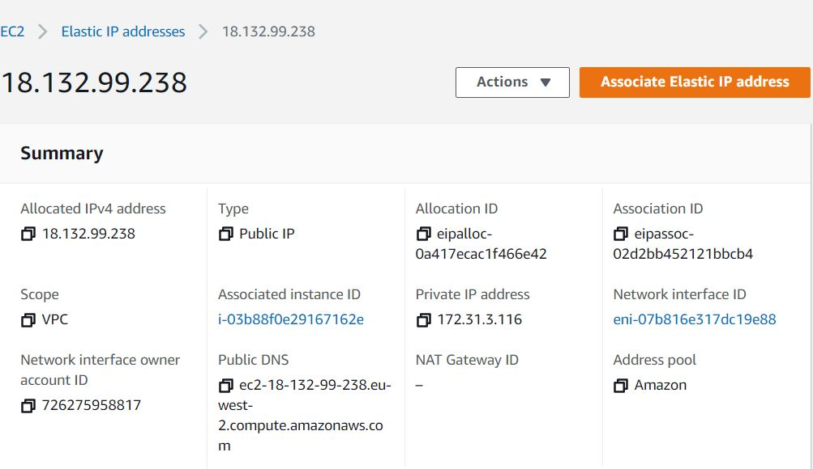

Setup my development environment using Visual Studio Code.

Setup an ssh connection to my Jenkins server from VS Code and cloned the ansible-config-mgt repository. 

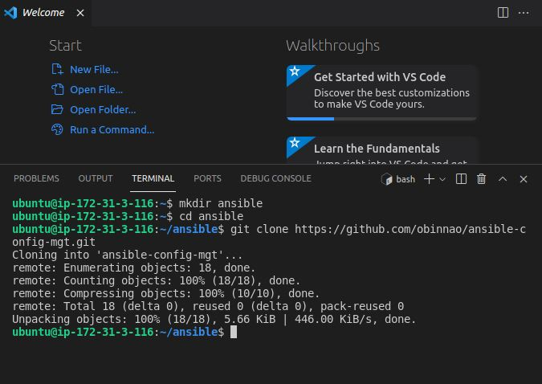

In my ‘ansible-config-mgt’ GitHub repository, I created a branch to be used for developing a new feature.

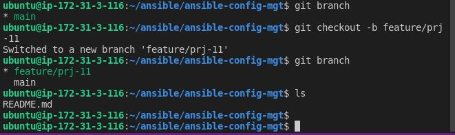

Created an inventory and playbooks directory. The playbooks and inventory folders will store playbook and inventory files respectively.

In the playbooks folder, created a playbook named ‘common.yml’

created an inventory file (.yml) for each environment (Development, Staging Testing and Production) dev, staging, uat and prod respectively.

The details of my group of host servers was added to my inventory/dev.yml file.

The details of my group of host servers was added to my inventory/dev.yml file.

[nfs]

172.31.13.5 ansible_ssh_private_key_file=/etc/ssh/ssh_rsa_key

[webservers]

172.31.8.147 ansible_ssh_private_key_file=/etc/ssh/ssh_rsa_key

172.31.6.151 ansible_ssh_private_key_file=/etc/ssh/ssh_rsa_key

[db]

172.31.14.19 ansible_ssh_private_key_file=/etc/ssh/ssh_rsa_key

[lb]

172.31.8.199 ansible_ssh_private_key_file=/etc/ssh/ssh_rsa_key

Ansible needs to ssh into target servers from Jenkins-Ansible host. Copied the private key (.pem) for the servers to the ansible server.
eval `ssh-agent -s`

ssh-add <path-to-private-key>

CREATE A COMMON PLAYBOOK

Entered the code below in playbooks/common.yml
This playbook is configured to install the latest version of wireshark on RHEL 8 (Web, NFS and Database servers) and Ubuntu (Load Balancer server). It uses root user to perform this task and respective package manager: yum for RHEL 8 and apt for Ubuntu.

---

- name: update web, nfs servers

  hosts: webservers, nfs

  remote_user: ec2-user

  become: yes

  become_user: root

  tasks:

    - name: ensure wireshark is at the latest version

      yum:

        name: wireshark

        state: latest

- name: update DB, LB server

  hosts: db, lb

  remote_user: ubuntu

  become: yes

  become_user: root

  tasks:

    - name: Update apt repo

      apt: 

        update_cache: yes

    - name: ensure wireshark is at the latest version

      apt:

        name: wireshark

        state: latest

 #### Updated GIT with the latest code

Entered the git command to add, commit and push branch to my GitHub repository.

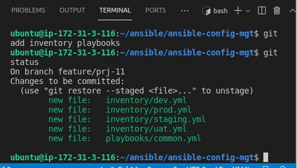

To push the current branch and set the remote as upstream, I ran command 

`git –set-upstream origin feature/prj-11`

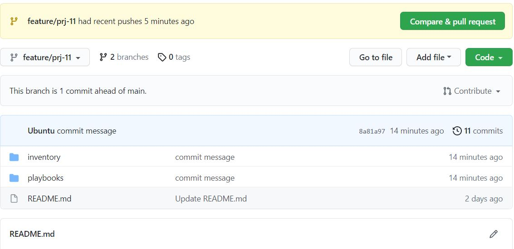

Created a pull request (PR) and merged the code to the master branch.

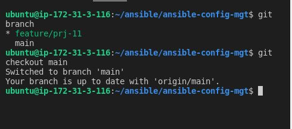

As shown below Jenkins saved all the files (build artifacts) after being triggered.

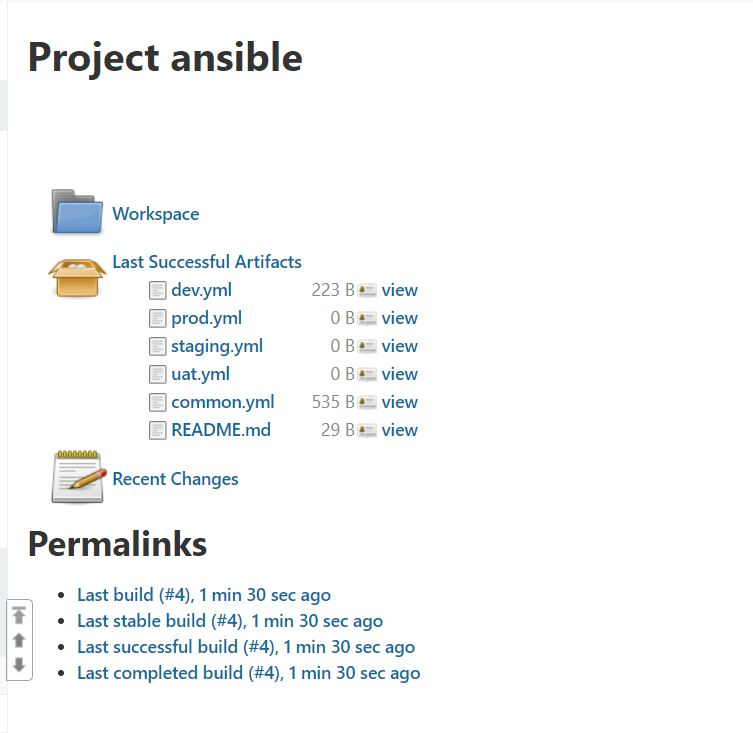

Run First Ansible Test

Executed ansible-playbook command 

`ansible-playbook -i /var/lib/jenkins/jobs/ansible/builds/<build-number>/archive/inventory/dev.yml /var/lib/jenkins/jobs/ansible/builds/<build-number>/archive/playbooks/common.yml`

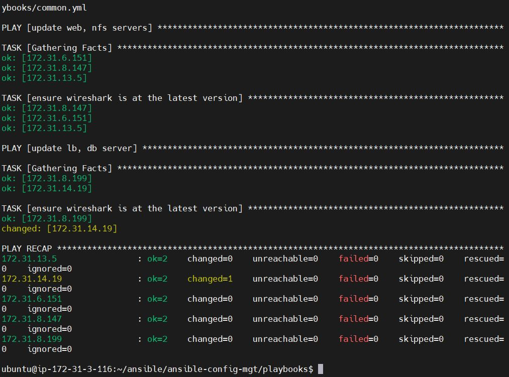

Wireshark was installed on target servers

Wireshark installed on Red Hat (RHEL 8) server

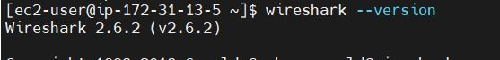

Wireshark installed on ubuntu server

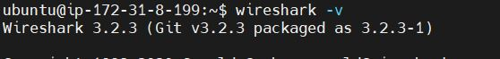

Updated Ansible Architecture 

