### ANSIBLE REFACTORING, ASSIGNMENTS AND IMPORTS

In this project I refactored my ansible code,  created assignments and used the imports functionality.

Imports functionality is used to re-use previously created playbooks in a new playbook. Imports is also used to organize tasks and reuse them when needed.

Code refactoring is the process of restructuring existing computer code without changing its external behavior.

Step 1 – Jenkins job enhancement

‘Copy Artifact’ plugin will be required to enhance job the new Jenkins job.

1.	 In Jenkins-Ansible server created a directory called ansible-config-artifact          artifacts will be stored in the directory after each build.

`sudo mkdir /home/ubuntu/ansible-config-artifact`

2.	Changed permissions on the directory, to allow  files to be saved there.

  `chmod -R 0777 /home/ubuntu/ansible-config-artifact`

3.	Installed copy artifact plugin in the Jenkins web console.
  
Manage Jenkins -> Manage Plugins -> on Available tab search  for Copy  Artifact and install this plugin without restarting Jenkins

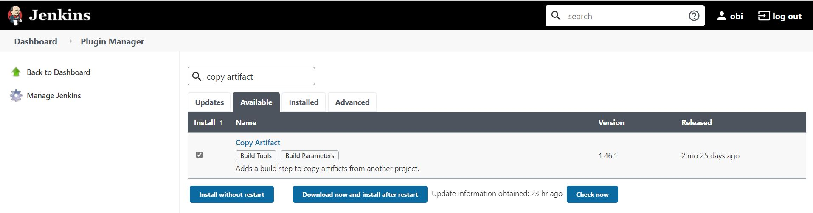

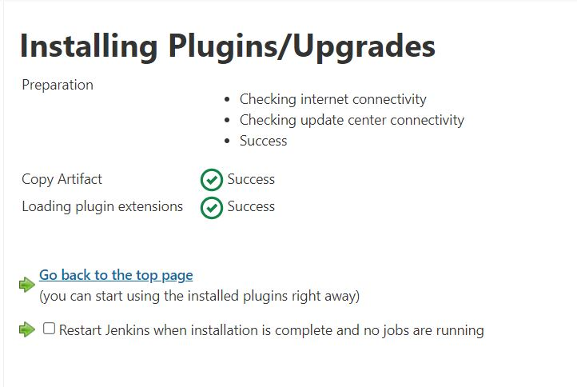

Created a freestyle project named ‘save_artifacts’.

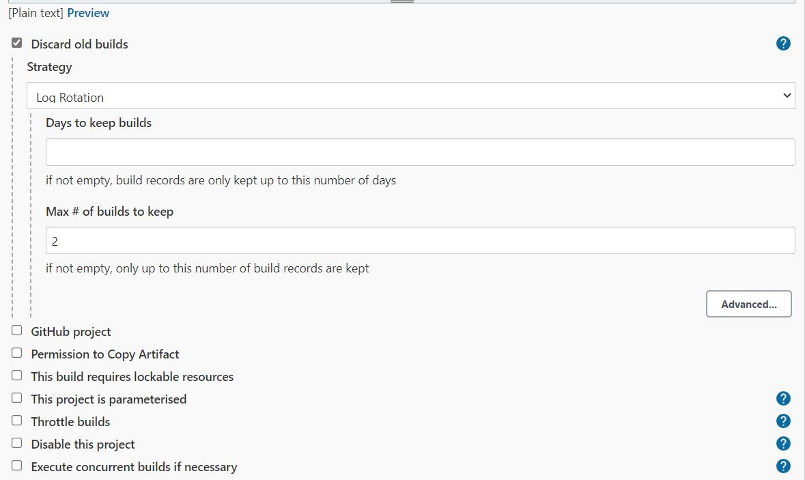

Tested my setup by making changes to the README.md file in my ansible_config_mgt repository. The ansible and save_artifacts projects were built.

REFACTOR ANSIBLE CODE BY IMPORTING OTHER PLAYBOOKS INTO SITE.YML

Step 2 – Refactor Ansible code by importing other playbooks into site.yml

In Project 11 i wrote all tasks in a single playbook common.yml, which is a simple set of instructions for only 2 types of OS. 

If we have many more tasks and need to apply this playbook to other servers with different requirements.

It means we will have to read through the whole playbook to check if all tasks written there are applicable and check if changes need to be made for some specific servers/OS families. 

Thus, arranging our tasks in different files is an excellent way to organize complex sets of tasks and reuse them.

•	In the playbooks folder, create a new file and name it ‘site.yml’ – This file will now be an entry point for the entire infrastructure configuration. 

Other playbooks files will be included here as a reference. In other words, ‘site.yml’ will become a parent to all other playbooks that will be developed.

•	Created a folder in the root of the repository and named it ‘static-assignments’. The static-assignments folder is where all other children playbooks will be stored.

•	Moved the common.yml file into the newly created static-assignments folder.

•	Imported common.yml playbook into site.yml file.

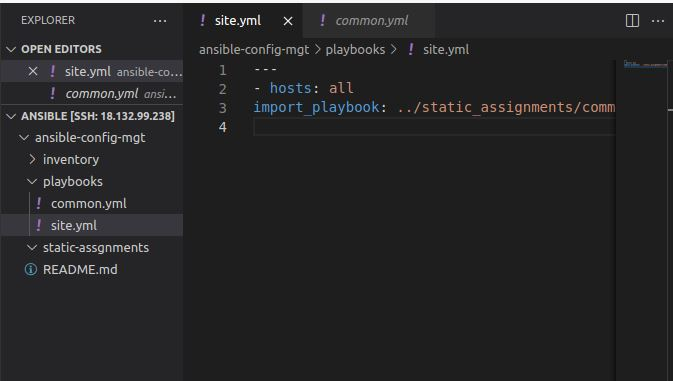

The above code uses the in-built import_playbook ansible module.

The folder structure:

├── static-assignments

│   └── common.yml

├── inventory

    └── dev
└── stage

    └── uat

    └── prod

└── playbooks

    └── site.yml

Created another playbook under static-assignments and named it common-del.yml

Configured playbook to delete the wireshark utility.

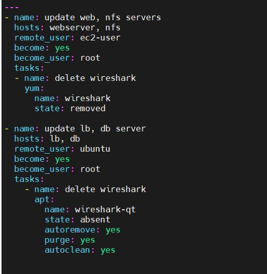

updated site.yml with - import_playbook: ../static-assignments/common-

del.yml instead of common.yml and ran it against dev servers:

`sudo ansible-playbook -i /home/ubuntu/ansible-config-mgt/inventory/dev.yml /home/ubuntu/ansible-config-mgt/playbooks/site.yaml`

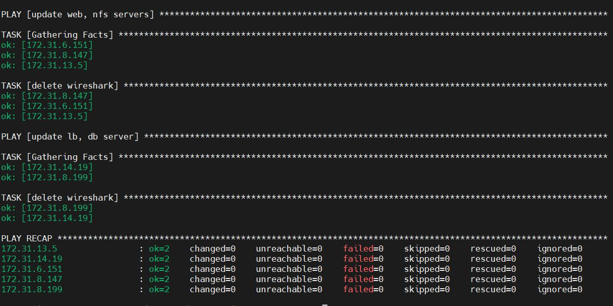

Wireshark deleted in RHEL and Ubuntu servers

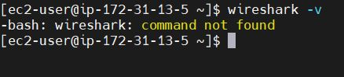

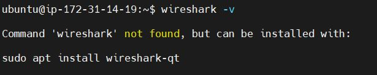

With this configuration, i have deleted packages on multiple servers with just one command.

### Step 3 – Configure UAT Web servers with a role ‘Webserver’

The next task is to configure 2 User Acceptance Testing servers (UAT).

1.	Launched 2 EC2 instances using RHEL 8 operating system. Server names are Web1-UAT and Web-2-UAT.
2.	Created a directory called roles/, relative to the playbook file.

Manually created the directory/file structure in VS Code as show below:

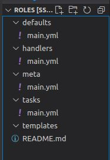

3.	Updated my inventory ansible-config-mgt/inventory/uat.yml file with the IP addresses of my two UAT Web servers

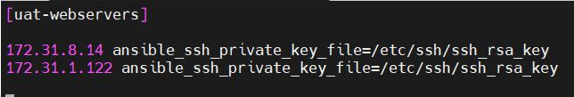

4.	In the /etc/ansible/ansible.cfg file uncomment roles_path string and provided a full path to my roles directory roles_path = /home/ubuntu/ansible-config-mgt/roles, so that ansible will know where to find configured roles.

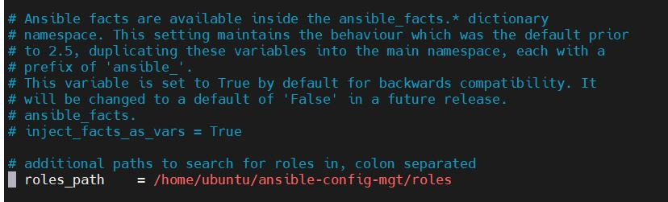

5.	Time to start adding some logic to the webserver role.
 
•	Installed and configure Apache (httpd service).

•	Cloned Tooling website from my GitHub repository

•	Deployed the tooling website code to /var/www/html to my UAT Web servers  

                
site.yaml playbook configuration:

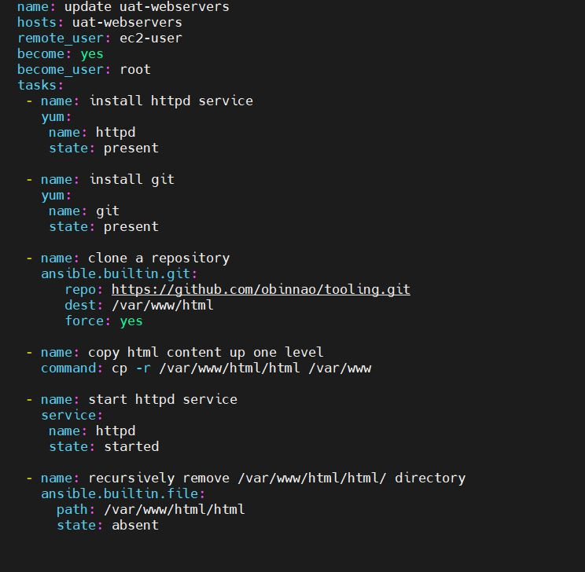

  ####  REFERENCE WEBSERVER ROLE

In the static-assignments folder, i created a new assignment for the uat-webservers `uat-webservers.yml`. 

This is where 'roles' will be referenced.

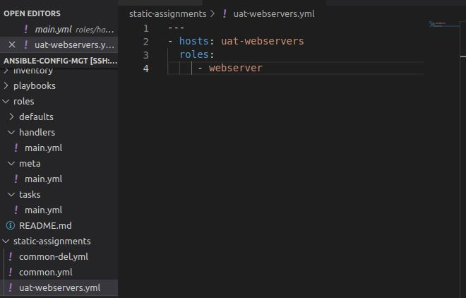

Since the site.yml file is the reference point to my ansible configuration, referenced the file in the site.yml configuration.

-hosts: uat-webservers

-import_playbook: ../static-assignments/uat-webservers.yml

### Step 5: Commit and Test

Committed the changes, created a pull request and merged them to main branch on GitHub repository.

Webhook triggered two consequent Jenkins jobs and copied the files to the Jenkins-Ansible server into the /home/ubuntu/ansible-config-artifact/ directory.

Ran the playbook against the uat inventory 

`sudo ansible-playbook -i /home/ubuntu/ansible-config-mgt/inventory/uat.yml /home/ubuntu/ansible-config-mgt/playbooks/site.yaml`

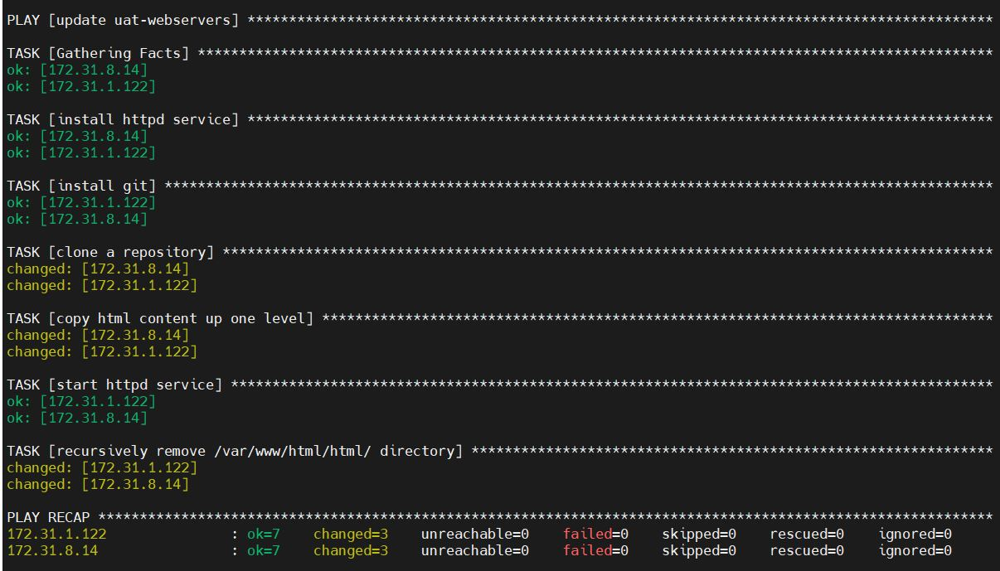

Opened TCP Port 80 on the UAT-Webservers ec2 instance, to allow access to the web servers public IP Address via the internet: http://18.170.50.58/index.php

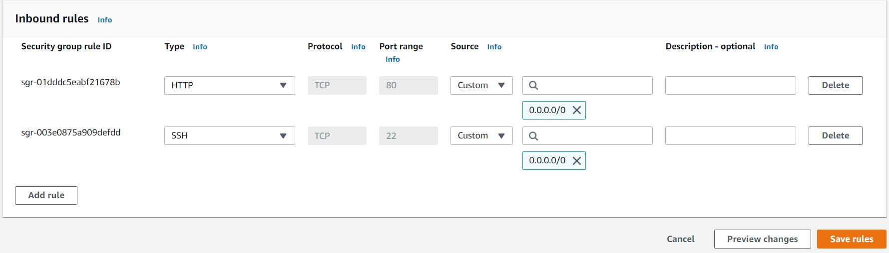

Ansible Architecture

