### ANSIBLE DYNAMIC ASSIGNMENTS (INCLUDE)

In this project, I continued with the configuration of my UAT-Webservers by using the ‘include’ module (dynamic assignments). The ‘include’ module enables the dynamic assignments.

The static assignments used in project 12 use the import module.

import = Static

include = Dynamic

 When the import module is used, all statements are pre-processed at the time playbooks are separated into easily processed components(parsed).
 
 Thus, when site.yml playbook is executed, Ansible will process all the playbooks referenced during the time it is parsing the statements.
This means if a statement changes during actual execution, it will not be considered.

On the other hand, when include module is used, all statements are processed only during execution of the playbook. Meaning, after the statements are parsed, any changes to the statements encountered during execution will be used.
Static assignments is recommended, since it is more reliable. 

However, dynamic assignments can be used in environment specific variables which I used in this project.

### Introducing Dynamic Assignment 

Created a branch and named it ‘dynamic-assignments’ in my GitHub repository.

Created a directory ‘dynamic-assignments’. Inside the folder, i created a file - ‘env-vars.yml’

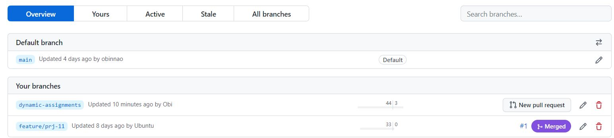

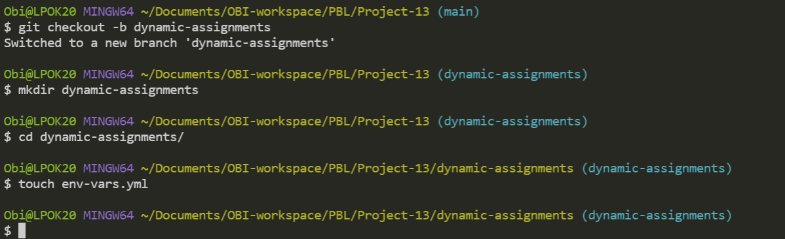

 Created a folder ‘env-vars’. Inside the folder, created new YAML for each environment – dev, prod, stage and uat. This will be used to set variables.

The folder structure now looks like this.

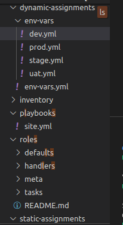

Entered the code below into env-vars.yml file.

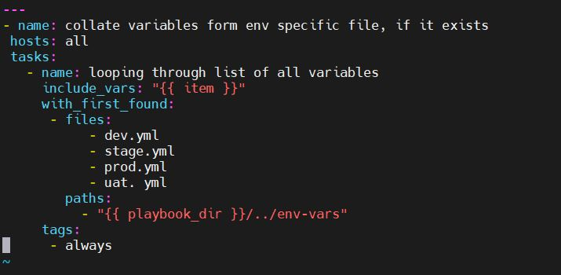

The env-vars.yml playbook loops through the variables in the env-vars folder using the include_vars and with_first_found modules.

{ playbook_dir     allows ansible to determine the location of the running playbook, and is able to navigate to other path on the filesystem. 

{ inventory_file }dynamically resolve to the name of the inventory file being used, then append .yml so that it picks up the required file within the env-vars folder.

### Update site.yml with dynamic assignments

Updated site.yml file to make use of the dynamic assignment. 

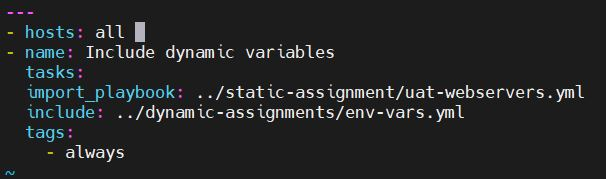

               Community Roles

Created a role for MySQL database. Created a database and configured users. 

Disabled webhook and Jenkins jobs, since it is not no longer required to update codes on the Jenkins-Ansible server.

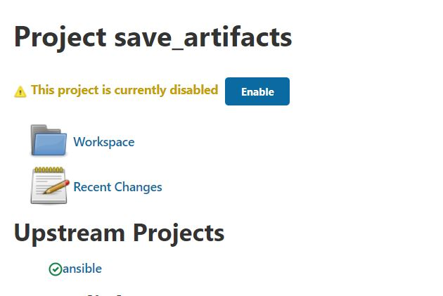

Downloaded and installed MySQL role developed by geerlingguy as shown in the screenshot below.

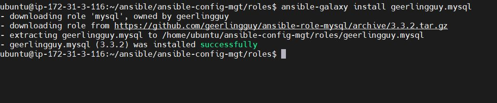

Using the information in the README.md file, edited ‘roles’ configuration to use correct credentials for MySQL required for the tooling website.

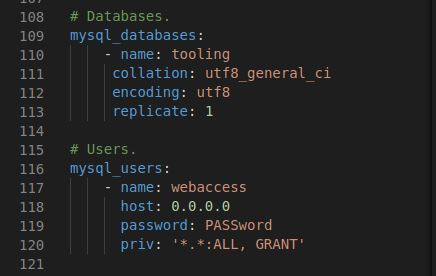

Updated `site.yml` and static-assignments files

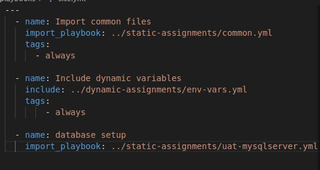

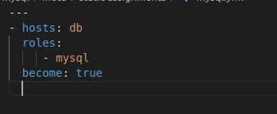

### LOAD BALANCER ROLES

Installed apache and nginx, so i can choose which load balancer to use based on ‘roles’.

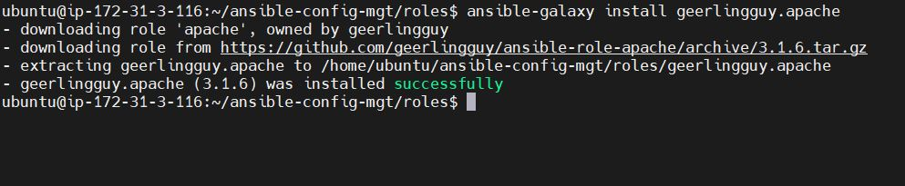

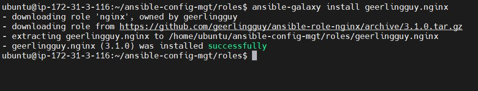

Configured the Nginx and Apache LB roles following the instructions in the README.md file for each role.

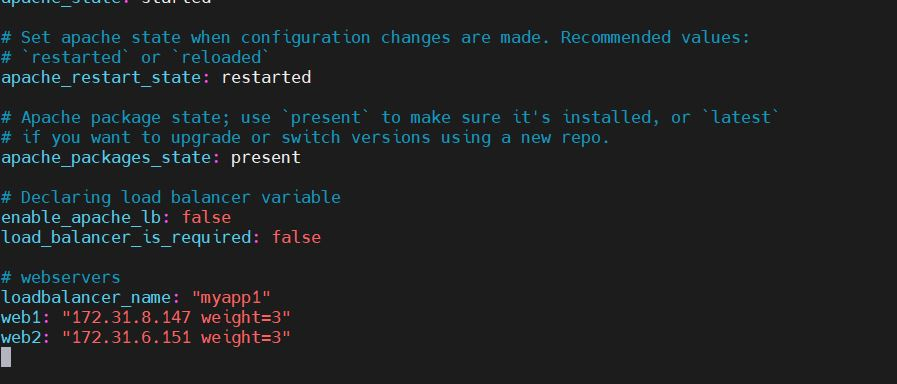

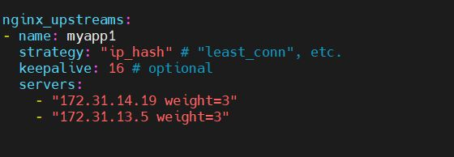

Since I can’t use nginx and apache load balancer simultaneously, I added a condition to enable one of them by making use of variables.

I declared a variable in ‘defaults > main.yml’ file in the nginx and apache ‘roles’. Named the variables ‘enable_nginx_lb’ and ‘enable_apache_lb’ respectively.

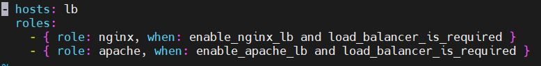

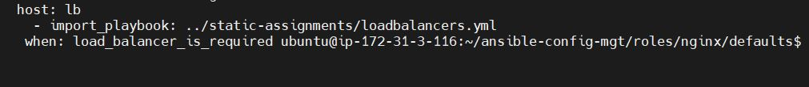

Activated load balancer and enabled nginx by setting the configuration below in the respective environment’s env-vars file.

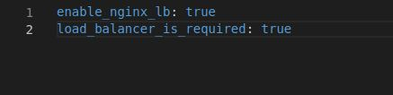

 Updated inventory for each environment and ran ansible for each environment. 

`ansible-playbook -i inventory/uat playbook/site.yml`

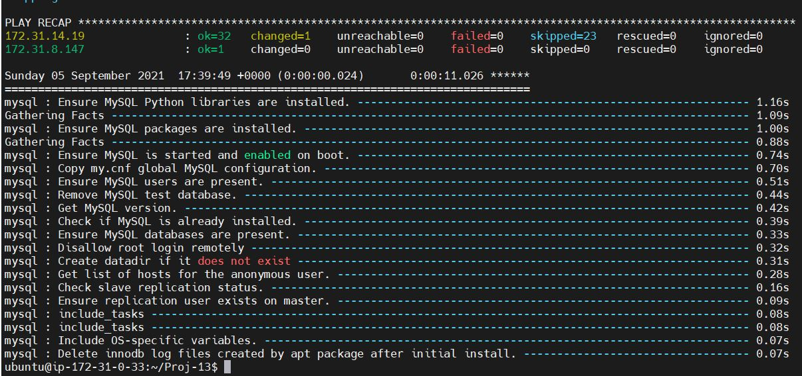

The skipped part of the play is for the apache load balancer which is disabled.