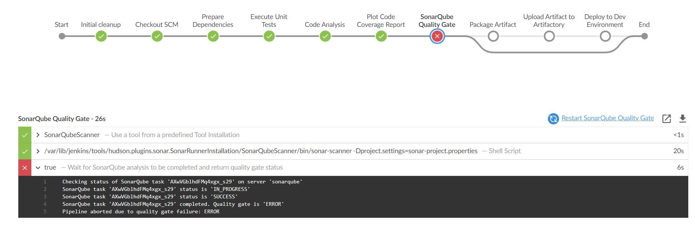

### CONTINUOUS INTEGRATION WITH JENKINS | ANSIBLE | ARTIFACTORY | SONARQUBE | PHP

Implemented a full-scale CI/CD pipeline with combination of various technologies. 
While implementing this project, I had a better understanding of DevOps terminologies and success metrics required to measure and constantly improve. Explore new instruments such as: artifact repository, quality analytics & assurance and pentest tools.

### Configure Ansible For Jenkins Deployment

In my previous projects, I launched ansible manually from a command line interface (CLI). We can now start running ansible from a Jenkins user interface (UI).

To do this

1.	Signed into Jenkins URL : http://<public-ip-address>:8080
2.	Install & Open Blue Ocean Jenkins Plugin
           

3.	Create a new pipeline

Select GitHub and signed in with my GitHub account to retrieve token.

Click on Administration to exit the Blue Ocean console.

Added the code below to start building the ‘Jenkinsfile’. This pipeline currently has just one stage called Build. The shell script module is used to echo the Building Stage.

A Jenkinsfile is a text file that contains the definition of a Jenkins Pipeline and is checked into source control.

In Blue Ocean the Jenkinsfile has completed the build stage.

When Jenkins scans the repository it will trigger a build for each branch. 

I created a new branch and named it ‘feature/jenkinspipeline-stages’

Added another stage called Test in addition to the Build stage as shown in the code below:

pipeline {

    agent any

  stages {

    stage('Build') {
      steps {
        script {
          sh 'echo "Building Stage"'
        }
      }
    }

    stage('Test') {
      steps {
        script {
          sh 'echo "Testing Stage"'
        }
      }
    }
    }

Refreshed the page and both branches will starts building.

In the Blue Ocean the Testing Stage is complete

Quick Task

Merged branch ‘feature/jenkinspipeline-stages’ with the main branch

4.	Add 3 more Stages to the Jenkinsfile 

1.	Package
2.	Deploy
3.	Clean up
   
Updated the Jenkisfile to run the package, deploy and clean up stages:

Scanned Repository in the ansible-config and then verified in Open Blue Ocean that all stages are working as shown below:

Running Ansible Playbook from Jenkins

Installed ansible and ansible dependencies:

•	python3 -m pip install --upgrade setuptools

•	python3 -m pip install --upgrade pip

•	python3 -m pip install PyMySQL

•	python3 -m pip install mysql-connector-python

•	python3 -m pip install psycopg2==2.7.5 --ignore-installed

ansible galaxy collection install community.postgresql

Installed ansible plugin in Jenkins user interface.

Create Jenkinsfile from scratch (delete all the current stages in the file)

Since Jenkins will run the playbook it needs to access the ec2 instances. Setup ssh private key by configuring global credentials in Jenkins UI.

In the Jenkins dashboard opened Blue Ocean to trigger a build against the branch, which yielded the outcome below.

Parametrizing Jenkinsfile for Ansible Deployment

Parameters are used to deploy to other environments.

1.	Update Jenkinsfile to introduce parameterization.

pipeline {

  agent any

  parameters {

    string(name: 'inventory', defaultValue: 'dev',

      description: 'This is the inventory file for 

      the environment to deploy configuration')
  }
...

2.	In the Ansible execution section, remove the hardcoded inventory/dev and replace with `${inventory}

Thus, when the ‘play’ button is selected an ‘Input Required’ box appears requesting for environment we want to deploy the configuration to.

#### CI/CD Pipeline for TODO application

The objective of this exercise is to deploy the application onto servers directly from Artifactory rather than from git.

Phase 1: Prepare Jenkins

1. Fork the repository below into your GitHub account

 https://github.com/darey-devops/php-todo.git

2.	Installed PHP and its dependencies

•	`yum module reset php -y`

•	`yum module enable php:remi-7.4 -y`

•	`yum install -y php php-common php-mbstring php-opcache php-intl php-xml php-gd php-curl php-mysqlnd php-fpm php-json`

•	`systemctl start php-fpm`

•	`systemctl enable php-fpm`

Installed Composer tool 
`curl -sS https://getcomposer.org/installer | php`

`sudo mv composer.phar /usr/bin/composer`

3.	Launched a new ec2 instance to install Artifactory server

4.	Install Jenkins plugins Plot plugin and Artifactory plugin

Plot plugin will be used to display tests reports, and code coverage information.

Artifactory plugin will be used to easily upload code artifacts into an Artifactory server.

Configured Artifactory in Jenkins UI

•	Click Manage Jenkins, click Configure System

•	Scroll down to JFrog, click Add Artifactory Server

•	Enter the Server ID

•	Enter URL as:
   http://< Artifactory-Public-IP >:8081

Configured Artifactory in Jenkins UI

PHASE 2 – INTEGRATE ARTIFACTORY REPOSITORY WITH JENKINS
Phase 2 – Integrate Artifactory repository with Jenkins
1.	Create a Jenkinsfile in the php-todo repository 
2.	Using Blue Ocean, create a multibranch Jenkins pipeline
3.	On the database server, create database and user
                 
                  `Create database homestead;

           CREATE USER 'homestead'@'%' IDENTIFIED BY 'sePret^i';

                GRANT ALL PRIVILEGES ON * . * TO 'homestead'@'%';`

4.	Update the database connectivity requirements in the file .env.sample

5.	Updated Jenkinsfile with proper pipeline configuration

`stages {`

 `stage("Initial cleanup") {`

      steps {

        dir("${WORKSPACE}") {

          deleteDir()
        }
      }
    }

`stage('Checkout SCM') 
{`

  `steps {`

        git branch: 'main', url: 'https://github.com/darey-devops/php-todo.git'
  `}`

`}`

stage('Prepare Dependencies') {
  steps {
         sh 'mv .env.sample .env'

         sh 'composer install'

         sh 'php artisan migrate'

         sh 'php artisan db:seed'

         sh 'php artisan key:generate'
   `}`

  `}`

`}`

`}`                                                                                                                                                 

Installed mysql client on the Jenkins server, so that the server can communicate with database server - `sudo yum install mysql`

In the database server, changed the bind address from 127.0.0.0 to 0.0.0.0 in the configuration file.

The php-todo pipeline

 
 

Updated the Jenkinsfile to include the Unit tests

    stage('Execute Unit Tests') {

      steps {

             sh './vendor/bin/phpunit'

      }` 

 

         
         

Resolved this by installing php-unit and phploc globally.

•	sudo dnf --enablerepo=remi install php-phpunit-phploc

•	wget -O phpunit https://phar.phpunit.de/phpunit-7.phar

•	chmod +x phpunit

•	sudo yum install php-xdebug

  #### Phase 3 – Code Quality Analysis

For PHP the most commonly tool used for code quality analysis is phploc.

The data produced by phploc can be ploted onto graphs in Jenkins.

1.	Add the code analysis step in Jenkinsfile. The output of the data will be saved in build/logs/phploc.csv file.

`stage('Code Analysis') {`

  `steps {`

        sh 'phploc app/ --log-csv build/logs/phploc.csv'

   `}`

`}`

2.	Plot the data using plot Jenkins plugin.

•	 Installed php-loc and dependencies – 
`sudo dnf --enablerepo=remi install php-phpunit-phploc`

Copied the code below to the Jenkinsfile

 `stage('Plot Code Coverage Report') {
    steps {

          plot csvFileName: 'plot-396c4a6b-b573-41e5-85d8-73613b2ffffb.csv', csvSeries: [[displayTableFlag: false, exclusionValues: 'Lines of Code (LOC),Comment Lines of Code (CLOC),Non-Comment Lines of Code (NCLOC),Logical Lines of Code (LLOC)                          ', file: 'build/logs/phploc.csv', inclusionFlag: 'INCLUDE_BY_STRING', url: '']], group: 'phploc', numBuilds: '100', style: 'line', title: 'A - Lines of code', yaxis: 'Lines of Code'
          plot csvFileName: 'plot-396c4a6b-b573-41e5-85d8-73613b2ffffb.csv', csvSeries: [[displayTableFlag: false, exclusionValues: 'Directories,Files,Namespaces', file: 'build/logs/phploc.csv', inclusionFlag: 'INCLUDE_BY_STRING', url: '']], group: 'phploc', numBuilds: '100', style: 'line', title: 'B - Structures Containers', yaxis: 'Count'
          plot csvFileName: 'plot-396c4a6b-b573-41e5-85d8-73613b2ffffb.csv', csvSeries: [[displayTableFlag: false, exclusionValues: 'Average Class Length (LLOC),Average Method Length (LLOC),Average Function Length (LLOC)', file: 'build/logs/phploc.csv', inclusionFlag: 'INCLUDE_BY_STRING', url: '']], group: 'phploc', numBuilds: '100', style: 'line', title: 'C - Average Length', yaxis: 'Average Lines of Code'
          plot csvFileName: 'plot-396c4a6b-b573-41e5-85d8-73613b2ffffb.csv', csvSeries: [[displayTableFlag: false, exclusionValues: 'Cyclomatic Complexity / Lines of Code,Cyclomatic Complexity / Number of Methods ', file: 'build/logs/phploc.csv', inclusionFlag: 'INCLUDE_BY_STRING', url: '']], group: 'phploc', numBuilds: '100', style: 'line', title: 'D - Relative Cyclomatic Complexity', yaxis: 'Cyclomatic Complexity by Structure'      
          plot csvFileName: 'plot-396c4a6b-b573-41e5-85d8-73613b2ffffb.csv', csvSeries: [[displayTableFlag: false, exclusionValues: 'Classes,Abstract Classes,Concrete Classes', file: 'build/logs/phploc.csv', inclusionFlag: 'INCLUDE_BY_STRING', url: '']], group: 'phploc', numBuilds: '100', style: 'line', title: 'E - Types of Classes', yaxis: 'Count'
          plot csvFileName: 'plot-396c4a6b-b573-41e5-85d8-73613b2ffffb.csv', csvSeries: [[displayTableFlag: false, exclusionValues: 'Methods,Non-Static Methods,Static Methods,Public Methods,Non-Public Methods', file: 'build/logs/phploc.csv', inclusionFlag: 'INCLUDE_BY_STRING', url: '']], group: 'phploc', numBuilds: '100', style: 'line', title: 'F - Types of Methods', yaxis: 'Count'
          plot csvFileName: 'plot-396c4a6b-b573-41e5-85d8-73613b2ffffb.csv', csvSeries: [[displayTableFlag: false, exclusionValues: 'Constants,Global Constants,Class Constants', file: 'build/logs/phploc.csv', inclusionFlag: 'INCLUDE_BY_STRING', url: '']], group: 'phploc', numBuilds: '100', style: 'line', title: 'G - Types of Constants', yaxis: 'Count'
          plot csvFileName: 'plot-396c4a6b-b573-41e5-85d8-73613b2ffffb.csv', csvSeries: [[displayTableFlag: false, exclusionValues: 'Test Classes,Test Methods', file: 'build/logs/phploc.csv', inclusionFlag: 'INCLUDE_BY_STRING', url: '']], group: 'phploc', numBuilds: '100', style: 'line', title: 'I - Testing', yaxis: 'Count'
          plot csvFileName: 'plot-396c4a6b-b573-41e5-85d8-73613b2ffffb.csv', csvSeries: [[displayTableFlag: false, exclusionValues: 'Logical Lines of Code (LLOC),Classes Length (LLOC),Functions Length (LLOC),LLOC outside functions or classes ', file: 'build/logs/phploc.csv', inclusionFlag: 'INCLUDE_BY_STRING', url: '']], group: 'phploc', numBuilds: '100', style: 'line', title: 'AB - Code Structure by Logical Lines of Code', yaxis: 'Logical Lines of Code'
          plot csvFileName: 'plot-396c4a6b-b573-41e5-85d8-73613b2ffffb.csv', csvSeries: [[displayTableFlag: false, exclusionValues: 'Functions,Named Functions,Anonymous Functions', file: 'build/logs/phploc.csv', inclusionFlag: 'INCLUDE_BY_STRING', url: '']], group: 'phploc', numBuilds: '100', style: 'line', title: 'H - Types of Functions', yaxis: 'Count'
          plot csvFileName: 'plot-396c4a6b-b573-41e5-85d8-73613b2ffffb.csv', csvSeries: [[displayTableFlag: false, exclusionValues: 'Interfaces,Traits,Classes,Methods,Functions,Constants', file: 'build/logs/phploc.csv', inclusionFlag: 'INCLUDE_BY_STRING', url: '']], group: 'phploc', numBuilds: '100', style: 'line', title: 'BB - Structure Objects', yaxis: 'Count'
        }
      }`

On the Jenkins Dashboard- main select the Plot menu

 

3.	Package the artifact as shown in the code below. Installed zip before packaging - `sudo yum install zip`

`stage ('Package Artifact') {`

    steps {

            sh 'zip -qr ${WORKSPACE}/php-todo.zip ${WORKSPACE}/*'

`}`

4.	Publish the artifact in Artifactory

`stage ('Package Artifact') {`

steps {
        sh 'zip -qr php-todo.zip ${WORKSPACE}/*'
 }

`}`

`stage ('Upload Artifact to Artifactory') {`

      steps {

        script { 
             def server = Artifactory.server 'artifactory-server'   
              
             def uploadSpec = """{

                "files": [

                  {
                   "pattern": "php-todo.zip",

                   "target": "PBL/php-todo",

                   "props": "type=zip;status=ready"

                   }
                ]
             }""" 

             server.upload spec: uploadSpec
           }
        }

    }

5.	Deploy the application to the dev environment by launching Ansible pipeline

`stage ('Deploy to Dev Environment') {`

    steps {

    build job: 'ansible-config/main', parameters: [[$class:   

  `'StringParameterValue', name: 'env', value: 'dev']], propagate: false,`

 `wait: true`

    }

  }`

 
 Artifact was published in Artfactory

 

5.	Deploy the application to the dev environment by launching Ansible pipeline
 

 

### Configure SonarQube

SonarQube is a tool that can be used to create quality gates for software projects.

 In this project we will use predefined Quality Gates (also known as The Sonar Way).

SonarQube is used for continuous inspection of code quality to perform automatic reviews with static analysis of code to detect bugs, code smells, and security vulnerabilities.

Instaledl SonarQube on Ubuntu 20.04 ec2 instance with PostgreSQL as Backend Database.
 
Tune Linux Kernel

sudo sysctl -w vm.max_map_count=262144

sudo sysctl -w fs.file-max=65536

ulimit -n 65536

ulimit -u 4096

This change does not persist after server is restarted.

To make a permanent change, edited the file /etc/security/limits.conf and append the below
		

sonarqube   -   nofile   65536

sonarqube   -   nproc    4096

Update and upgrade system packages

sudo apt-get update

sudo apt-get upgrade

Install wget and unzip packages

sudo apt-get install wget unzip -y

Install OpenJDK and Java Runtime Environment (JRE) 11

 sudo apt-get install openjdk-11-jdk -y

 sudo apt-get install openjdk-11-jre -y

To set default JDK or switch to OpenJDK entered below command:

 sudo update-alternatives --config java

Verify the set JAVA Version:

java -version

Output

openjdk version "11.0.11" 2021-04-20

OpenJDK Runtime Environment (build 11.0.11

+9-Ubuntu-0ubuntu2.20.04)

OpenJDK 64-Bit Server VM (build 11.0.11

+9-Ubuntu-0ubuntu2.20.04, mixed mode, sharing)

INSTALL AND SETUP POSTGRESQL 10 DATABASE FOR SONARQUBE

Install and Setup PostgreSQL 10 Database for SonarQube

The command below will add PostgreSQL repo to the repo list:

sudo sh -c 'echo "deb http://apt.postgresql.org/pub/repos/apt/ `lsb_release -cs`-pgdg main" >> /etc/apt/sources.list.d/pgdg.list'

Download PostgreSQL software

wget -q https://www.postgresql.org/media/keys/ACCC4CF8.asc -O - | sudo apt-key add -
Install PostgreSQL Database Server

sudo apt-get -y install postgresql postgresql-contrib

Start PostgreSQL Database Server

sudo systemctl start postgresql

Enable it to start automatically at boot time

sudo systemctl enable postgresql

Change the password for default postgres user (Pass in the password you intend to use, and remember to save it somewhere)

sudo passwd postgres

Switch to the postgres user

su - postgres

Create a new user by typing

createuser sonar

Switch to the PostgreSQL shell

psql

Set a password for the newly created user for SonarQube database

ALTER USER sonar WITH ENCRYPTED password 'sonar';

Create a new database for PostgreSQL database by running:

CREATE DATABASE sonarqube OWNER sonar;

Grant all privileges to sonar user on sonarqube Database.

grant all privileges on DATABASE sonarqube to sonar;
Exit from the psql shell:

\q

Switch back to the sudo user by running the exit command.

exit

Install SonarQube on Ubuntu 20.04 LTS

Navigate to the tmp directory to temporarily download the installation files

cd /tmp && sudo wget https://binaries.sonarsource.com/Distribution/sonarqube/sonarqube-7.9.3.zip

Unzip the archive setup to /opt directory

sudo unzip sonarqube-7.9.3.zip -d /opt

Move extracted setup to /opt/sonarqube directory

sudo mv /opt/sonarqube-7.9.3 /opt/sonarqube

Configure SonarQube

We cannot run SonarQube as a root user, if you run using root user it will stop automatically. The ideal approach will be to create a separate group and a user to run SonarQube

Create a group sonar

sudo groupadd sonar

Now add a user with control over the /opt/sonarqube directory

 sudo useradd -c "user to run SonarQube" -d /opt/

 sonarqube -g sonar sonar 

 sudo chown sonar:sonar /opt/sonarqube -R

Open SonarQube configuration file using 

sudo vim /opt/sonarqube/conf/sonar.properties

Find the following lines:

#sonar.jdbc.username=

#sonar.jdbc.password=

#--------------------------------------------------------------------------------------------------

#DATABASE

#

#IMPORTANT:

#- The embedded H2 database is used by default. It is recommended for tests but not for

#production use. Supported databases are Oracle, PostgreSQL and Microsoft SQLServer.

#- Changes to database connection URL (sonar.jdbc.url) can affect SonarSource licensed products.

#User credentials.

#Permissions to create tables, indices and triggers must be granted to JDBC user.

#The schema must be created first.

sonar.jdbc.username=sonar

sonar.jdbc.password=sonar

sonar.jdbc.url=jdbc:postgresql://localhost:5432/sonarqube

Edit the sonar script file and set RUN_AS_USER

sudo nano /opt/sonarqube/bin/linux-x86-64/sonar.sh

To start SonarQube

Switch to sonar user

sudo su sonar

Move to the script directory

cd /opt/sonarqube/bin/linux-x86-64/

Run the script to start SonarQube

./sonar.sh start
Expected output shall be as:

Starting SonarQube...

Started SonarQube
Check SonarQube running status:

./sonar.sh status

SonaQube is up and running

Configure SonarQube to run as a systemd service

Stop the currently running SonarQube service

 cd /opt/sonarqube/bin/linux-x86-64/

Run the script to start SonarQube

./sonar.sh stop

Create a systemd service file for SonarQube to run as System Startup.

 `sudo vi /etc/systemd/system/sonar.service`

Add the configuration below for systemd to determine how to start, stop, check status, or restart the SonarQube service.

[Unit]

Description=SonarQube service

After=syslog.target network.target

[Service]

Type=forking

ExecStart=/opt/sonarqube/bin/linux-x86-64/sonar.sh start

ExecStop=/opt/sonarqube/bin/linux-x86-64/sonar.sh stop

User=sonar

Group=sonar

Restart=always

LimitNOFILE=65536

LimitNPROC=4096

[Install]
WantedBy=multi-user.target

Save the file and control the service with systemctl

sudo systemctl start sonar

sudo systemctl enable sonar

sudo systemctl status sonar

#### ACCESS AND INTEGRATE SONARQUBE INTO THE JENKINS PIPELINE

To access SonarQube using browser, type server’s IP address followed by port 9000

http://server_IP:9000 OR http://localhost:9000

Login to SonarQube with default administrator username and password

Configure SonarQube and Jenkins For Quality Gate
In Jenkins, install SonarScanner plugin

Navigate to configure system in Jenkins. Add SonarQube server as shown below:

Manage Jenkins > Configure System

Configure sonar-scanner.properties – From the step above, Jenkins will install the scanner tool on the Linux server. You will need to go into the tools directory on the server to configure the properties file in which SonarQube will require to function during pipeline execution.

`cd /var/lib/jenkins/tools/hudson.plugins.sonar.SonarRunnerInstallation/SonarQubeScanner/conf/`

Open sonar-scanner.properties file

sudo vi sonar-scanner.properties

Add configuration related to php-todo project

sonar.host.url=http://<SonarQube-Server-IP-address>:9000

sonar.projectKey=php-todo

#----- Default source code encoding

sonar.sourceEncoding=UTF-8

sonar.php.exclusions=**/vendor/**

sonar.php.coverage.reportPaths=build/logs/phploc.csv

sonar.php.tests.reportPath=reports/unitreport.xml

Update Jenkins Pipeline to include SonarQube scanning and Quality Gate

`stage('SonarQube Quality Gate') {`

`environment {`

`scannerHome = tool 'SonarQubeScanner'

        }`

`steps {`

`withSonarQubeEnv('sonarqube') {`

`sh "${scannerHome}/bin/sonar-scanner"`

     }

    }

}

To further examine the configuration of the scanner tool on the Jenkins server – navigate into the tools directory

cd /var/lib/jenkins/tools/hudson.plugins.sonar.SonarRunnerInstallation/SonarQubeScanner/bin

List the content to see the scanner tool sonar-scanner. 

Output of ls -latr looks like this

ubuntu@ip-:/var/lib/jenkins/tools/hudson.plugins.sonar.SonarRunnerInstallation/SonarQubeScanner/bin$ ls -latr
total 24

-rwxr-xr-x 1 jenkins jenkins 2550 Sept  25 12:42 sonar-scanner.bat

-rwxr-xr-x 1 jenkins jenkins  586 Sept 25 12:42 sonar-scanner-debug.bat

-rwxr-xr-x 1 jenkins jenkins  662 Sept 25 12:42 sonar-scanner-debug

-rwxr-xr-x 1 jenkins jenkins 1823 Sept 25 12:42 sonar-scanner

drwxr-xr-x 2 jenkins jenkins 4096 Sept 25 12:42 .

Add the following build stage for Quality Gate

`stage('SonarQube Quality Gate') {`

  `environment {`

`scannerHome = tool 'SonarQubeScanner'`

`}`
      
 `steps {`

   `withSonarQubeEnv('sonarqube') {`

   `sh "${scannerHome}/bin/sonar-scanner"`

      }

    }

`}`

After running the pipeline, the output is shown below:

On the sonarqube UI, the result of the sonarqube quality check is shown below:

Conditionally Deploy to Higher Environments

Include a When condition to run Quality Gate whenever the running branch is either develop, hotfix, release, main, or master

`when { branch pattern: "^develop*|^hotfix*|^release*|^main*", comparator: "REGEXP"}`

 Add a timeout step to wait for SonarQube to complete analysis and successfully finish the pipeline only when code quality is acceptable.

`timeout(time: 1, unit: 'MINUTES') {
        waitForQualityGate abortPipeline: true
    }`

The complete stage will now look like this:

    stage('SonarQube Quality Gate') {
      when { branch pattern: "^develop*|^hotfix*|^release*|^main*", comparator: "REGEXP"}
        environment {
            scannerHome = tool 'SonarQubeScanner'
        }
        steps {
            withSonarQubeEnv('sonarqube') {
                sh "${scannerHome}/bin/sonar-scanner -Dproject.settings=sonar-project.properties"
            }
            timeout(time: 1, unit: 'MINUTES') {
                waitForQualityGate abortPipeline: true
            }
        }
    }

SonarQube will not allow poor code quality to be deployed to artifactory server for "develop, hotfix, release and main" branches. I resolved the above blocker, by creating a branch - ‘new-feature’, ran the pipeline build which skipped the SonarQube Quality Gate stage. 

Additional Tasks: Configure Jenkins Slave Servers

Jenkins uses a master-slave architecture to manage distributed builds. On the slave server we install a software called agent. This agent executes the tasks provided by Jenkins master.

Launched an instance – Red Hat 8 Linux Enterprise 8

Installed Java - sudo yum install java-11-openjdk-devel -y

On the Jenkins main server

•	Navigate to Manage Jenkins > Manage Nodes

•	Click New Node

•	Enter name of the node and click the 'Permanent Agent' button and click the OK button

•	Fill in the remote root directory as /home/ec2-user/

•	Enter 'Host' value as the Public-IP of the slave node

•	For Launch Method, select Launch Agents via SSH

•	Add SSH with username and private key credentials with username as ec2-user (for Jenkins-ansible connection).

•	For Host Key Verification Strategy, select ‘Non verifying Verification Strategy’.

•	Click Save

Configure GitHub Webhook for Automatic Build of Pushed Code.

Configured GitHub webhook to automatically trigger a build when a code is pushed.

Deploy to all Environments

Link to my pipeline demo video: 

https://drive.google.com/file/d/1nxmbmsTcYpK_1kqrPUVDSwIngOpJpzNT/view?usp=sharing
