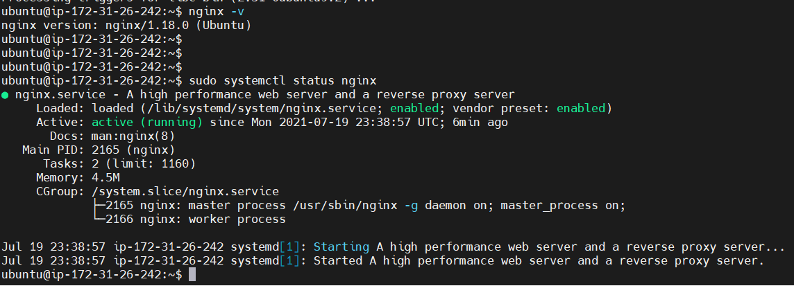
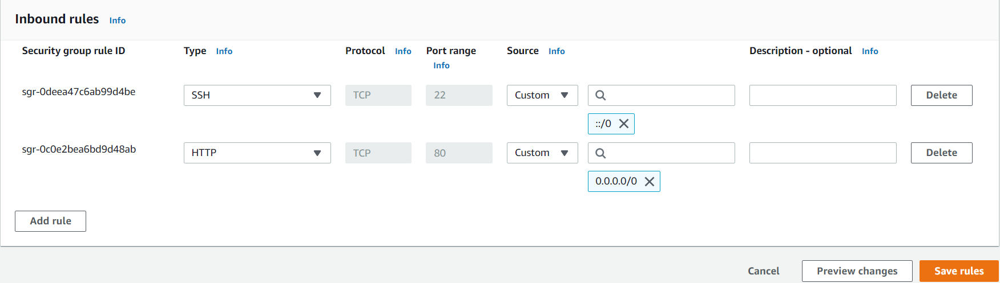
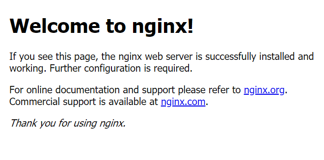
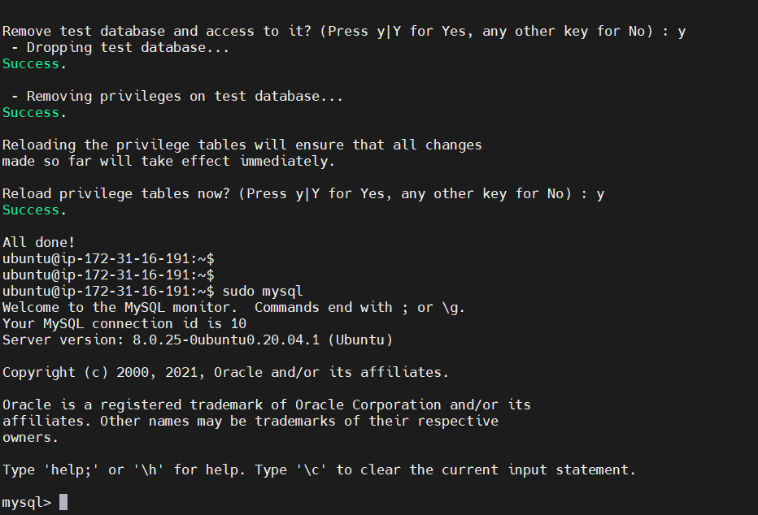
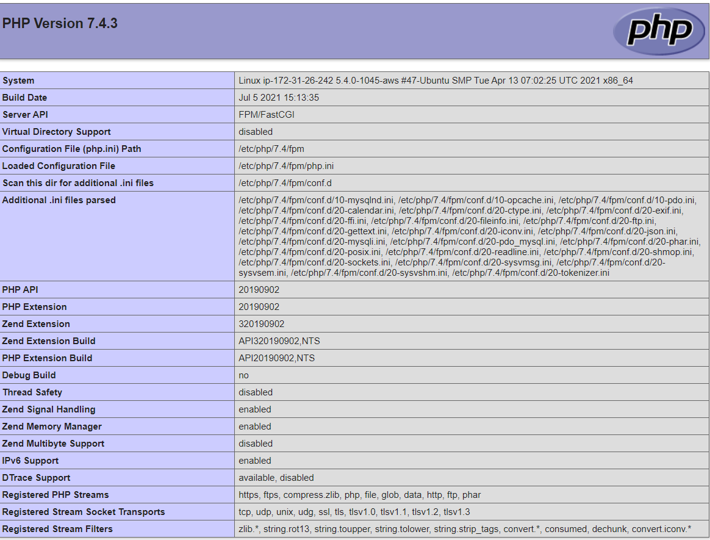
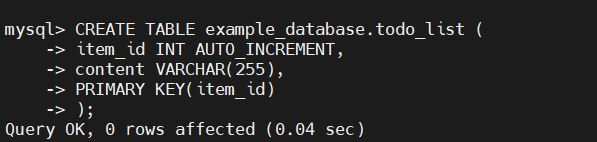
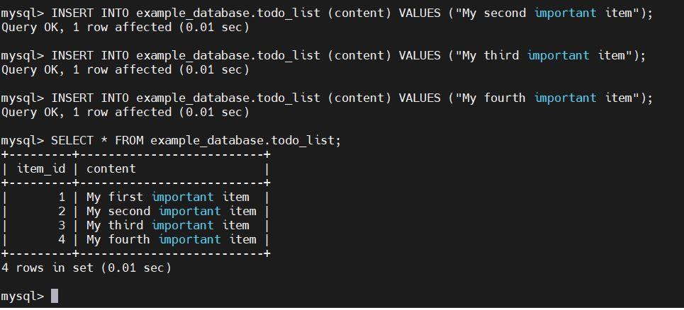
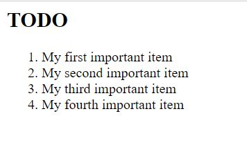

## LEMP PROJECT

The objective of this project is to deploy a web solution using the LEMP stack.
Setup a new EC2 instance on AWS, then launched the MobaXterm SSH protocol to establish connection with my Ubuntu Server 20.04 LTS.

### STEP 1 – INSTALL THE NGINX WEB SERVER

Nginx is a high-performance web server. The application was installed to display web pages to visitors to my site.
Installed package update by running `sudo apt update` to update packages on the server.
Installed NGINX webserver by running the command
`sudo apt install nginx`

To verify that nginx was successfully installed, I ran this command
sudo systemctl status nginx

Screenshot showing nginx was successfully installed

Opened TCP port 80 which is the default port that web browsers use to access web pages on the Internet

To check that my Nginx server can respond to requests from the internet, I opened the URL of my EC2 virtual server public IP Address on a web browser from my local computer.

Screenshot of the webpage

### STEP 2 — INSTALLING MYSQL

Installed MySQL by running this command
sudo apt install mysql-server

ran a security script that comes pre-installed with MySQL
sudo mysql_secure_installation

Validate Password plugin
After running ‘sudo mysql secure installation’. I was prompted to setup a password.
Tested connection to MySQL server by running ‘sudo mysql’

screenshot output

`mysql>exit` to exit the console

### STEP 3 – INSTALL PHP

Installed PHP to process code and generate dynamic content for the web browser
PHP interpreter in each request, Nginx requires an external program to handle PHP processing and act as a bridge between the PHP interpreter itself and the web server. This allows for a better overall performance in most PHP-based websites, but it requires additional configuration.
Also installed php-fpm which stands for “PHP fastCGI process manager” and tells Nginx to pass PHP requests to this software for processing. I also installed php-mysql, a PHP module that allows PHP to communicate with MySQL-based databases. Core PHP packages will automatically be installed as dependencies.
I installed the two packages at the same time, by running
sudo apt install php-fpm php-mysql

### STEP 4 – CONFIGURING NGINX TO USE PHP PROCESSOR

With the Nginx web server, we can host more than one domain on a single server.
I created a directory structure within /var/www for the your\_ domain website, leaving /var/www/html in place as the default directory to be served if a client request does not match any other sites.
I created the root web directory for your_domain as follows:
sudo mkdir /var/www/projectLEMP

I assigned ownership of the directory with the $USER environment variable to reference my current system user:
sudo chown -R $USER:$USER /var/www/projectLEMP

I opened a new configuration file in Nginx’s sites-available directory using your preferred command-line editor.
I used nano text editor
sudo nano /etc/nginx/sites-available/projectLEMP

I then pasted the configuration below in the blank file
#/etc/nginx/sites-available/projectLEMP

server {

    listen 80;
    server_name projectLEMP www.projectLEMP;
    root /var/www/projectLEMP;

    index index.html index.htm index.php;

    location / {
        try_files $uri $uri/ =404;
    }

    location ~ \.php$ {
        include snippets/fastcgi-php.conf;
        fastcgi_pass unix:/var/run/php/php7.4-fpm.sock;
     }

    location ~ /\.ht {
        deny all;
    }

}

Activated my configuration by linking to the config file from Nginx’s sites-enabled directory:
sudo ln -s /etc/nginx/sites-available/projectLEMP /etc/nginx/sites-enabled/

I disabled default Nginx host that is currently configured to listen on port 80, for this run:
sudo unlink /etc/nginx/sites-enabled/default

Reloaded Nginx to apply the changes:
sudo systemctl reload nginx

Created index.html file in the web root /var/www/projectLEMP

### STEP 5 – TESTING PHP WITH NGINX

Tested my LAMP STACK to validate that Nginx can correctly hand .php files off to my PHP processor.
Created info.php on the root of /var/www/projectLEMP
Entered the following lines into the new file

`<?php

phpinfo();`

Opened my public IP Address url followed by /info.php

##STEP 6 – RETRIEVING DATA FROM MYSQL DATABASE WITH PHP

Connect to the MYSQL console
sudo mysql

Created a new database named example_database and a user named example_user
mysql> CREATE DATABASE `example_database`;

Created a new user named example_user, using mysql_native_password as default authentication method.
mysql> CREATE USER 'example_user'@'%' IDENTIFIED WITH mysql_native_password BY 'password';

Granted user permission over the example_database database:
mysql> GRANT ALL ON example_database.\* TO 'example_user'@'%';

To confirm that i have access to the example_database database, I ran command
mysql> SHOW DATABASES;

I created a test table named todo_list, as shown in the screenshot below

Inserted rows of content in the test table as shown below:

Next, I created a PHP script to connect to MySQL and query my content. I created a php file called todo_list.php in the root of /var/www/projectLEMP

Copied and pasted the code below into todo_list.php file.

`<?php`

$user = "local_user";
$password = "Password1$";
$database = "example_database";
$table = "todo_list";

try {
  $db = new PDO("mysql:host=localhost;dbname=$database", $user, $password);
  echo `"<h2>TODO</h2><ol>"`;
  foreach($db->query("SELECT content FROM $table") as $row) {
    echo "<li>" . $row['content'] . "</li>";
  }
  echo "</ol>";
} catch (PDOException $e) {
    print "Error!: " . $e->getMessage() . " ";
    die();

}

Opened the page on my computer web browser by entering the url of my public IP Address followed by /todo_list.php

Screenshot of the php webpage:

