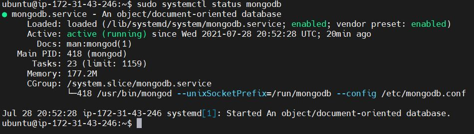
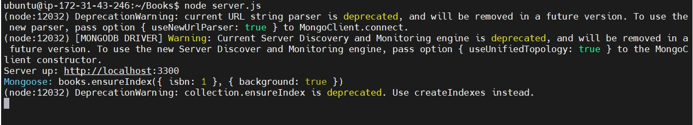
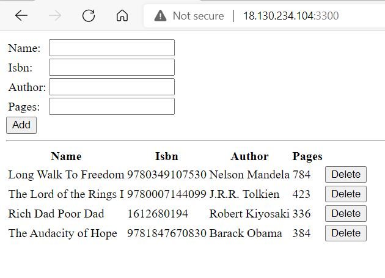

### MEAN-STACK PROJECT

MEAN Stack comprises of the following:

MongoDB: a cross-platform document-oriented database program

Express: a Node.js back-end web application used to build web application and API’s

Angular: a front-end web framework used to develop single page application.

Node.js: is a platform used to build fast and scalable network application.

The objective of this project is to build a book register web application using MEAN stack.
Step 1: Setup my virtual server – Ubuntu Server 20.04 LTS

Signed into my AWS free tier account and created a new EC2 Instance of t2.nano family with Ubuntu Server 20.04 LTS (HVM) image.

### Step 2: Install Node.js

Before installing Node.js, I updated and upgraded my ubuntu server.

`sudo apt update`
`sudo apt upgrade`

Next installed node.js 

`sudo apt install -y nodejs`
 
### Step 3: Install MongoDB

Book records will be added to MongoDB (Database). Book record contains the book name, International Standard Book Number (ISBN), author and number of pages.
 
Before installing MongoDB, I added the MongoDB key below to my key server.

sudo apt-key adv --keyserver hkp://keyserver.ubuntu.com:80 --recv 0C49F3730359A14518585931BC711F9BA15703C6

Next i added a repository for MongodDB.

Entered command below into my terminal to install MondoDB

sudo apt install -y mongodb

Then started the server by running command

`sudo service mongodb start`

I verified that the service status by running command

sudo systemctl status mongodb

screenshot:

I installed Node package manager (npm). 
npm can install in one command, all the dependencies of a project through the package.json file. 

Installed ‘body-parser’ package. ‘body-parser’ processes JSON files passed in requests to the server.

sudo npm install body-parser

Created a folder called Books which I used to build my application

`mkdir Books && cd Books`

Initialized npm project by running command

`npm init`

Created a file server.js and entered the code below

Step 4: Install Express and set up routes to the server

Express was installed, so that book information can be sent and received from the MongoDB.

`sudo npm install express mongoose`

Created a file called apps in Books folder

`mkdir apps && cd apps`

Created a file routes.js and entered the code below.

var Book = require('./models/book');

module.exports = function(app) {

  app.get('/book', function(req, res) {

    Book.find({}, function(err, result) {
      if ( err ) throw err;
      res.json(result);

    });

  }); 

  app.post('/book', function(req, res) {

    var book = new Book( {

      name:req.body.name,

      isbn:req.body.isbn,

      author:req.body.author,

      pages:req.body.pages
      
    });

    book.save(function(err, result) {

      if ( err ) throw err;

      res.json( {

        message:"Successfully added book",

        book:result

      });

    });

  });

  app.delete("/book/:isbn", function(req, res)

   {

    Book.findOneAndRemove(req.query, function(err, result) {
      if ( err ) throw err;
      res.json( {
        message: "Successfully deleted the book",
        book: result
      });
    });
  });

  var path = require('path');

  app.get('*', function(req, res) {

    res.sendfile(path.join(__dirname + '/

    public', 'index.html'));

  });

};

Created a folder known as models in the models folder, then created a file ‘book.js’

Copied the code below into the book.js file

var mongoose = require('mongoose');

var dbHost = 'mongodb://localhost:27017/test';

mongoose.connect(dbHost);

mongoose.connection;

mongoose.set('debug', true);

var bookSchema = mongoose.Schema( {

  name: String,

  isbn: {type: String, index: true},

  author: String,

  pages: Number

});

var Book = mongoose.model('Book', bookSchema);

module.exports = mongoose.model('Book', 

bookSchema);

### Step 5: Access the routes with AngularJS

AngularJS is used to connect our web page with Express and perform actions on our book register.

In the Books directory, created a folder named 

public and a file named script.js

mkdir public && cd public

`touch script.js`

Copied the code below into script.js

var app = angular.module('myApp', []);

app.controller('myCtrl', function($scope, $http) {

  $http( {

    method: 'GET',

    url: '/book'

  }).then(function successCallback(response) {

    $scope.books = response.data;

  }, function errorCallback(response) {

    console.log('Error: ' + response);

  });

  $scope.del_book = function(book) {

    $http( {

      method: 'DELETE',

      url: '/book/:isbn',

      params: {'isbn': book.isbn}

    }).then(function successCallback(response)

     {
      console.log(response);

    }, function errorCallback(response) {

      console.log('Error: ' + response);

    });

  };

  $scope.add_book = function() {

    var body = '{ "name": "' + $scope.Name +

    '", "isbn": "' + $scope.Isbn +

    '", "author": "' + $scope.Author + 

    '", "pages": "' + $scope.Pages + '" }';

    $http({

      method: 'POST',

      url: '/book',

      data: body

    }).then(function successCallback(response)

     {
      console.log(response);

    }, function errorCallback(response) {

      console.log('Error: ' + response);

    });

  };

});

Typed `:wq` to save and exit the file

In the public folder created index.html file and copied the code below

<!doctype html>

<html ng-app="myApp" ng-controller="myCtrl">

  <head>

    
    

  </head>

  <body>

    

      <table>

        <tr>

          <td>Name:</td>

          <td><input type="text" 

          ng-model="Name"></td>

        </tr>

        <tr>

          <td>Isbn:</td>

          <td><input type="text" 

          ng-model="Isbn"></td>

        </tr>

        <tr>

          <td>Author:</td>

          <td><input type="text" 

          ng-model="Author"></td>

        </tr>

        <tr>

          <td>Pages:</td>
          
          <td><input type="number"

           ng-model="Pages"></td>

        </tr>

      </table>

      <button ng-click="add_book()">Add</

      button>

    

    

    

      <table>

<tr>
          <th>Name</th>

          <th>Isbn</th>

          <th>Author</th>

          <th>Pages</th>

        </tr>

        <tr ng-repeat="book in books">

          <td>{{book.name}}</td>

          <td>{{book.isbn}}</td>

          <td>{{book.author}}</td>

          <td>{{book.pages}}</td>

          <td><input type="button" 

          value="Delete" 

          data-ng-click="del_book(book)"></td>

        </tr>

      </table>

    

  </body>

</html>

Change directory to Books and started the server by running command

`node server.js`

The output on the terminal is shown below:

To access the server from the internet, I opened Port 3300 in my AWS EC2 instance.

Accessed my web application on my web browser through my server public IP Address followed by :3300

Screenshot:

