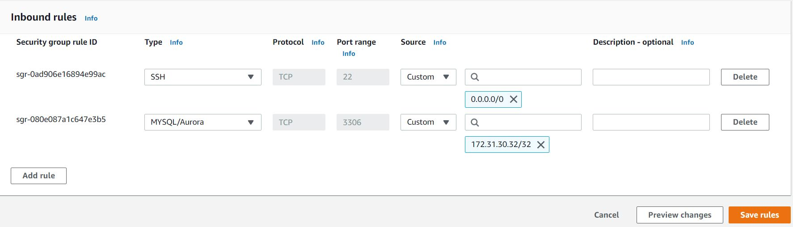
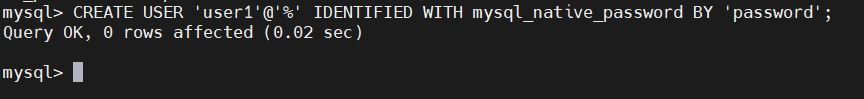
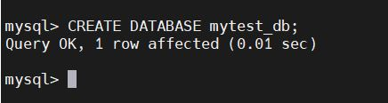
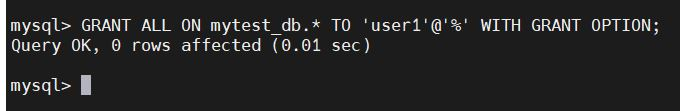
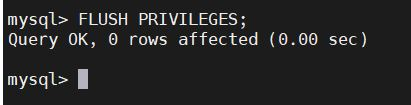
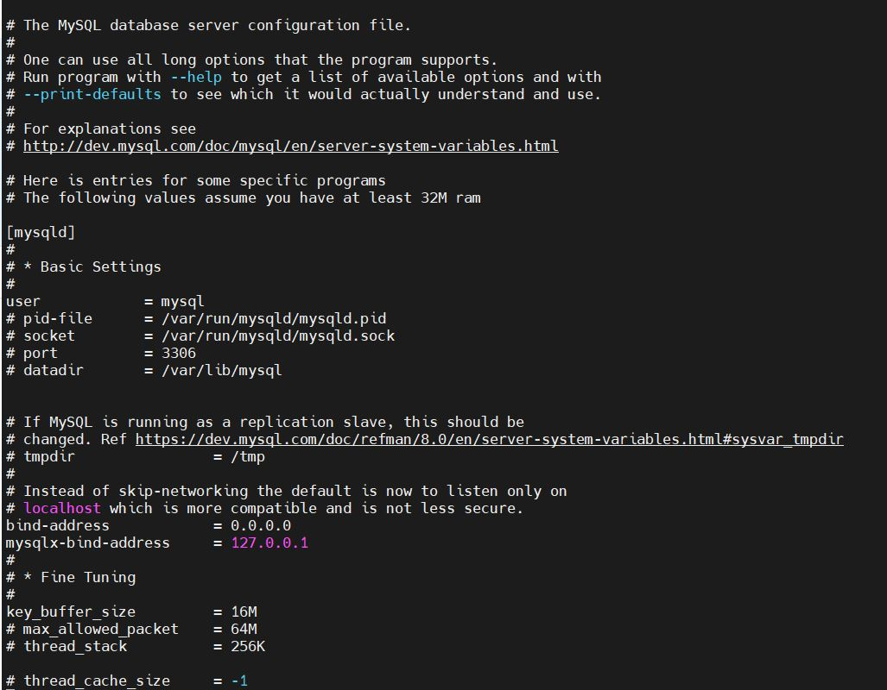
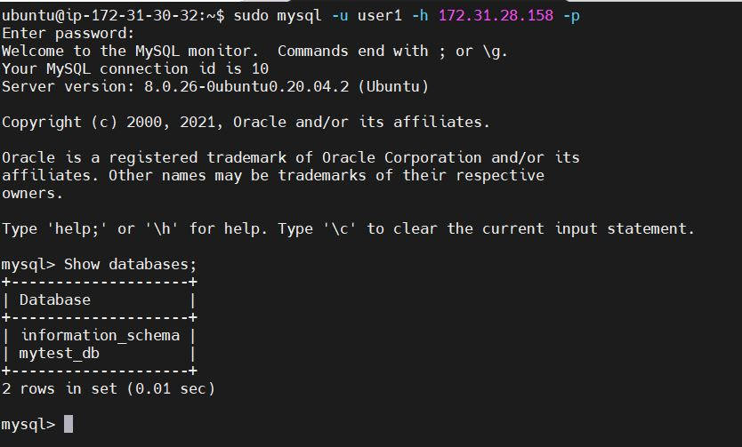

CLIENT SERVER ARCHITECTURE WITH MYSQL 

The objective of this project is to implement a client server architecture using MYSQL relational database management system (RDMS).
Configure and setup mysql client to connect remotely to mysql server without using ssh. 

STEP 1

On AWS I setup 2 EC2 instances (Ubuntu Server 20) named them mysql client and mysql server.
On ‘mysql server’, ran `sudo apt update` and `sudo apt upgrade`, then installed MySQL server software.
 `sudo apt install mysql-server`
Enabled the service - `sudo systemctl enable mysql`

On mysql client I ran `sudo apt update` and `sudo apt upgrade`, then installed MySQL client software.

 `sudo apt-get install mysql-client`

Opened TCP port 3306 by creating a new entry in ‘Inbound rules’ in ‘mysql server’ Security Groups. For security purposes, I only allowed mysql client IP address access to port 3306.

I installed a security script to help secure mysql server. 

This security script ensures that only authorized users can access the server.

`sudo mysql_secure_installation`

Next, I created a user to access mysql server

Created a database named mytest_db

Granted remote user privileges to the database

Flush privilege. This enables the changes to take effect without reloading or restarting mysql service.

Configured MySQL server to allow connections from remote hosts, by running the command below to change the bind-address from 127.0.0.1 to 0.0.0.0 in the configuration file. 
The bind address allows client server to connect remotely to the mysql server from any IP address.

`sudo vi /etc/mysql/mysql.conf.d/mysqld.cnf` 

Restarted the service by running the command below

`sudo systemctl restart mysql`

Connected remotely from mysql client to mysql server using the mysql utility as shown below:

