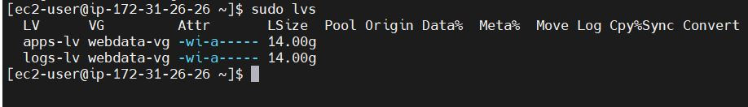

### WEB SOLUTION WITH WORDPRESS

The objective of this project is to setup a storage infrastructure on two Linux servers and implement a basic web solution using WordPress.
WordPress is a content management system (CMS) that allows you to host and build websites. WordPress contains plugin architecture and a template system, so you can customize any website.

The first task is to configure a storage subsystem for Web and Database servers based on Linux OS. 

The three-tier architecture will be used to implement this web solution.

Three-tier architecture is a client-server architecture in which presentation, application processing and data management functions are physically separated.

My 3-tier setup are: 

1.	My windows laptop
2.	An EC2 Linux server as my webserver
3.	An EC2 Linux server as my database server

I setup two AWS EC2 instance using RedHat as the operating system. 

Step 1: Prepare a web server 

On my web server, I created 3 volumes (each 10GB). 

Attached all 3 volumes to the web server EC2 instance.

Connected to my Linux terminal via SSH, and ran the `lsblk` command to see the block devices attached to the web server.

The 3 newly created blocks are xvdf, xvdg and xvdh.

Entered `df -h` command to inspect all mounts and free space on the server

Used the gdisk utility to create a single partition on each of the 3 disks

`sudo gdisk /dev/ xvdf` 
`sudo gdisk /dev/ xvdg`
`sudo gdisk /dev/ xvdh`

Ran lsblk command to verify that partition have being created.

From the image above, each disk xvdf, xvfg and xvdh have being partitioned -  xvdf1, xvdg1 and xvdh1.

Ran the command below to install Logical Volume Manager

`sudo yum install lvm2 -y`

In RedHat, the yum command is used to install packages. 

Entered the pvcreate utility to setup each of the 3 partitions as physical volumes.

`sudo pvcreate /dev/xvdf1 /def/xvg1 /dev/xvdh1`

Verified that my Physical volume was successfully created by running 
      `sudo pvs`

 Ran vgcreate utility to combine all 3 physical volume to a volume group (VG). Named the Volume Group webdata-vg

`sudo vgcreate webdata-vg /dev/xvdh1 /dev/xvdg1 /dev/xvdf1`

By running `sudo vgs`, I verified that my volume group was successfully created. The volume size is 29.99G

 lvcreate utility was used to create two logical volumes. apps-lv and logs-lv, by entering command. apps-lv will be used to store data, while logs-lv will be used to store data for logs.

sudo lvcreate -n apps-lv -L 14G webdata-vg

sudo lvcreate -n logs-lv -L 14G webdata-vg

Verified that my Logical Volume was created by running `sudo lvs`

Ran `sudo vgdisplay -v` to view compete setup.

Used `mkfs.ext4` to format the logical volumes with the ext4 filesystem, as shown in the command below.

`sudo mkfs -t ext4 /dev/webdata-vg/apps-lv`

`sudo mkfs -t ext4 /dev/webdata-vg/logs-lv`

Ran the command below to create the /var/www/html directory to store website files

`sudo mkdir -p /var/www/html`

Created /home/recovery/logs to store backup of log data by running this command

Mounted /var/www/html on apps-lv logical volume, Ran the command below

`sudo mount /dev/webdata-vg/apps-lv /var/www/html/`

Before mounting the file system, I used the  rsync utility to backup all the files in the log directory /var/log into /home/recovery/logs

`sudo rsync -av /var/log/ /home/recovery/logs/`

Ran the command below to mount /var/log on logs-lv logical volume. All data on /var/log were deleted. 
sudo mount /dev/webdata-vg/logs-lv /var/log

Restored the log files in /home/recovery/logs/log/ back into the /var/log directory by running command

`sudo rsync -av /home/recovery/logs/log/ /var/log`

      UPDATED THE /ETC/FSTAB FILE

Updated the /etc/fstab file so the mount configuration will persist. If the /etc/fstab file is not updated and the server is restarted the configuration will be deleted.

The UUID of the device will be used to update the /etc/fstab file.

Ran `sudo blkid` command to retrieve the device UUID

Added the UUID for /var/log and /var/www/html in the /etc/fstab file 

 `sudo vi /etc/fstab`

Tested the configuration and reloaded the daemon

`sudo mount -a`

`sudo systemctl daemon-reload`

Verified my setup by running `df -h`

STEP 2: Prepare a Database Server using MYSQL

Repeated the same steps as for the Web Server. However, I created db-lv and mounted it on the /db directory.

Verified my setup by running df -h

STEP 3: Install WordPress on my Web Server

1.	Updated the repository 

    `sudo yum -y update`

2.	Installed wget, Apache and it’s dependencies

` sudo yum -y install wget httpd php php-mysqlnd php-fpm php-json`

3.	Started Apache service

   `sudo systemctl enable httpd`

    `sudo systemctl start httpd`

4.	Installed PHP and its dependencies

`sudo yum install https://dl.fedoraproject.org/pub/epel/epel-release-latest-8.noarch.rpm`

`sudo yum install yum-utils http://rpms.remirepo.net/enterprise/remi-release-8.rpm`

`sudo yum module list php`

`sudo yum module reset php`

`sudo yum module enable php:remi-7.4`

`sudo yum install php php-opcache php-gd php-curl php-mysqlnd`

`sudo systemctl start php-fpm`

`sudo systemctl enable php-fpm`

`set sebool -P httpd_execmem 1`

5.	Restarted Apache by running this command

    `sudo systemctl restart httpd`

6.	Downloaded wordpress and copied wordpress to var/www/html directory.

Ran the commands below to download and configure wordpress.

  `mkdir wordpress`

  `cd   wordpress`

  `sudo wget http://wordpress.org/latest.tar.gz`

  `sudo tar xzvf latest.tar.gz`

  `sudo rm -rf latest.tar.gz`

  `sudo cp wordpress/wp-config-sample.php wordpress/wp-config.php`

  `sudo cp -R wordpress /var/www/html/`

  

STEP 4: Installed MYSQL Server on my Web Server and Database Server

     sudo yum install mysql-server

     sudo systemctl enable mysqld

     sudo systemctl ststus mysqld

     sudo mysql_secure_installation
 
The installation secures mysql server deployment

STEP 5:  Configured Database to Work with WordPress

Logged into the database as the root user

`sudo mysql -u root -p`

Created a database named wordpress.

Setup ‘wordpress’ as a user on the database by entering the command below.

Mysql> CREATE USER ‘wordpress’@172.31.28.61 IDENTIFIES WITH mysql_native_password BY ‘wordpress’;

Granted user ALL privileges

Flush privileges to enabling the changes to take effect without reloading or restarting mysql service

Updated the configuration file in /etc/my.cnf directory. Entered the web server IP Address as the bind-address.

Restarted mysql service

`sudo systemctl restart mysqld`

Changed the DB_NAME, DB_USER, DB_PASSWORD and DB_HOST in the wp-config.php configuration file to match the credentials in the database server.

#### Configured Selinux Policies
The SELinux Policy is the set of rules that guide the SELinux security engine. It defines types for file objects and domains for processes

 `sudo chown -R apache:apache /var/www/html/wordpress`

  `sudo chcon -t httpd_sys_rw_content_t /var/www/html/wordpress -R`

  `sudo setsebool -P httpd_can_network_connect=1`

STEP 6: Configured WordPress to connect to remote database

Opened MySQL port 3306 on my Database Server EC2 instance.

### Disabled the Apache Default Page

 To access WordPress site, i disabled the apache default page.  
 
 Renamed the welcome.config file 

 /etc/httpd/conf.d/welcome.conf by running the command below

`sudo mv /etc/httpd/conf.d/welcome.conf /etc/httpd/conf.d/welcome.conf_backup`

Verified that my Webserver can access my database server by entering the command 

`sudo mysql -h 172.31.20.43 -u wordpress -p`

Successfully accessed WordPress from my computer browser by entering my web-server public IP Address. 

