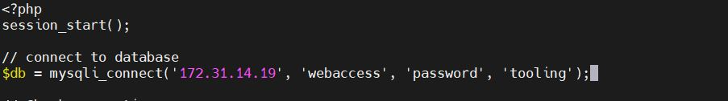

### DEVOPS TOOLING WEBSITE SOLUTION

The objective of this project is to use a set of DevOps tools to create a web solution which makes access to DevOps tools within the corporate infrastructure easily accessible.
I implemented a tooling website solution consisting these components:

Amazon Web Services (AWS): Cloud Services
Red Hat Enterprise Linux 8: Webserver Linux
Ubuntu 20.04 and MySQL: Database Server
Red Hat Enterprise Linux 8 + NFS Server: Storage Server
PHP: Programming Language
GitHub: Code Repository

STEP 1: SETUP NETWORK FILE SYSTEM (NFS)

 I Launched 5 new EC2 instances on AWS.
 3 web servers and the NFS server will run on Red Hat 8. The database server will run on Ubuntu 20.04

Created a volume and attached to the NFS server.

Updated Red Hat packages by running command below:

` sudo yum install lvm2 -y`

Ran lsblk command on my NFS terminal to verify that the volume has being attached to the server.

I used the gdisk utility to create a single
 partition on the single disk xvdf

I ran command `sudo gdisk /dev/xvdf`

Created a physical volume

Created a volume group and named it webdata-vg

 lvcreate utility was used to create 3 logical volumes lv-opt lv-apps and lv-logs

Formatted the 3 volumes by using the xfs file system

`sudo mkfs.xfs /dev/webdata-vg/lv-apps`

`sudo mkfs.xfs /dev/webdata-vg/lv-logs`

`sudo mkfs.xfs /dev/webdata-vg/lv-opt`

I then created 3 directories: 

 /mnt/apps, 
 
 /mnt/logs 
 
 /mnt/opt

I created mount points on /mnt directory for the logical volumes as follow:

Mount lv-apps on /mnt/apps – To be used by webservers

Mount lv-logs on /mnt/logs – To be used by webserver logs

Mount lv-opt on /mnt/opt – To be used by Jenkins server

      UPDATE THE /ETC/FSTAB FILE

Updated the /etc/fstab file so the mount configuration will persist. 

 vi /etc/fstab

If the /etc/fstab file is not updated and the server is restarted the configuration will be deleted.

The UUID of the device will be used to update the /etc/fstab file.

Ran `sudo blkid` command to retrieve the device UUID

Opened the /etc/fstab file with the vi editor and added the UUID for mnt/apps, mnt/logs and mnt/opt

Installed and configred my NFS Server, by running the scripts below:

`sudo yum -y update`

`sudo yum install nfs-utils -y`

`sudo systemctl start nfs-server.service`

`sudo systemctl enable nfs-server.service`

`sudo systemctl status nfs-server.service`

I eet up permissions to allow my Web servers to read, write and execute files on the NFS server and restarted the NFS server - 

 `sudo systemctl restart nfs-server.service`

Configured access to the NFS server for clients within the same subnet. 

Subnet CIDR for my NFS server: 172.31.0.0/20 

Exported the mounts for webservers’ subnet cidr to connect as clients and restarted the NFS services.

`/mnt/apps <Subnet-CIDR>(rw,sync,no_all_squash,no_root_squash)`

`/mnt/logs <Subnet-CIDR>(rw,sync,no_all_squash,no_root_squash)`

`/mnt/opt <Subnet-CIDR>(rw,sync,no_all_squash,no_root_squash)`

Checked the port used by NFS and opened it by adding new Inbound rule in the Security Groups in my NFS server EC2 instance.

STEP 2: CONFIGURE THE DATABASE

Installed mysql server

Created a database and named it 'tooling'

Created a database user and named it webaccess

Granted full permission to webaccess user on tooling database to access data from the webserver subnet cidr

Flush privileges to enable the changes to take effect without reloading or restarting mysql service.

Updated the configuration file in /etc/my.cnf directory by changing the bind-address to 0.0.0.0
Restarted mysql service - 

`sudo systemctl restart mysql`

       STEP 3: SETUP WEB SERVERS

i.	Connected to my first web server (web1) from my AWS EC2 instance

ii.	Updated Red Hat packages by running the command below. 

      `sudo yum -y update`

iii.	installed the NFS client

  `sudo yum install nfs-utils nfs4-acl-tools -y`

iv.	Mounted /var/www/ directory and targeted the NFS server’s export for apps and verified that it was mounted.

v.	Verified that /html has being mounted on the NFS server

vi.	Amended the configuration file in /etc/fstab by adding the line below. This is to ensure changes will persist on the web server after rebooting.

Installed Apache:  sudo yum install httpd -y

vii.	Ran script to start and enable apache service 

 `sudo systemctl start httpd`

 `sudo systemctl enable httpd`

viii.	Mounted the log folder on the Apache web server to the NFS servers export for logs.

ix.	Deployed the tooling website’s code to my Webserver, by producing a copy of a source code (forking) from Darey.io Github Account. 

x.	Before cloning the github account, i installed git.

`sudo yum install git -y`

xi.	Cloned the github account as shown in the image below:

Screenshot of the Tooling directory

xii.	Deployed the html folder to /var/www/html directory by running the command as shown in the screenshot below:

xiii.	Update the website’s configuration to connect to the database

xiv.	Updated the functions.php configuration file. Added users login credentials to allow access to MYSQL database as shown in the image below:

xv.	Installed mysql-server, so that the webserver can communicate with mysql-server in the database. 

`sudo yum install mysql-server -y`
xvi.	Created tooling database in the database server

xvii.	Applied tooling-db.sql script

xviii.	Disabled SELINUX

Ran the scripts below to disable selinux

`sudo setsebool -P httpd_can_network_connect 1`

`sudo setsebool -P httpd_use_nfs 1`

`sudo setsebool -P httpd_can_network_connect_db 1`

Repeated step i to xviii for web2 and web3 servers EC2 instance.

xix.	Opened my webserver public IP Address:  http://3.11.70.59/login.php 

on my computer web browser and successfully opened the login page

