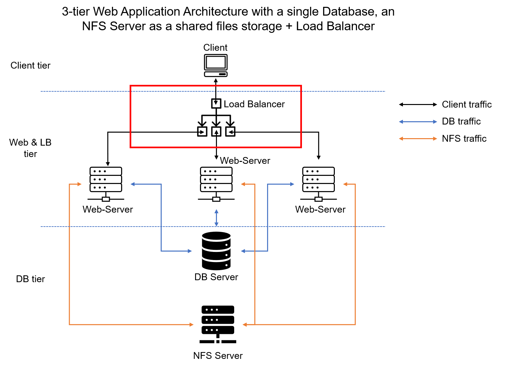
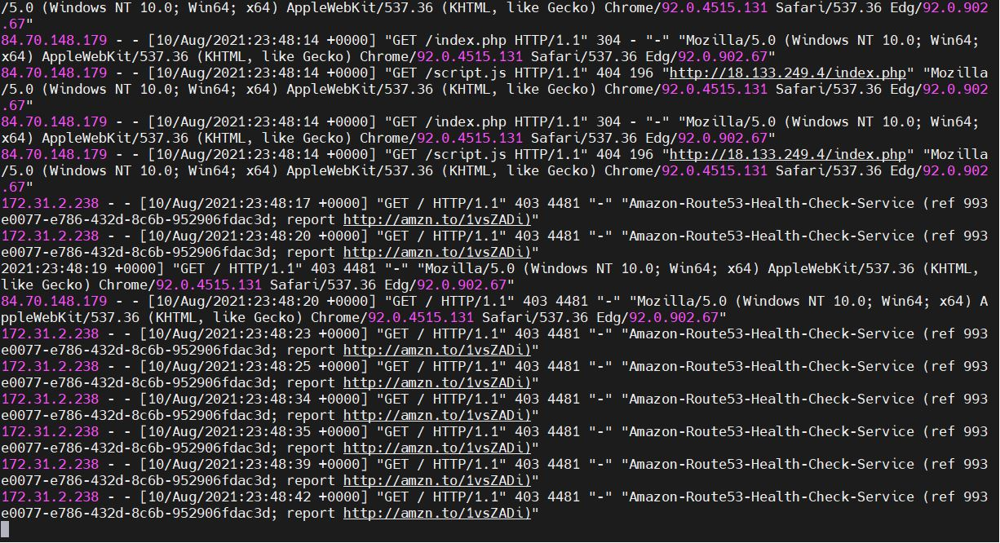

 ### LOAD BALANCER SOLUTION WITH APACHE

The objective of this project is to configure and deploy an Apache Load Balancer for my Tooling website solution. 
 
I also configured a local DNS name resolution. 

This approach ensures that the web servers can be accessed, by using their host names as the URL.

### SYNOPSIS

A load balancer routes client requests across multiple servers capable of fulfilling those requests in a manner that maximizes speed and capacity utilization and ensures that no one server is overworked. 

If a single server goes down, the load balancer redirects traffic to the remaining online servers. When a new server is added to the server group, the load balancer automatically starts to send requests to it.

Diagram (a)

  ###   IMPLEMENTATION

1.	Launched an Ubuntu server 20.04 EC2 instance in AWS.
2.	Opened TCP port 80 when in the  Security Group.
3.	Installed Apache Load Balancer on the server. Also, configured the load balancer to direct incoming traffic to the web servers, as shown in diagram (a) above.

Diagram (b)

Prior to installing apache, I updated and upgraded ubuntu server packages by running the commands `sudo apt update` and `sudo apt upgrade`

`sudo apt update`

`sudo apt upgrade`

`sudo apt install apache2 -y`

`sudo apt-get install libxml2-dev`

 #Enable following modules:

`sudo a2enmod rewrite`

`sudo a2enmod proxy`

`sudo a2enmod proxy_balancer`

`sudo a2enmod proxy_http`

`sudo a2enmod headers`

`sudo a2enmod lbmethod_bytraffic`

#Restart apache2 service

`sudo systemctl restart apache2`

4.	Checked the status of apache2

5.	Configure Load Balancing
      Added a script in the apache2 configuration file. The script maps the private IP address of the 2 web servers so that the load balancer can distribute traffic to the web servers efficiently. 

    `sudo vi /etc/apache2/sites-available/000-default.conf`

Restarted apache server 

6.	Verified that my configuration above worked by accessing my load balancer’s public IP Address from my computer web browser.

http://18.168.198.245/index.php

7.	Unmounted /var/log/httpd from my 2 web servers to the NFS server and ensured that each web server has a log directory. 
Every attempt to access the web servers will be logged on the webservers log directory.
 I ran the command below on the web servers:

       `sudo tail -f /var/log/httpd/access_log`

The volume of requests sent to web1 and web2 server are roughly the same The loadfactor set in the load balancer’s configuration are the same value for both servers. 

loadfactor was set to 5 for both web servers.

Traffic is evenly distributed by the load balancer.

Web1 server log output

8.	Configure Local DNS Names Resolution

Configured the /etc/hosts for domain name resolution.

 This approach allows using host name to access the web servers instead of using their ip address although it is not very scalable.

Added the hostnames and IP Address of the web servers in the /etc/hosts configuration file.

Updated the configuration file as shown below

I was able to curl my web servers locally from my load balancer.

curl http://Web1 

curl http://web2

