### CONTINOUS INTEGRATION PIPELINE FOR TOOLING WEBSITE

Automation and speedy delivery of software application are key requirements in DevOps.
Continuous integration (CI) is a software development strategy that increases the speed of development while ensuring the quality of the code that teams deploy. 

In this project I utilized Jenkins CI capabilities to ensure that changes made to the source code in GitHub repository gets updated to the Tooling website automatically.

                
### CI Pipeline Architecture

          
           

##  IMPLEMENTATION

STEP 1: INSTALL AND CONFIGURE JENKINS SERVER

1.	Launched an AWS EC2 instance running on Ubuntu server 20.04 LTS.

2.	Ran `sudo apt update` 

     `sudo apt upgrade`

3.	Installed Java Development Kit (JDK).
    Jenkins is a java-based application.

    `sudo apt install default-jdk-headless`

4.	Installed Jenkins

`wget -q -O - https://pkg.jenkins.io/debian-stable/jenkins.io.key | 

sudo apt-key add –

`sudo sh -c 'echo deb https://pkg.jenkins.io/debian-stable binary/ > \
    /etc/apt/sources.list.d/jenkins.list'`

`sudo apt update`

`sudo apt-get install Jenkins`

Verified that Jenkins is running

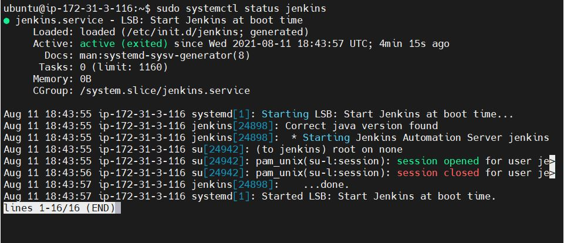

Since Jenkins server uses port 8080, i created an Inbound rule in the EC2 instance.

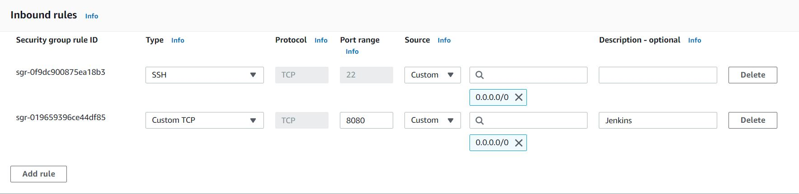

5.	### Jenkins Setup

 Opened Jenkins public IP Address URL followed by :8080on my web browser.

A prompt appears asking for Administrator password to unlock Jenkins

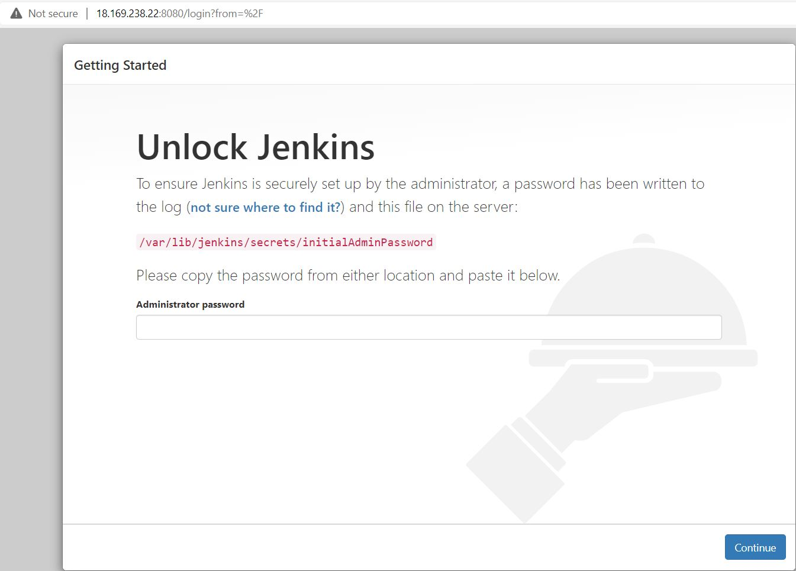

Retrieved password by running command 

`sudo cat /var/lib/jenkins/secrets/initialAdminPassword`

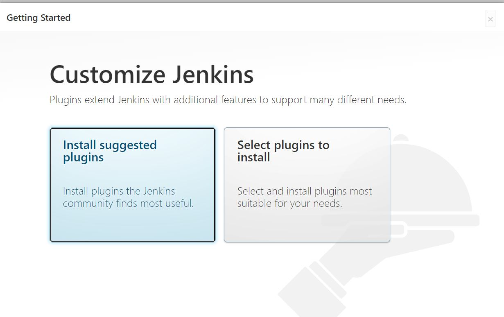

Selected ‘Install suggested plugins’ option, to commence installation.
Created first admin user.

Jenkins Dashboard

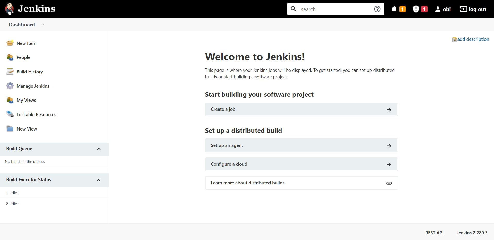

### STEP 2: Configure Jenkins to retrieve source codes from using Webhooks

Configured a simple Jenkins project. GitHub webhooks triggered the project and executed a ‘build’ task to retrieve codes from GtHub and store it locally on Jenkins server.

Enabled webhook in my GitHub repository

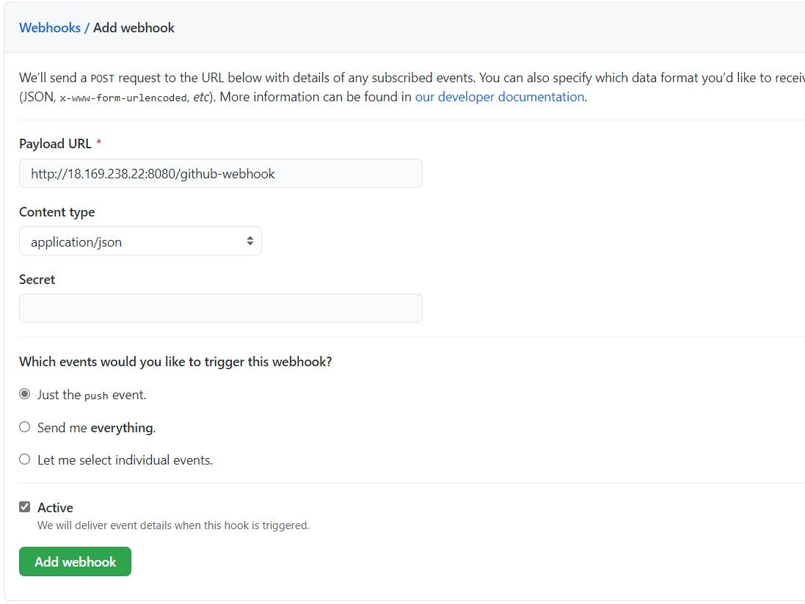

In the Jenkins dashboard, clicked ‘New Item’ and created a ‘Freestyle project’.
When configuring my Jenkins freestyle project, I selected Git repository and entered provide the link to my Tooling GitHub to enable Jenkins to access the source codes in the repository.

Entered my Github login credentials as shown in the screenshot below.
Saved the configuration.

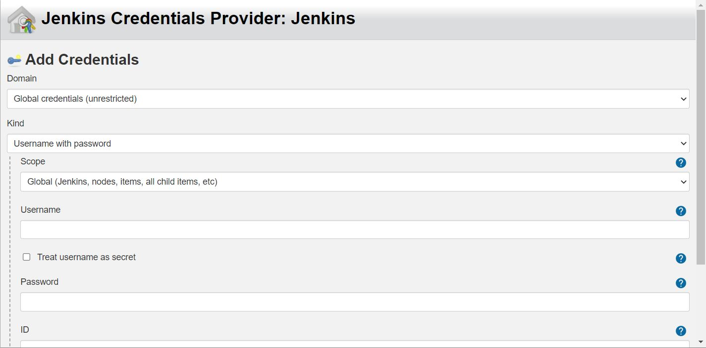

Clicked the "Build Now" button and then selected build history #5

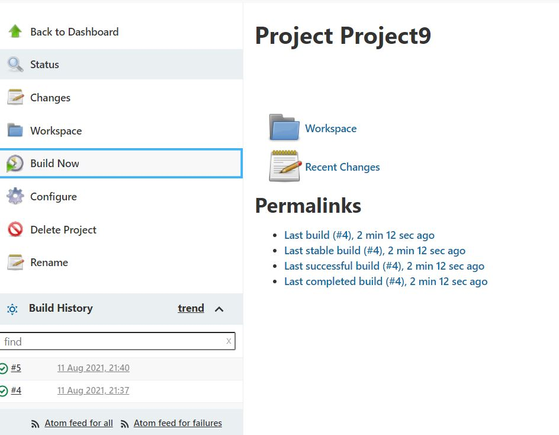

Selected Configure and the image below confirmed the build was successful.

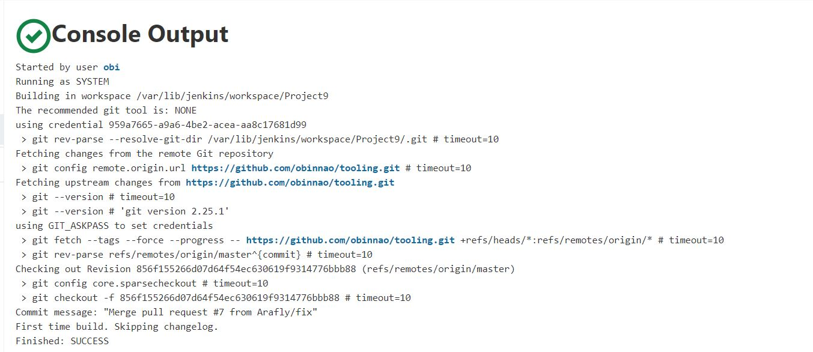

Configured ‘triggering’ the project from GitHub webhook

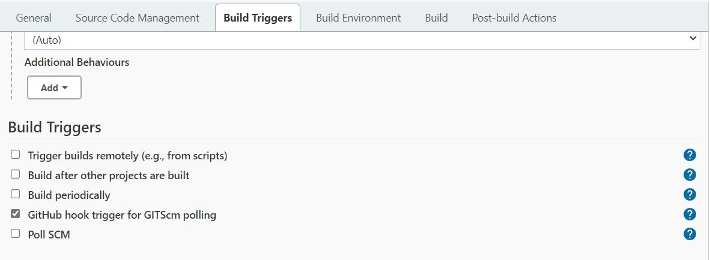

Selected ‘Archive as Artifact’ option under Post-build Actions.

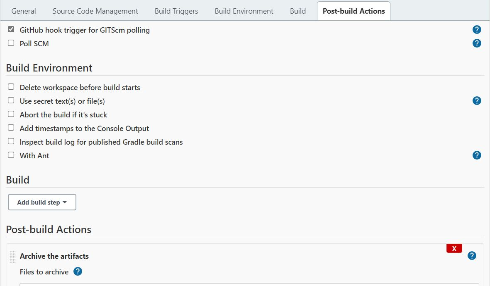

Checked that the configuration worked by editing the ‘README.md’ file in my GitHub repository. 

Opened Jenkins dashboard and checked ‘Changes’ status.

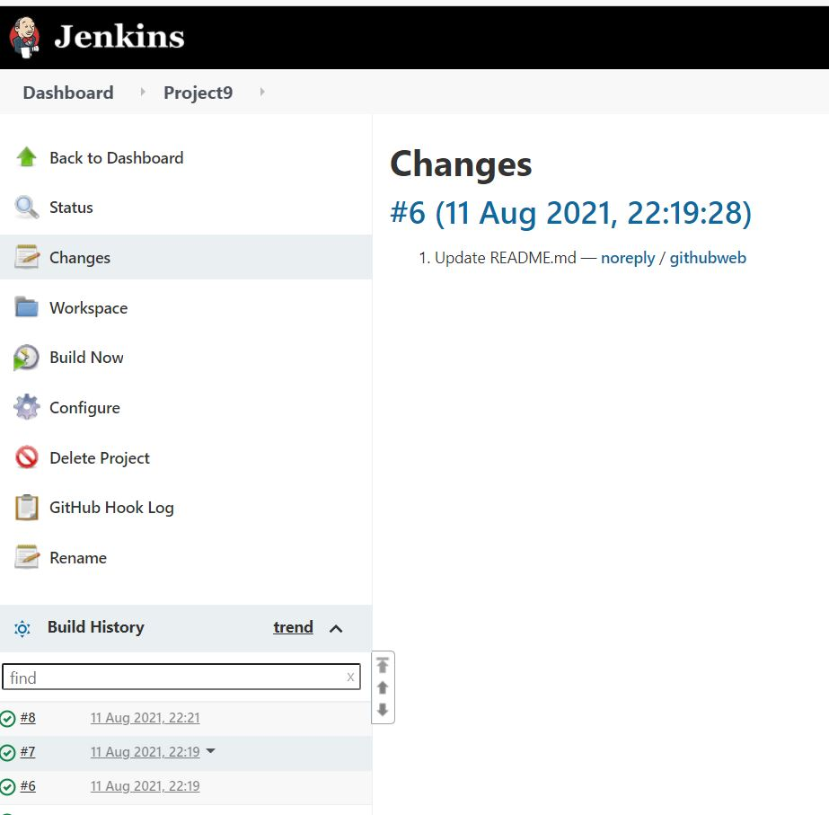

The artifacts are stored on Jenkins server locally

`ls /var/lib/jenkins/jobs/tooling_github/builds/<build_number>/archive/`

### STEP 3: CONFIGURE JENKINS TO COPY FILE TO THE NFS SERVER VIA SSH

Since my artifacts saved locally on Jenkins server, I  copied the files to my NFS server tin the /mnt/apps directory.

1.	Installed "Publish Over SSH" plugin.
On main dashboard select "Manage Jenkins" and choose "Manage Plugins" menu item.

On the "Available" tab search for "Publish Over SSH" plugin and installed without restart

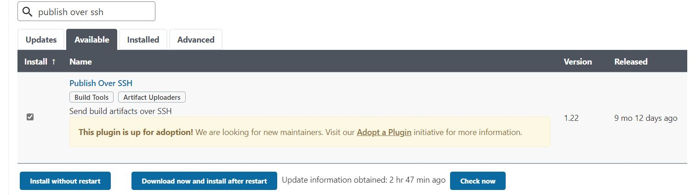

2.	Configured the project to copy artifacts over to the NFS server.

On the main dashboard selected "Manage Jenkins" and chose "Configure System" menu item.

Scrolled down to ‘Publish over SSH’ plugin configuration section and configured it to be able to connect to my NFS server:

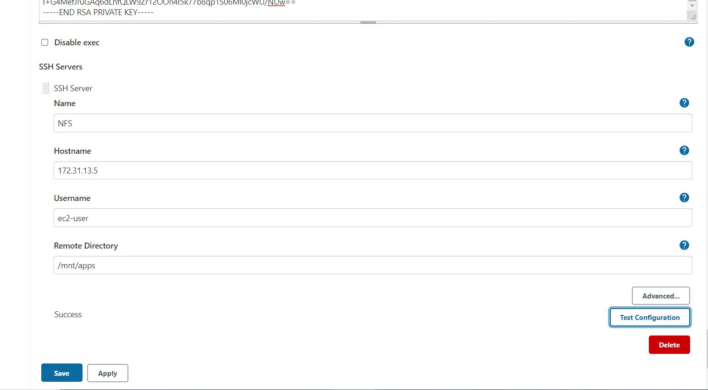

Opened my Jenkins project configuration page and added another "Post-build Action". Selected ‘Send build artifact over SSH’.

Configured it to send all build files into my remote directory. Entered ** under Source files. Saved the configuration.

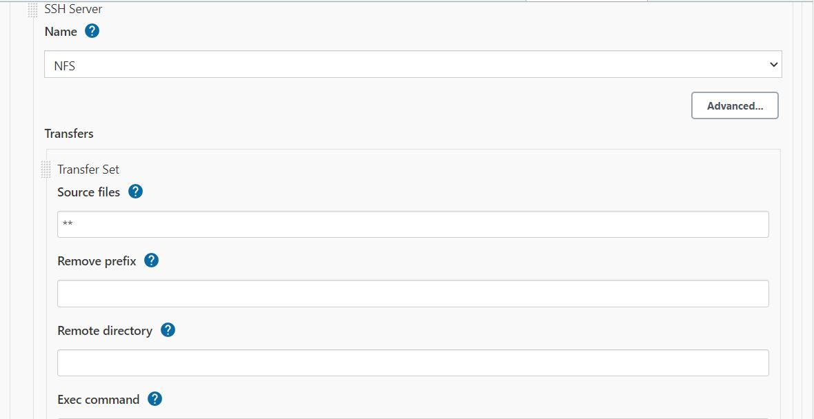

Edited the README.MD file in my GitHub Tooling repository. Entered ‘minor change’ at the bottom of the page.

Checked the Console Output of my project, however the transfer was not successful.
'Permission denied'.

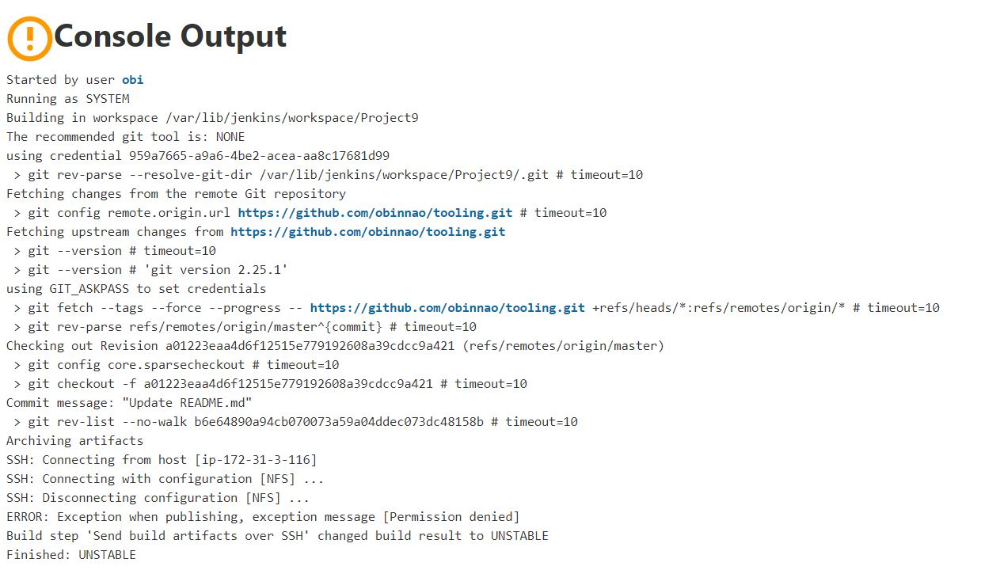

To resolve it, I changed ownership and granted full permission on /mnt/apps/ in the NFS server by running the command below:

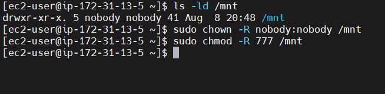

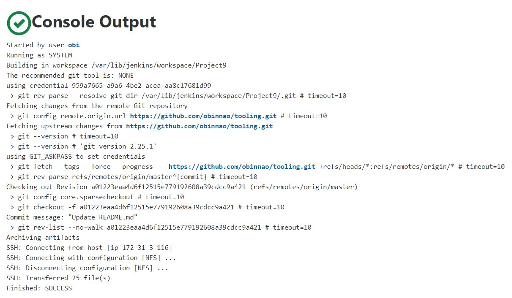

Checked that the mnt/apps/ README.md file has being updated with ‘minor change’ at the bottom of the page. 
`cat /mnt/apps/README.md`

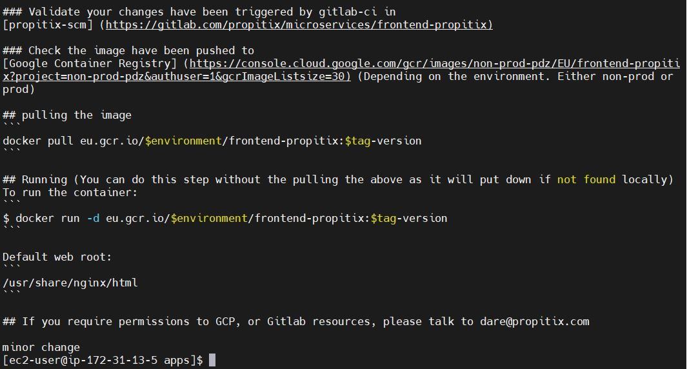

