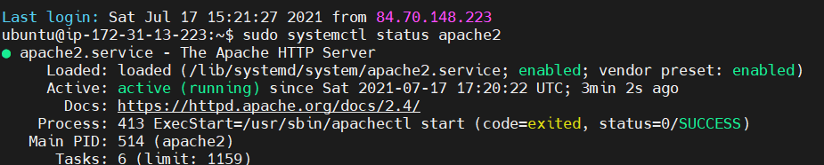
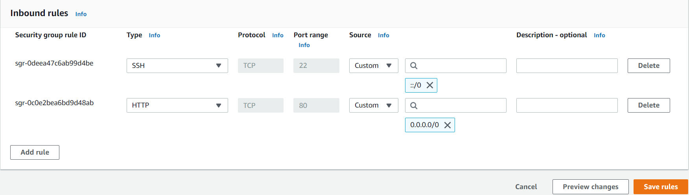
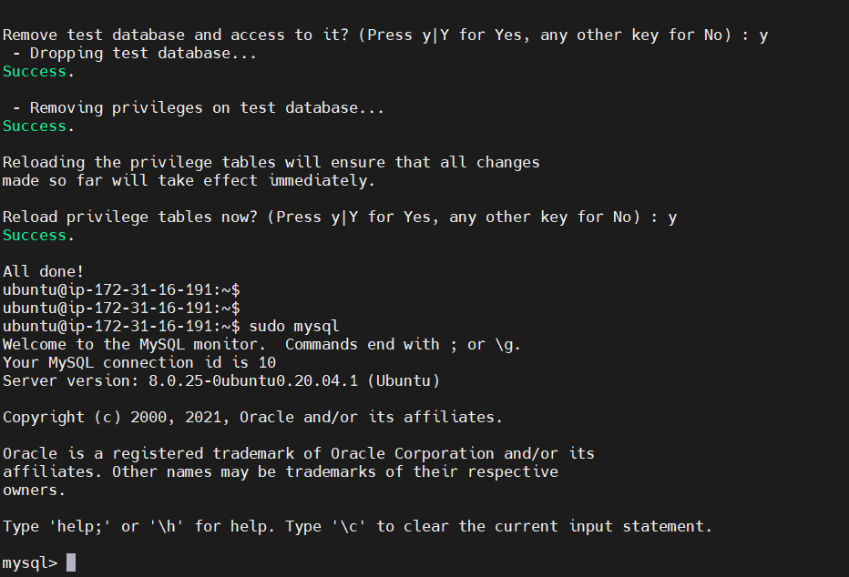

## LAMP PROJECT

Created my AWS account and performed the following tasks:
• Signed into AWS and setup launched a new EC2 instance of t2.micro family with Ubuntu Server 20.04 LTS (HVM)
• Saved my private key
• Connected to my EC2 instance through MobaXterm SSH client.
INSTALLED APACHE AND UPDATED THE FIREWALL

Install package update by running sudo apt update
Installed apache by running command `sudo apt install apache2`
Verified that apache2 is running by entering command `sudo systemctl status apache2`

Opened TCP port 80 which is the default port that web browsers use to access web pages on the Internet

Verified that my web server is now correctly installed and accessible through my firewall. Opened my EC2 virtual machine public IP Address URL on my computer browser.

## INSTALLED MYSQL

Installed a Database Management System (DBMS) to be able to store and manage data for my site in a relational database. MySQL is a popular relational database management system used within PHP environments
Installed MySQL - ran this command
`sudo apt install mysql-server`

ran a security script that comes pre-installed with MySQL
`sudo mysql_secure_installation`

Validate Password plugin
After running `sudo mysql secure installation`. I was prompted to setup a password.
Tested connection to MySQL server by running `sudo mysql`

Exit the MySQL console by typing `mysql> exit`

## INSTALLING PHP

PHP is the component of our setup that will process code to display dynamic content to the end user.
In addition to the php package, my server will need php-mysql, a PHP module that allows PHP to communicate with MySQL-based databases.
libapache2-mod-php will be required to enable Apache to handle PHP files. Core PHP packages will automatically be installed as dependencies.
I installed all 3 packages by running:
`sudo apt install php libapache2-mod-php php-mysql`

To confirm php version I ran `php -v`

Configure a Virtual Host For My Website Using Apache
The objective is to setup a domain called ‘projectlamp’
Apache on Ubuntu 20.04 has one server block enabled by default that is configured to serve documents from the /var/www/html directory.
Created a directory for project LAMP - sudo mkdir /var/www/projectlamp

Assigned ownership of the directory with your current system user:
`sudo chown -R $USER:$USER /var/www/projectlamp`

created and opened a new configuration file in Apache’s sites-available directory
`sudo vi /etc/apache2/sites-available/projectlamp.conf`

This created a new blank file. Pasted the following configuration by hitting the i key on my keyboard. Entered the insert mode, and pasted the text:

`<VirtualHost *:80>`

    ServerName projectlamp
    ServerAlias www.projectlamp
    ServerAdmin webmaster@localhost
    DocumentRoot /var/www/projectlamp
    ErrorLog ${APACHE_LOG_DIR}/error.log
    CustomLog ${APACHE_LOG_DIR}/access.log combined

`</VirtualHost>`

Saved and closed the file, by following the steps below:

1. Hit the esc button on the keyboard
2. Type :
3. Type wq (w means write and q means quit)
4. Hit ENTER to save the file

Entered the following command to to show the new file in the sites-available directory

`sudo ls /etc/apache2/sites-available`

Enabled the new virtual, by entering this command

`sudo a2ensite projectlamp`

I disabled the default website that comes installed with Apache. This is required if you’re not using a custom domain name, because in this case Apache’s default configuration would overwrite your virtual host. To disable Apache’s default website use a2dissite command , type:

`sudo a2dissite 000-default`

To ensure my configuration file doesn’t contain syntax errors, run:

`sudo apache2ctl configtest`

reloaded Apache so these changes take effect:
`sudo systemctl reload apache2`

Created an index.html file in that location so that i can test that the virtual host works as expected, by typing this command

`~$ cd /var/www/projectlamp`
`:/var/www/projectlamp$ touch index.html`
Ran the command below to set my virtual host default web page when my public IP Address URL is launched on my computer web browser.

`sudo echo 'Hello LAMP from hostname' $(curl -s http://169.254.169.254/latest/meta-data/public-hostname) 'with public IP' $(curl -s http://169.254.169.254/latest/meta-data/public-ipv4) > /var/www/projectlamp/index.html`

## ENABLE PHP ON THE WEBSITE

I need to edit the /etc/apache2/mods-enabled/dir.conf file and change the order in which the index.php file is listed within the DirectoryIndex directive:

Entered command

`sudo vim /etc/apache2/mods-enabled/dir.conf`

`<IfModule mod_dir.c>`

        #Change this:
        #DirectoryIndex index.html index.cgi index.pl index.php index.xhtml index.htm
        #To this:
        DirectoryIndex index.php index.html index.cgi index.pl index.xhtml index.htm

`</IfModule>`

Saved and closed the file.

Reloaded apache2, so change can take effect
sudo systemctl reload apache2

Created a PHP test script file known as ‘index.php’ to confirm that Apache is able to handle and process requests for PHP files.

vim /var/www/projectlamp/index.php

Entered the following text inside the file:

`<?php`

`phpinfo();`

Saved and closed file and refreshed my EC2 public ip address url page

